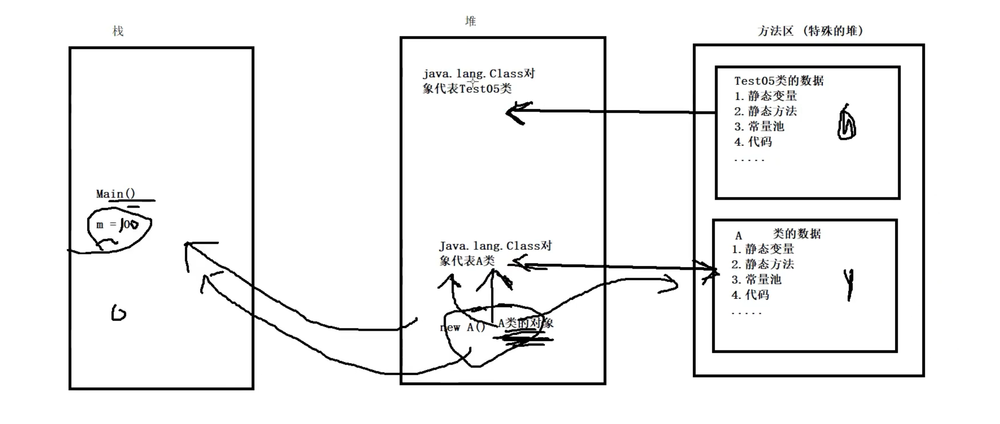
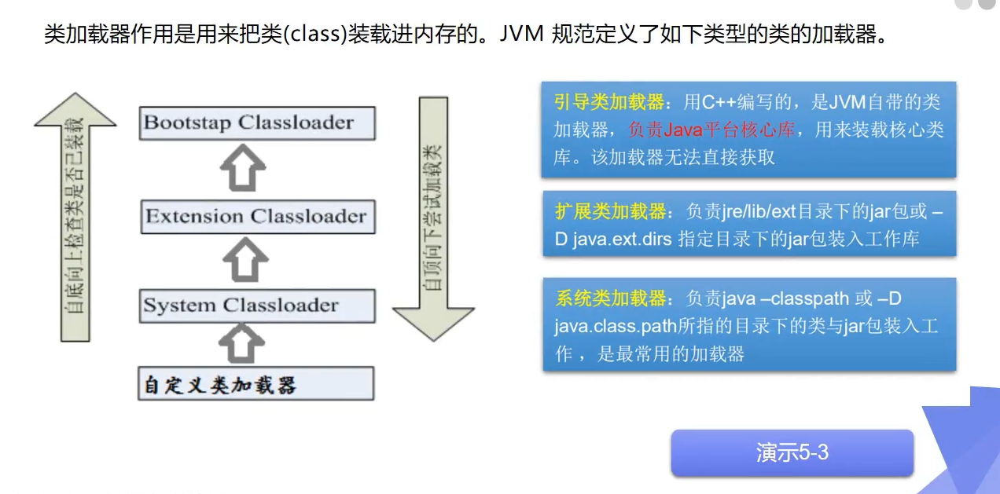
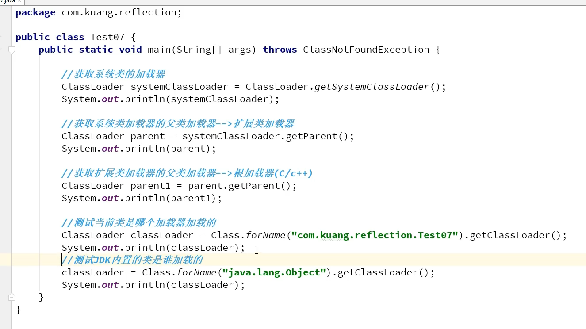

# Java 补充

## 类加载器

[类加载器详解](https://blog.csdn.net/briblue/article/details/54973413)

#### 分类

- Bootstrap  ClassLoader

  顶层加载类

  `sun.boot.class.path`

- Extention ClassLoader

  扩展类加载器, 加载`%JRE_HOME%\lib\ext`目录下的jar包

  

- System ClassLoader

  `java.class.path`

  加载当前应用的类, 也即是自定义类


```java
static class ExtClassLoader extends URLClassLoader{}
static class AppClassLoader extends URLClassLoader{}
```


#### Java内存理解


#### 类的加载与ClassLoader的理解

1. **加载**: 将class文件字节码内容加载到内存中, 并将这些静态数据转换成方法区的运行时数据结构, 然后生成一个代表这个类的java.lang.Class对象


2. **链接:** 将Java类的二进制代码合并到JVM的运行状态之中的过程
   - 验证: 确保加载的类信息符合JVM规范, 没有安全方面的问题
   - 准备: 正式为类变量(`static`)分配内存并设置变量默认初始值的阶段, 这些内存都将方法区中的进行分配
   - 解析: 虚拟机常量池内的符号引用(常量名) 替换为之间引用(地址)的过程


3. **初始化:**
   - 执行类构造器<clinit>()方法的过程.
   - 初始化一个类的过程中, 如果发现器父类还没有进行初始化, 则需要先触发父类的初始化.
   - 虚拟机会保证一个类的<clinit>()方法在多线程环境中被正确加锁和同步





#### **双亲委托机制**





