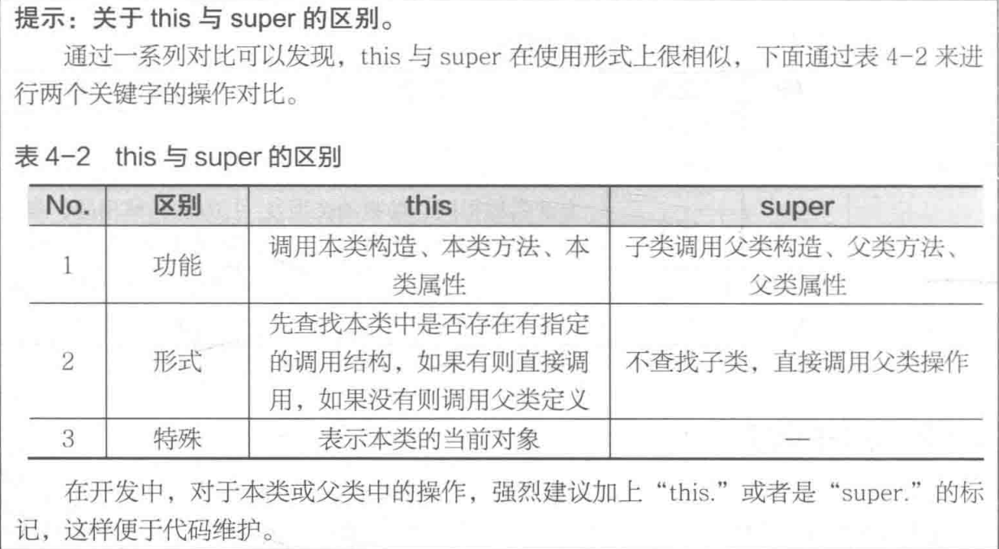

# Java基础(第一行代码)

[TOC]


## 一、简介

### 1.1 分类
***

- Java SE(Java标准版)

- Java EE(Java企业版)

- Java ME(Java微版本)

  

### 1.2 特性

***

- 简洁有效可移植

- 面向对象

- 解释型

- 适合分布式计算

- 多线程处理

- 较高的安全性

### 1.3 JDK与JRE

***

- JDK

  > 包含开发工具、编译器

- JRE

  > 包含Java虚拟机、Java核心类库、支持文件

### 1.4 几点知识

***

- public class类名称应与文件名一致，且一个java文件中只能有一个public class 

- class  类名称可以和文件名称不一致，且一个java文件中可以有多个class类，编译时会生成多个对应的.class文件  


### 1.5 面试题

#### 1.5.1 Oracle为什么收购SUN公司？

***

- 市场商用体系程序开发结构层次：操作系统、数据库、中间件、编程语言,而Oracle与微软是竞争关系，Oracle收购SUN公司，得到Java，从而获得大量Java开发从业人员，更适合公司的利益推广。


#### 1.5.2 PATH与CLASSPATH的区别

***

- PATH：操作系统的环境属性，指可执行命令的程序路径
- CLASSPATH：*.class文件的执行路径，Java命令执行时利用此路径加载所需要的 *.class文件。


## 二、基本概念

### 2.1 标识符

***

- 字母、数字、_ 、$组成

- 有特殊意义（内部类）：编译后，内部类Inner的class文件的名称形式为：Outer$Inner.class (Outer为外部类的名称)

- 关键字


### 2.2 数据类型

***

#### 2.2.1 分类（基本数据类型、引用数据类型）


#### 2.2.1 大小、范围、默认值

- **char类型默认值是'\u0000', \u代表Unicode编码,  ASCII码值为十进制值为0**, 是null, 将其打印, 将不会有任何输出

  | 基本类型 | 大小    | 最小值     | 最大值              | 包装类型  |
  | -------- | ------- | ---------- | ------------------- | --------- |
  | boolean  | —       | —          | —                   | Boolean   |
  | char     | 16 bits | Unicode 0  | Unicode $2^{16} -1$ | Character |
  | byte     | 8 bits  | -128       | +127                | Byte      |
  | short    | 16 bits | - $2^{15}$ | +$ 2^{15} -1$       | Short     |
  | int      | 32 bits | - $2^{31}$ | + $2^{31} -1$       | Integer   |
  | long     | 64 bits | - $2^{63}$ | + 2$^{63} -1$       | Long      |
  | float    | 32 bits | IEEE754    | IEEE754             | Float     |
  | double   | 64 bits | IEEE754    | IEEE754             | Double    |
  | void     | —       | —          | —                   | Void      |
  
  | 基本类型 | 初始值        |
  | -------- | ------------- |
  | boolean  | false         |
  | char     | \u0000 (null) |
  | byte     | (byte) 0      |
  | short    | (short) 0     |
  | int      | 0             |
  | long     | 0L            |
  | float    | 0.0f          |
  | double   | 0.0d          |


- 需要注意的是, 只有当基本类型数据作为类的属性时, 才有默认值, 否则(比如方法内的局部变量)将会是**任意值**

  ```bash
  所以有一点, 在方法内部即使是static方法也是不可以定义static变量的, 因为方法内定义的是局部变量,存在堆栈中,  而static变量是静态变量, 存储区不同.
  ```

#### **2.2.2 类型选择**

  - 整数int，小数double
  - 日期时间、文件大小、内存大小long
  - 内容传递（IO操作、网络编程）、编码转换byte
  - 逻辑控制 boolean
  - 处理中文 char

#### **2.2.3数值比较**

- 浮点数比较不应该用  ==  判断  （精度问题）
- 数值常量比较直接比大小得到boolean值

#### 2.2.4 注意

- 整数默认是int， 小数默认是double

- 123L: L的作用为将int转为long

- 123.2F：double转变为float

- byte num= 100:  在byte范围内的int型数据（对于int型变量，JVM不能确定是否在byte范围内，但整数常量可以确定在byte范围内），java自动把int型转换为byte，不需要显示转换(**其实short也一样**)

    ```java
    byte b1 = 1, b2 = 2, b;  
    b = b1+ b2;     // 错
    b= 1 + 2;
    ```

    ```java 
    short s = 1;
    s = s + 1;   // 报错
    ```

    ```Java
    short s1 = 1;
    s1 += 1;    //  不报错  这里应该是数值参与运算，变量没有参加运算
    ```

- 对于扩展赋值运算符而言，如果右边运算式得到的结果和左边不同，则会自动发生强制类型转换

     ```java
    int x = 0;
    x = x + 3.5;
    ```

    ```java
    int x = 0;
    x += 3.5
    ```

  - 上述两个表达式，其含义是一样的，但只有第二个是合法的，说明扩展赋值运算符隐含强转

    - **x += y   <---->  x = (x的数据类型) （x + y）**


- 声明变量的同时也要为其赋初始值

- 当int、long（4字节，8字节）自动转换成float（4字节）时，可能会有精度损失

- 当long自动转换成double（8字节）时，也可能产生精度损失

- 不要用浮点型计算小数，除非对精度十分不敏感

- boolean类型和其他数据类型之间不能通过强制类型转换语法直接转换

### 2.3 分支结构

***

- 很多开发工具的switch支持没有考虑到String，实际开发时最稳妥的做法是switch只用来判断字符或数字（2017年）

### 2.4 方法重载

#### 2.4.1 什么是重载

- 方法名称相同
- 参数**类型**或**个数**不同或参数列表中的**参数顺序**

#### 2.4.2 可变参数方法的重载

```java
public class OverloadingVarargs2 {
    static void f(float i, Character... args) {
        System.out.println("first");
    }
	// char c不添加, 将发生编译错误
    static void f(char c , Character... args) {
        System.out.print("second");
    }

    public static void main(String[] args) {
        f(1, 'a');
        f('a', 'b');
    }
}
```

#### 2.4.3注意

- 方法不能通过使返回值的不同来进行重载
- **以标准开发的角度，重载方法时应尽量使得各方法的返回类型**一致


### 2.5、面试题

#### 2.5.1 如何更快地计算出2的三次方？

- 左移运算符，如int x = 2;  int num = x <<2;

#### 2.5.2 &和&&的区别

- 作为逻辑运算符
  
  - $ \& $：所有判断条件都要判断
  - $\&\&$：若前面的判断条件的判断结果为false，后面的判断条件不再判断，最终结果为false
- 作为位运算符
  - $\&$为位与运算，&&不能用于位运算


## 三、面向对象的基本概念

### 3.1 特性

***

>  封装性

- 属性与方法看作一个密不可分的整体
- 信息隐蔽，隐蔽具体实现的细节，变量（属性）和方法规定了不同级别的可见性或者说访问权限；

> 继承性

- 定义反映事物一般特性的类，在这个类的基础上通过继承派生出反映特殊事物的类（由一般（父类）到特殊（子类）再到具体（实例））
- 单继承：一个子类只允许继承一个父类
- 多继承：一个子类允许继承多个父类

> 多态性

- 方法重载：方法名一致，参数类型或个数不同
- 对象多态：子类与父类对象可相互转换

### 3.2 类与对象

***

- 在主类中定义的并且由主方法直接调用的方法应该加上**static**关键字
- **内存空间**
  - 堆内存：保存对象的属性内容，即保存对象的真正数据，需要关键字new来开辟空间。
  - 栈内存：保存一块堆内存的地址，类似c/c++中的指针。
  - 每使用一次关键字new，都会开辟一块新的堆内存空间
- GC （Garbage Collector）
  - 核心功能：内存分配与回收
  - 监视对象的地址、大小、状态
  - 防止内存泄漏
  - 垃圾分类的处理方式
    - 引用计数
    - 跟踪收集：记录对象的引用路径，从root set开始扫描，若对象不可达，则回收
    - 基于对象跟踪的分代增量收集（根据堆内存的结构来收集）
      - 基于对象跟踪（分代）
        - YoungGen(Minor GC回收)
        - OldGen（Major GC回收）
        - PermGen ：方法、属性、对象池
      - 增量收集：不是每一次都全部收集，而是累积的增量收集

### 3.3 封装性初级

***

- 属性定义用private声明，定义setter、getter方法设置和获取属性值

### 3.4 构造方法

***

- 方法名称与类名称相同，没有返回值类型声明，可重载

- 若不定义构造方法，默认无参构造当定义了有参构造时，原默认无参构造将不会自动生成，此时如需无参构造，需要自己定义

- 仅在实例化新对象时调用一次

- 对象实例化过程：类的加载、内存分配、默认值设置、构造方法
  
  - **在构造方法之前，属性值都是其对应数据类型的默认值**
  
- 访问权限

  ```
  1. 可以是public private  protected
  2. 不使用任何权限修饰符时, 构造方法访问权限是public
  ```

  

### 3.5 匿名对象

***

- 对象存储在堆内存中，没有栈内存指向该堆内存空间，该对象就是匿名对象
- 使用一次就被GC回收

### 3.6 简单Java类

***

- > 要求
  
  - 类名称必须由存在意义
  - 属性private声明，每个属性均提供setter、getter
  - 构造方法可多个，但必须保留一个无参构造
  - 类中不允许出现任何输出语句，信息输出交由调用处
  - 类中提供一个取得对象完整信息的方法，以String型数据返回

### 3.7 数组

> 多维数组的各子数组地址不一定时连续存储

#### 3.7.1 数组操作方法

- src / dest 如果是数组对象, 那么就是数组复制操作

  > 该方法属于System类

  ```java
  public static void arraycopy(Object src, int srcPos, Object dest, int destPos, int length)
  ```

- 数组排序

  > 1. 基本数据类型数组, 基本数据类型包装类和String类型,(实现了Comparable接口)可以直接使用该方法
  > 2. 自定义类需要实现Comparable接口, 并且重写compareTo方法
  > 3. 如果设计类时没有实现Comparable接口, 可以写一个比较器类, 该比较器类实现了Comparator接口

  ```java
  // 从小到大排序
  java.util.Arrays.sort(数组)
  ```

  

### 3.8 String类

***

> **字符串内容的比较**

- Java中是没有字符串数据类型的，而字符串常量其实是String类的匿名对象，直接赋值的方式赋值，赋值内容相同时，引用指向的堆内存地址一致。
- “==” 用于引用数据类型的比较时，比较的是该引用保存的地址，机其指向的堆内存地址，而不是比较堆内存中的实际数据
- public boolean equals(Object str); 方法可用于字符串内容的比较

    ```java
    public class test {
        public static void main(String[] args){
            String str1 = "Hello";
            String str2 = "Hello";
            if (str1 == str2){
                System.out.println("Equal！");
            }
        }
    }

    //  运行结果   Equal！
    ```

- 与指定字符串(比如”hello“)比较,采用下列方式，可以防止NullPointerException

  ```java
  public class StringDemo {
      public static void main(String[] args){
          String input = null;
          // 用户输入为null时，也不会出现NullPointerException
          if ("hello".equals(input)){
              System.out.println("Hello World!");
          }
      }
          
  
  ```

> **构造方法赋值与直接赋值**


- 直接赋值

  - 用直接赋值的方式给不同的String引用赋相同的值，如都为”hello“，此时有两块栈内存空间，一块堆内存空间，即没有新开辟第二块堆内存
  - 其实直接赋值时，字符串匿名对象会在JVM中的对象池中保存，String类的这种设计模式为共享设计模式

- 构造方法赋值

  - String str = new String("hello");
  - 实例化字符串时，会开辟两块空间，其中一块为垃圾空间("hello"匿名字符串对象)，并且这样创建的字符串内容不会保存在对象池中。开发中给字符串赋值时，均采用直接赋值。

  

- 字符串对象引用不能频繁变更，不然会产生大量垃圾空间；若没办法出现了频繁更改，用StringBuffer或StringBuilder类代替String

### 3.9 String类常用方法

***

> **字符与字符串**

- String类构造方法，接收字符数组的全部

  ```java
  public String (char[] value);
  ```

- String类构造方法，接受字符数组的一部分

  ```java
  public String(char[] value, int offset, int count);
  ```

-  String类普通方法，取出指定索引的字符  

  ```java
  public char charAt(int index);
  ```

- String类普通方法，整个字符串转换为字符数组
  
  ```java
  public char[] toCharArray();
  ```


> **字节与字符串  （传输、编码转换）**

- Stirng类构造方法，接收字节数组

  ```java
  public String(byte[] bytes);
  ```

- String类构造方法，接收部分字节数组

  ```java
  public String(byte[] bytes, int offset, int length);
  ```
  
- String类普通方法，将字符串变为字节数组

  ```java
  public byte[] getBytes();
  ```

- String类普通方法，将字符串变为指定字符集的字节数组

  ```java
  // charsetName 字符集的名称，该方法用于编码转换
  public byte[] getBytes(String charsetName) throws UnsupportedEncodingException;
  ```
  
- String构造方法, 以指定字符集接收字节数组

  ```java
  public String(byte[] bytes, String charsetName)
  ```

  

> **字符串的比较**

- 相等判断  (区分大小写)

  ```java
  public boolean equals(Stirng anObject);
  ```

- 相等判断  (不区分大小写)

  ```java
  public boolean equalsIgnoreCase(String anotherString);
  ```

- 字符串大小比较

  ```java
  //  return
      = 0 : 相等
      > 0 : 大于anotherString
      < 0   : 小于anotherString
  public int compareTo(String anotherString);
  ```

  

> **字符串查找**

- 判断指定内容是否存在

  ```java
  public boolean contains(String s);
  ```

- 由前向后查找指定字符串

  ```java
  // 找到了，返回（第一个字母）位置索引，否则返回-1
  public int indexOf(String str);
  ```

- 从指定位置由前向后查找指定字符串

  ```java
  public int indexOf(String str, int fromIndex);
  ```

- 由后向前查找指定字符串的位置

  ```java
  public int lastIndexOf(String str);
  ```

- 从指定位置由后向前查找指定字符串的位置

  ```java
  public int lastIndexOf(String str, int fromIndex);
  ```

- 判断是否以指定字符串开头

  ```java
  public boolean startsWith(String prefix);
  ```

- 从指定位置判断是否以指定的字符串开头

  ```java
  public boolean startsWith(String prefix, int toffset);
  ```

- 判断是否以指定字符串结尾

  ```java
  public boolean endsWith(String suffix);
  ```


> **字符串替换**

- 用新的内容替换全部旧的内容

  ```java
  // regex为正则表达式
  public String replaceAll(String regex, String replacement);
  ```

- 替换首个满足条件的内容

  ```java
  public String replaceFirst(String regex, String replacement);
  ```

  

> **字符串截取**

- 从指定索引截取到结尾

  ```java
  public String substring(int beginIndex);
  ```

- 截取部分子字符串的数据

  ```java
  public String substring(int beginIndex, int endIndex);
  ```

  

> **字符串的拆分**

- 按照指定字符串进行拆分

  ```java
  // regex 为空字符串时（""）,表示按照每一个字符拆分
  public String[] split(String regex);
  ```

- 按照指定字符串进行拆分，返回数组最大长度由limit决定

  ```java
  // 拆分结果很多时， 即大于limit时，前面拆，后面不拆
  public String[] split(String regex, int limit);
  ```


> **其他方法**

- 字符串连接，与"+"类似

  ```java
  public String concat(String str);
  ```

- 转大写/小写

  ```java
  public String toLowerCase();
  public String toUpperCase();
  ```

- 去掉字符串左右两边空格

  ```java
  public String trim();
  ```

- 取得字符串长度

  ```java
  public int length();
  ```

- 字符串数据入池

  ```java
  public String intern();
  ```

- 判断是否是空字符串("")

  ```java
  public boolean isEmpty();
  ```

- 格式化字符串

  ```java
  public static String format(String format, Object... args)
  ```

  


> **首字母大写操作**

```java
public static void main(String[] args){
    //定义字符串
	String str="yootk";
    //调用initcap0方法
	System.out.printin( initcap(str) );
}

	/**
	*实现首字母大写的操作
	*@param temp 要转换的字符串数据
    *@return 将首字母大写后返回
    */        
public static String initcap(String temp){
    //先利用substring（0，1）取出字符串的第一位后将其变为大写，再连接剩余的字符串
    return temp.substring(0，1).toUpperCase0 + temp.substring(1);
};
```

### 3.10 this关键字

#### 3.10.1 特性

- 表示当前对象

  - `peel()` 方法中第一个参数隐密地传入了一个指向操作对象的引用

    ```java
    // housekeeping/BananaPeel.java
    
    class Banana {
        void peel(int i) {
            /*...*/
        }
    }
    public class BananaPeel {
        public static void main(String[] args) {
            Banana a = new Banana(), b = new Banana();
            a.peel(1);
            b.peel(2);
            // Banana.peel(a, 1)
    		// Banana.peel(b, 2)
        }
    }
    ```

- this调用本类构造方法
  
  ```java
  this([parm...]);
  ```
  
  - **this()只能放在构造方法的首行**
  - 构造方法互相调用，应保留出口
  
- 调用普通方法/访问属性
  - 普通类中的方法调用所在类的的方法，不用static声明，用this进行访问 （开发习惯）
  - 不建议使用this访问static成员方法或属性

#### 3.10.2 限制

- this只能在非静态方法中使用

### 3.11 引用传递

***

> **与数据库的关系**


### 3.12 对象比较

***

- 类的private封装属性在类的外部时不能直接访问的，但类的对象传递回该类的方法中时，相当于取消了封装，可直接通过对象访问属性

  ```java
  class Info{
      private String msg="Hello"；
      public void print(){
          System.outprintln（"msg="+msg）；
  	}
      public void fun（dnfo temp）{
      	temp.msg = "修改内容";
  	}
  }
  //在类的内部直接利用对象访问私有属性
  public class Demo{  //本类接收本类对象temp.msg=“修改内容”；
          public static void main(String args){
          Info x=new Info();
          x.fun（x）;  //没有意义，只是一个语法验证	  
          x.print()；
      }
      程序执行结果；msg=修改内容
  ```


### 3.13 static关键字

> 1. static不可修饰局部变量
> 2. static属性, 方法不依赖于对象的创建, 可以之间通过类名称访问
> 3. static属性初始化只会执行一次
> 4. 构造器也是一个 **static** 方法尽管它的 **static** 关键字是隐式的

#### 3.13.1 static定义属性

1. 将属性定义为公共属性，该类所有对象都可以使用，且共用该属性的值

2. 此类属性应由类修改，不应由具体对象修改

#### 3.13.2 static定义方法

1. 不可以定义构造方法

#### 3.13.3 static定义类(内部类)

1. static 不可以定义普通类，抽象类也不可以

2. static可以定义内部类，此时该内部类就相当于外部类

3. 不受外部类实例化对象约束

4. 相当于变为外部类，只能访问外部类staic属性或方法

5. 实例化static内部类对象(详细的内容可以参考内部类小节)

   > 在内部类所在类的其他类中创建的方法, 在所在的类的内部创建用此方法也可以, 只是不必要如此麻烦

   ```
   外部类.内部类  对象  =  new 外部类.内部类();
   ```

6. 实例化非static内部类

   ```
   外部类.内部类  对象  = new  外部类().new 内部类();
   ```

   

#### 3.13.4 static方法访问限制

- static方法不能直接访问非static方法和属性，只能调用static属性或方法
- 非static方法可以访问static属性或方法，不受任何限制
  - 如何理解：非static方法要调用，必须实例化对象，不实例化对象都已经可以访问static方法属性和方法，那么实例化对象自然也可以

#### 3.13.5 什么时候定义static方法

1. 类中如果没有普通属性，那么在使用这个类时，就没有必要另外开辟堆内存空间，即实例化对象，此时定义可以考虑定义static方法

2. 开发中优先定义非static方法

#### 3.13.6 实际应用

1. 统计类实例化对象的个数
   - 比如再构造函数中改变private static int num属性的值,  还需参考11章的finalize()方法

2. 实现属性的自动设置


### 3.14 代码块（分清类加载和创建对象）

```java
// reuse/Beetle.java
// The full process of initialization
class Insect {
    private int i = 9;
    protected int j;
    
    Insect() {
        System.out.println("i = " + i + ", j = " + j);
        j = 39;
    }
    
    private static int x1 = printInit("static Insect.x1 initialized");
    
    static int printInit(String s) {
        System.out.println(s);
        return 47;
    }
}

public class Beetle extends Insect {
    private int k = printInit("Beetle.k.initialized");
    
    public Beetle() {
        System.out.println("k = " + k);
        System.out.println("j = " + j);
    }
    
    private static int x2 = printInit("static Beetle.x2 initialized");
    
    public static void main(String[] args) {
        System.out.println("Beetle constructor");
        Beetle b = new Beetle();
    }
}

```

```bash
## 结果
static Insect.x1 initialized  (主类static想加载, 发现有父类, 父类static加载)
static Beetle.x2 initialized (子类static加载)
Beetle constructor (主方法输出)
i = 9, j = 0  (new 子类构造, 去调用父类构造, 普通属性先加载,在进入父类构造)
Beetle.k initialized (子类普通属性加载)
k = 47  (子类构造)
j = 39  (子类构造, 继承了父类的protected属性(或者说可以访问父类protected属性))

```


#### 3.14.1 没有代码块时的执行顺序

1. 即使没有显式地使用 **static** 关键字，**构造器实际上也是静态方法**。所以，当首次创建 **Dog** 类型的对象或是首次访问 **Dog** 类的静态方法或属性时，Java 解释器必须在类路径中查找，以定位 **Dog.class**。
2. 当加载完 **Dog.class** 后（后面会学到，这将创建一个 **Class** 对象），有关静态初始化的所有动作都会执行。因此，静态初始化只会在首次加载 **Class** 对象时初始化一次。
3. 当用 `new Dog()` 创建对象时，首先会在堆上为 **Dog** 对象分配足够的存储空间。
4. **分配的存储空间首先会被清零，即会将 Dog 对象中的所有基本类型数据设置为默认值**（数字会被置为 0，布尔型和字符型也相同），引用被置为 **null**。
5. 执行所有出现在字段定义处的初始化动作。
6. 执行构造器。你将会在"复用"这一章看到，这可能会牵涉到很多动作，尤其当涉及继承的时候。


#### 3.14.2 代码块种类

- 普通代码块  写在方法中

  ```java
  {
    // 代码块
  }
  ```

  

- 构造块  
  - 写在类中，**实例化对象**时会调用，可以访问非static属性和static属性，并且先于构造方法执行
  - 把构造方法中都会执行的语句都提取出来放在代码块中
  - 要特别复杂的赋值，用构造代码块

- 静态块 

  ```java
  static {
      // 代码;
  }
  ```

  1. 在主类中的静态块

     先于主方法执行

- 同步代码块 （多线程中会出现）

  - 非主类中

#### 3.14.3 定义代码块后的执行顺序


- 实例化对象时，之后是静态块执行，**（如果实例化了对象）**然后是构造块，最后构造方法
- 静态库**仅执行一次**，无论多少个对象
- 静态块**可用于static属性的初始化**
- JDBC的驱动加载

- 主类中
  - 

### 3.15 内部类  

***

> **开发中优先考虑普通的类，不可过多考虑内部类**

```java
class A{  // 外部类
    
}

class B{  // 外围类
    class C{ // 内部类
        
    }
}
```

#### 3.15.1 定义在类中

- **在类中定义普通内部类（成员内部类）**
  - 不能定义静态方法、静态成员、静态代码块
    - 类加载时，要触发内部类的类加载，需要给内部类创建对象，而内部类又依赖于外部类对象，故内部类的静态方法、成员、代码块无法加载
      - 反射机制也不能不创建外围类对象而创建成员内部类对象
  - 可以定义全局常量（加入了常量池）
  - 访问权限

- **在外部类方法中实例化内部类对象**，
  
  - 调用内部类方法可轻松访问外部类的私有属性和内部类的私有属性
  
- 在内部类中，
  
  - **外部类.this:  表示当前外部类对象**
  
- **实例化内部类** （内部类依赖于外部类）
  
  - 在外部类中实例化
  
    ```java
    // 方式1
    外围类.内部类 对象  =  new  外围类().new 内部类();
    // 方式2
    外围类  对象B  = new  外围类();
    外围类.内部类  对象C = B.new 内部类();
    ```
  
  - 在外围类中示例化
  
    > 注意, 在外部类实例化内部类的方法同样适用于外围类, 不仅限于下面的方法
  
    ```java
    // 方式1
    内部类 对象  =  new  外围类().new 内部类();
    // 方式2
    外围类  对象B  = new  外围类();
    内部类  对象C = B.new 内部类();
    ```
  
- **私有内部部类**
  
  - private声明内部类，此时只能由其所在外部类访问，其他外部类不能访问
  
- **static定义内部类**
  - 内部类与外部类的类加载是相互独立的，互不干涉
  - 不受外部类实例化对象约束
  - 相对于变为外部类，**只能访问外部类staic属性或方法**
  - 实例化static内部类对象
    - 外部类.内部类  对象  =  new   **外部类.内部类（）;**

> **在方法中定义内部类（最常用） **

```java
class Outer{
    private String msg = "Hello World!";
    public void fun(){
        class Innner{
            public void print(){
                System.out.println(Outer.this.msg)  // 可访问外部类的属性
            }
        }
        new Inner().print();
	}
}
```

- 内部类中可访问方法中的参数或变量
  - JDK 1.8开始，在1.7及之前的版本，只能访问final声明的变量或参数，如final double score;因此添加final关键字是一个好习惯

### 3.16 链表

***

- 链表基础功能

  

#### 1.17 常用内存区域

***

- 栈内存空间
- 堆内存空间
- 全局数据区   (保存所有static类型属性)
- 全局代码区 （保存所有方法）


### 3.17、面试题

#### 3.17.1 请解释String类中“==”和“equals（）”比较的区别。

***

- “==”是Java提供的关系运算符，主要的功能是进行数值相等判断，如果用在String对象上表示的是内存地址数值的比较；
- “equals0”：是由String提供的一个方法，此方法专门负责进行字符串内容的比较。

#### 3.17.2 请解释String类的两种对象实例化方式的区别。

***

- 直接赋值（String str=“字符串”；）
  - 只会开辟一块堆内存空间，并且会自动保存在对象池中以供下次重复使用；
- 构造方法（String str=new String（“字符串”））
  - 会开辟两块堆内存空间，其中有一块空间将成为垃圾，并且不会自动入池，但是用户可以使用intern0方法手工入池。
    在所有开发中，String对象的实例化永远都采用直接赋值的方式完成。


## 四、面向对象高级

### 4.1 继承

***

#### 父类与子类的关系

- 通常，把子类对象用一个父类对象引用指向

  ```java
  Father f = new Son();
  ```

- 继承了父类的所有成员，同时子类可以定义新成员

- 子类又称派生类，父类又称超类

#### **限制**

- 不允许多重继承，允许多层继承
- **父类私有操作隐式继承，非私有操作显示继承**
  - 比如父类定义了一个私有属性，子类要访问该私有属性，不能用“类.属性”的方式访问，只能通过setter、getter方法访问

- 子类对象构造默认调用父类的构造（默认无参构造）
- super()
  - 如要编写，应放在构造方法的首行
  - 调用父类无参构造
  - 若父类没有定义无参构造，子类构造方法调用super()方法应指定参数

- 如何合理使用继承

  - 对于父类private成员，子类不能直接访问，但可以通过父类setter、getter方法访问
  - 父类构造方法不能被子类继承
- 子类创建过程

  - 先加载父类再接在子类，且父类对象的成员先初始化，即父类成员先开辟堆空间

#### 使用继承设计

```
利用已有类创建新类首先选择继承的话，事情会变得莫名的复杂。
更好的方法是首先选择组合，特别是不知道该使用哪种方法时
```


### 4.2 **关于super()和this()**

***

- > **构造方法调用**

	

- > **普通方法的调用**

  

  

### 4.3 覆写

***

- 被子类覆写的方法不能拥有比父类更严格的访问权限

- 父类中方法为**private**或**static**方法声明，子类不能对该方法覆写（可以编写，但实际运行将不起作用）

- 子类方法覆写后，若希望调用父类的方法，可用**super.覆写方法()**来访问

- 子类覆写父类方法的返回值(在重写的时候，重写方法的返回值类型可以是被重写方法返回值类型的子类。)

  |     父类     |             子类             |
  | :----------: | :--------------------------: |
  |     void     |             void             |
  | 基本数据类型 |       相同基本数据类型       |
  |   引用类型   | 相同引用类型或引用类型的子类 |

  

- **属性覆盖无意义**（父类子类属性名称一致，称为属性覆盖）

### 4.4 子类编写原则

***

- 绝不改变客户端已有的使用方法
- 子类应该为了维持方法的功能继续完善，必须要根据情况进行父类方法的覆写

### 4.5 final关键字

***

- final定义的类不能再有子类
  - Stirng类是final关键字定义的类
  - System
  - Math
  - 基本数据类型包装类
  - Void类
- final定义的方法不能被子类所覆写
- final定义的变量就成为了常量，常量应在定义时设置好内容，并且不能修改，常量的命名应全部大写
  - 全局常量 public static final String MSG  = "YOOTK"；
- final成员变量表示常量，只能被赋值一次
  - **成员变量为引用类型时，则是其保存的地址不变**
- final定义的静态常量
  - 访问基本数据常量不会触发类加载
  - 访问除了String类型的引用数据常量会触发类加载
- 类中所有的 **private** 方法都隐式地指定为 **final**

### 4.6 多态性

> 任何属性访问都被编译器解析，因此不是多态的, 只有普通方法才具有多态性

#### 方法多态性

- 重载与覆写

#### 对象多态性

- 父子类对象的转换
- 向上转型：自动转换（父类  父类对象  =  子类实例），使参数统一
  - 实例对象时哪一类，调用方法时就按覆写原则调用对应的方法
  - 向上转型后，只能调用父类中定义过的方法
- 向下转型：强制转换  （子类  子类对象 =  （子类）父类实例），调用子类的个性化操作方法
  - 必须发生子类向上转型才可以进行向下转型（对应抽象类和接口，必须有子类才行），直接定义一个父类向子类转换，程序会报错，此时可以调用子类私有的方法了

#### instanceof

- 对象  instanceof  类    返回boolean值
- 向下转型前建议都使用instanceof判断

#### 多态在代码上的表现

代码1: 普通方法可以实现多态

```java
// polymorphism/music3/Music3.java
// An extensible program
// {java polymorphism.music3.Music3}
package polymorphism.music3;
import polymorphism.music.Note;

class Instrument {
    void play(Note n) {
        System.out.println("Instrument.play() " + n);
    }
    
    String what() {
        return "Instrument";
    }
    
    void adjust() {
        System.out.println("Adjusting Instrument");
    }
}

class Wind extends Instrument {
    @Override
    void play(Note n) {
        System.out.println("Wind.play() " + n);
    }
    @Override
    String what() {
        return "Wind";
    }
    @Override
    void adjust() {
        System.out.println("Adjusting Wind");
    }
}

class Percussion extends Instrument {
    @Override
    void play(Note n) {
        System.out.println("Percussion.play() " + n);
    }
    @Override
    String what() {
        return "Percussion";
    }
    @Override
    void adjust() {
        System.out.println("Adjusting Percussion");
    }
}

class Stringed extends Instrument {
    @Override
    void play(Note n) {
        System.out.println("Stringed.play() " + n);
    } 
    @Override
    String what() {
        return "Stringed";
    }
    @Override
    void adjust() {
        System.out.println("Adjusting Stringed");
    }
}

class Brass extends Wind {
    @Override
    void play(Note n) {
        System.out.println("Brass.play() " + n);
    }
    @Override
    void adjust() {
        System.out.println("Adjusting Brass");
    }
}

class Woodwind extends Wind {
    @Override
    void play(Note n) {
        System.out.println("Woodwind.play() " + n);
    }
    @Override
    String what() {
        return "Woodwind";
    }
}

public class Music3 {
    // Doesn't care about type, so new types
    // added to the system still work right:
    public static void tune(Instrument i) {
        // ...
        i.play(Note.MIDDLE_C);
    }
    
    public static void tuneAll(Instrument[] e) {
        for (Instrument i: e) {
            tune(i);
        }
    }
    
    public static void main(String[] args) {
        // Upcasting during addition to the array:
        Instrument[] orchestra = {
            new Wind(),
            new Percussion(),
            new Stringed(),
            new Brass(),
            new Woodwind()
        };
        tuneAll(orchestra);
    }
}

```

代码1的输出

```
Wind.play() MIDDLE_C
Percussion.play() MIDDLE_C
Stringed.play() MIDDLE_C
Brass.play() MIDDLE_C
Woodwind.play() MIDDLE_C
```

代码2: 属性无法体现多态性

```java
// polymorphism/FieldAccess.java
// Direct field access is determined at compile time
class Super {
    public int field = 0;
    
    public int getField() {
        return field;
    }
}

class Sub extends Super {
    public int field = 1;
    
    @Override
    public int getField() {
        return field;
    }
    
    public int getSuperField() {
        return super.field;
    }
}

public class FieldAccess {
    public static void main(String[] args) {
        Super sup = new Sub(); // Upcast
        System.out.println("sup.field = " + sup.field + 
                          ", sup.getField() = " + sup.getField());
        Sub sub = new Sub();
        System.out.println("sub.field = " + sub.field + 
                          ", sub.getField() = " + sub.getField()
                          + ", sub.getSuperField() = " + sub.getSuperField())
    }
}
```

代码2的输出

```
sup.field = 0, sup.getField() = 1
sub.field = 1, sub.getField() = 1, sub.getSuperField() = 0
```

#### 继承与清理

```
层级结构中的每个类都有 Characteristic 和 Description 两个类型的成员对象，它们必须得被销毁。销毁的顺序应该与初始化的顺序相反，以防一个对象依赖另一个对象。对于属性来说，就意味着与声明的顺序相反（因为属性是按照声明顺序初始化的）。对于基类（遵循 C++ 析构函数的形式），首先进行派生类的清理工作，然后才是基类的清理。这是因为派生类的清理可能调用基类的一些方法，所以基类组件这时得存活，不能过早地被销毁。输出显示了，Frog 对象的所有部分都是按照创建的逆序销毁的。
```

```java
// polymorphism/Frog.java
// Cleanup and inheritance
// {java polymorphism.Frog}
package polymorphism;

class Characteristic {
    private String s;
    
    Characteristic(String s) {
        this.s = s;
        System.out.println("Creating Characteristic " + s);
    }
    
    protected void dispose() {
        System.out.println("disposing Characteristic " + s);
    }
}

class Description {
    private String s;
    
    Description(String s) {
        this.s = s;
        System.out.println("Creating Description " + s);
    }
    
    protected void dispose() {
        System.out.println("disposing Description " + s);
    }
}

class LivingCreature {
    private Characteristic p = new Characteristic("is alive");
    private Description t = new Description("Basic Living Creature");
    
    LivingCreature() {
        System.out.println("LivingCreature()");
    }
    
    protected void dispose() {
        System.out.println("LivingCreature dispose");
        t.dispose();
        p.dispose();
    }
}

class Animal extends LivingCreature {
    private Characteristic p = new Characteristic("has heart");
    private Description t = new Description("Animal not Vegetable");
    
    Animal() {
        System.out.println("Animal()");
    }
    
    @Override
    protected void dispose() {
        System.out.println("Animal dispose");
        t.dispose();
        p.dispose();
        super.dispose();
    }
}

class Amphibian extends Animal {
    private Characteristic p = new Characteristic("can live in water");
    private Description t = new Description("Both water and land");
    
    Amphibian() {
        System.out.println("Amphibian()");
    }
    
    @Override
    protected void dispose() {
        System.out.println("Amphibian dispose");
        t.dispose();
        p.dispose();
        super.dispose();
    }
}

public class Frog extends Amphibian {
    private Characteristic p = new Characteristic("Croaks");
    private Description t = new Description("Eats Bugs");
    
    public Frog() {
        System.out.println("Frog()");
    }
    
    @Override
    protected void dispose() {
        System.out.println("Frog dispose");
        t.dispose();
        p.dispose();
        super.dispose();
    }
    
    public static void main(String[] args) {
        Frog frog = new Frog();
        System.out.println("Bye!");
        frog.dispose();
    }
}
```

#### 构造器使用规范

```
做尽量少的事让对象进入良好状态。如果有可能的话，尽量不要调用类中的任何方法。在基类的构造器中能安全调用的只有基类的 final 方法（这也适用于可被看作是 final 的 private 方法）。这些方法不能被重写，因此不会产生意想不到的结果。你可能无法永远遵循这条规范，但应该朝着它努力。
```


### 4.7 抽象类

***

#### 特点

1. 抽象类不能**直接实例化**对象

2. 抽象类的子类通过向上转型可以给抽象类实例化

3. 继承抽象类的子类可以不复写抽象方法, 但是该子类依然是一个抽象类, 要变为普通类, 则子类必须覆写抽象方法

4. 抽象类除了abstract关键字和抽象方法，**其他组成与普通类一致**
5. 可以将一个类声明为抽象类使之不能实例化对象

#### 原则

1. 实际开发中，应继承一个抽象类而不是一个普通类

2. 抽象类命名规范

   ```java
   abstract class AbstractName{}
   ```

#### 抽象方法

1. 不可以用static修饰abstract方法
   - static修饰的方法不可以被覆写
2. 不可以定义private的abstract方法

#### 相关说明

1. 子类实例化时，仍先执行父类构造，再调用子类构造

2. 抽象类不能用final定义

3. 可以没有抽象方法

4. 抽象类中可以定义内部抽象类，子类可根据需要决定是否继承抽象内部类

4. **外部抽象类不允许static声明，但内部抽象类可以，static声明的内部抽象类，相当于外部抽象类**

5. 抽象类虽然不能实例化，但是static属性和方法，可以在没有对象的时候调用

#### 隐藏抽象子类

```
利用static可以在抽象类中定义不受实例化对象限制的方法, 现在抽象类只需要一个特定的系统子类操作, 那么就可以通过内部类的方式来定义抽象类的子类, 这样的设计在系统类库中比较常见, 目的是为用户隐藏不需要知道的子类
```

```java
abstract class A{
	public abstract void print();
    
    // 内部抽象子类
    private static class B extends A{
        public void print(){
            System.out.println("HelloWOrld!");
        }
    }
    public static A getInstance(){
        return new B();
    }
}

public class TestDemo{
    public static void main(String[] args){
        // 此时取得抽象类对象不需要知道B类这个子类存在
        A a = A.newInstance();
        a.print();
    }
}
```


### 4.8 方法定义原则

1. 开发中大多数都是采用public定义方法


### 4.9 接口

>  解决抽象类继承只能单继承的问题

#### 特点

1. 仅由抽象方法和全局常量组成 （JDK1.8前）

2. JDK1.8之后

   - 可添加default方法：

     ```
     在需要给一个接口添加新的功能时, 如果这个接口有很多实现类，那么添加default方法只需要在需要该方法子类中覆写即可, 其他子类不强制覆写该方法
     ```

   - 可添加static 方法

3. 若X  implements A， B，则X的实例化对象也是A、B接口的实例化对象，instanceof判断为true

4. 接口中可定义普通内部类、抽象内部类、内部接口

   ```
   static定义一个内部接口，那么这个接口就变成了外部接口
   ```

#### 使用原则

1. 必须有子类，可用implements关键字实现多个接口，避免单继承的局限

2. 如果子类不是抽象类，则必须覆写全部抽象方法

3. 接口对象可利用子类对象向上转型进行实例化操作

#### 接口简化定义

接口中的方法修饰是public abstract

属性定义可以默认是static final

- **简化写法**
  - abstract省略
  - public static final省略

#### 接口继承

```
一个接口可以继承（extends）多个接口
```

#### 接口功能

- 定义不同层之间的操作标准
- 表示一种操作能力
- 将服务器读入的远程方法视图暴露给客户端：分布式开发


### 4.10 接口应用：工厂设计模式

***


- **Spring框架的核心目的就是解决代码耦合问题**
- > **两个原则**
  
  - 客户端调用简单，不需要关注具体的细节
  - 程序代码的修改，不影响客户端的调用，使用者不用担心代码是否变更

### 4.11 接口应用：代理设计模式

### 4.12接口与抽象类

1. 接口的典型使用是代表一个类的类型或一个形容词，如 Runnable 或 Serializable，而抽象类通常是类层次结构的一部分或一件事物的类型，如 String 或 ActionHero。

> **优先考虑接口**


### 4.13 接口使用建议

***

- 在进行公共操作时，一定要定义出接口
- 有了接口就需要利用子类完善方法
- 自己写的接口，不要直接用new关键字直接实例化接口子类，而应该使用工厂类完成

### 4.14 如何使用各类概念

***


### 4.15 Object类

#### 4.15.1 作用

- 统一实际开发中的参数类型

  > Object类提供了无参构造方法

#### 4.15.2 Object类的几个方法

- **简单java类应该覆写Object类中的三个方法**

  - toString()

    ```java
    // 返回能够代表该类的信息, 默认返回对象编码
    public String toStirng();
    ```

  - equals方法

    ```java
    public boolean equals(Object obj)
    ```

  - hashCode()方法

    ```java
    public int hashCode()
    ```

- 其他方法

  - getClass()

    ```java
    // Returns the runtime class of	this Object
    public final Class<?> getClass()
    ```

  - clone()

    ```java
    // Creates and returns a copy of this object
    protected Object clone() throws CloneNotSupportedException
    ```

  - finalize()

    ```java
    //Called by the garbage collector on an object when garbage collection determines that there are no more references to the object
    protected void finalize() throws Throwable
    ```

    

- Object类与引用数据类型

  - 可接收所有引用数据类型，包括数组、接口、类

    

### 4.16 匿名内部类

- 看代码

  ```java
  interface Message{
      public void print();
  }
  
  public class TestDemo{
      public static void main(String[] args){
          fun(new Message(){
              public void print(){
                  System.out.println("Hello World!");
              }
          })
      }
      
  }
  ```

  

- **必须在抽象内部类或接口基础上才可以定义**
- 为什么要匿名内部类
  
  - 抽象类或接口的子类只使用一次的时候
  
    

### 4.17 基本数据类型的包装
#### 4.17.1 对象型包装类(Object 直接子类)
  - Character
  - Boolean
    - booleanValue()

#### 4.17.1 数值型包装类（Number直接子类）
  - Byte
    - byteValue()
  - Short
    - shortValue()
  - Integer
    - intValue()
  - Long
    - longValue()
  - Float
    - floatValue()
  - Double
    - doubleValue()

#### 4.17.2 装箱与拆箱
- 装箱
  
  - 基本数据变为包装类 （利用对应类的构造方法）
- 拆箱
  - 利用类的 xxx.Value()方法实现
    ```java
    Integer obj = new Integer(10);
    int temp = obj.intValue();
    
    Boolean obj  = new Boolean(true);
    boolean temp = obj.booleanValue();
    ```

- 自动装箱与拆箱
    ```java
    Integer obj = 10;
    int temp = obj;
    obj++;  // obj = 11,可以像基本数据类型一样进行计算
    ```
     > 与String类一样，自动装箱会使得类对象保存在对象池中，因此类对象比较时应该用equals()方法

    - 自动装箱使得**基本数据类型可以直接用Object接收**

      ```java
      Object obj = 10;
      int temp = (Integer) obj;
      ```

#### 4.17.3 包装类与基本数据类型如何选择

  - 包装类默认值为null，应用与简单Java类和数据库中
  - 其他情况基本数据类型更合适

#### 4.17.4 数据类型转换(String转换为基本数据类型)
  - Integer类

    ```java
    public static int parseInt(String s);
    ```

  - Double类

    ```java
    public static double parseDouble(String s);
    ```

  - Boolean类

    ```java
    public static boolean parseBoolean(String s);
    ```

    > String类转boolean比较特殊，只要字符串不是"true",  统一按照false处理

  - 其它包装类与上面形式一致

  - Character类

    ```java
    // String类中提供了一个charAt()方法转换为char型
    String str = "123";
    int temp = Integer.parseInt(str);
    ```

#### 4.17.5 基本数据类型变为String

- “+”号，造成垃圾空间

  ```java
  "str" + 2
  ```

- **valueOf()方法**  

  ```java
  // public static String valueOf(数据类型变量)
  int num = 10;
  String str = String.valueOf(num);
  ```


### 4.18 面向对象知识点总结

#### 4.2.1 final与static

|                      |                            final                             |               static               |
| -------------------- | :----------------------------------------------------------: | :--------------------------------: |
| 修饰类               |                        该类不可被继承                        |           仅可修饰内部类           |
| 修饰接口             |                  <font color='red'>x</font>                  |     <font color='red'>x</font>     |
| 修饰构造函数         |                  <font color='red'>x</font>                  |     <font color='red'>x</font>     |
| 修饰代码块           |                  <font color='red'>x</font>                  |     <font color=green>✔</font>     |
| 修饰字段属性         |                         属性变为常量                         | 变为类属性，所有该类对象共享该属性 |
| 修饰方法             |                          不可被覆盖                          |   变为类方法，所有实例共享该方法   |
| 修饰方法参数         |              传递该参数后，在方法内部不可被更改              |     <font color='red'>x</font>     |
| 修饰方法内部局部变量 |                           局部常量                           |     <font color='red'>x</font>     |
| 用途                 | 1) 为了防止方法被覆盖或改写  <br>2).提高运行效率，JAVA对final方法调用采用内嵌机制 |    1）定义属性<br>2)定义类方法     |

### Java中的委托

>  **DerivedSpaceShip** 并不是真正的“一种” **SpaceShipControls** ，即使你“告诉” **DerivedSpaceShip** 调用 `forward()`。更准确地说，一艘宇宙飞船包含了 **SpaceShipControls**，同时 **SpaceShipControls** 中的所有方法都暴露在宇宙飞船中。委托解决了这个难题:

```java
// reuse/SpaceShipControls.java
// (c)2017 MindView LLC: see Copyright.txt
// We make no guarantees that this code is fit for any purpose.
// Visit http://OnJava8.com for more book information.

public class SpaceShipControls {
  void up(int velocity) {}
  void down(int velocity) {}
  void left(int velocity) {}
  void right(int velocity) {}
  void forward(int velocity) {}
  void back(int velocity) {}
  void turboBoost() {}
}
```

```java
// reuse/SpaceShipDelegation.java
// (c)2017 MindView LLC: see Copyright.txt
// We make no guarantees that this code is fit for any purpose.
// Visit http://OnJava8.com for more book information.

public class SpaceShipDelegation {
  private String name;
  private SpaceShipControls controls =
    new SpaceShipControls();
  public SpaceShipDelegation(String name) {
    this.name = name;
  }
  // Delegated methods:
  public void back(int velocity) {
    controls.back(velocity);
  }
  public void down(int velocity) {
    controls.down(velocity);
  }
  public void forward(int velocity) {
    controls.forward(velocity);
  }
  public void left(int velocity) {
    controls.left(velocity);
  }
  public void right(int velocity) {
    controls.right(velocity);
  }
  public void turboBoost() {
    controls.turboBoost();
  }
  public void up(int velocity) {
    controls.up(velocity);
  }
  public static void main(String[] args) {
    SpaceShipDelegation protector =
      new SpaceShipDelegation("NSEA Protector");
    protector.forward(100);
  }
}
```

### 4.19 面试题

#### 4.19.1 解释覆写与重载的区别，重载时是否可以改变返回值类型

***

1. 
2. 可以改变，实际开发应考虑程序设计的统一性，返回类型相同是更好的选择


#### 4.19.2 抽象类与接口的区别

***


## 五、包及访问控制权限

### 5.1 包

- package 关键字， 必须在*.java文件首行

- 同名类，不同包，在同一java文件中会冲突，应指明包名调用

- 优先使用本包的类，其次再是其他包

- java.lang包被隐式导入

  ```java
  import java.lang.*;
  ```

- 静态导包

  - 导入的是**静态成员变量（可以）**和**静态成员方法(不推荐)**

    ```java
    import static java.lang.System.out;
    import static java.lang.Math.PI;
    ```

    

### 5.2 jar

#### 5.2.1 是什么

- Java Archive,  java归档文件

#### 5.2.2 jar命令


- 常用参数
  - -c :   创建一个新文件
  - -v :  生成标准压缩信息
  - -f  :  由用户自己指定一个*.jar的文件名称

#### 5.2.3 如何打包

- 一个Message.java文件, 假设会生成很多*.class文件

  ```bash
  ## 打包编译
  javac -d . Message.java
  ## 代码压缩
  jar -cvf my.jar com
  ## 生成的my.jar不能直接使用, 必须配置CLASSPATH
  SET ClASSPATH= jar文件路径
  ```

  

### 5.3 访问控制权限

> 一个类如果如果有被继承的需要,  为了允许继承，一般规则是所有字段设置为私有，所有方法设置为公共。

#### 5.3.1  4种访问控制权限

| 范围           | private | default | protected | public |
| -------------- | ------- | ------- | --------- | ------ |
| 同一包的同一类 | 可以    | 可以    | 可以      | 可以   |
| 同一包的不同类 |         | 可以    | 可以      | 可以   |
| 不同包的子类   |         |         | 可以      | 可以   |
| 不同包的非子类 |         |         |           | 可以   |

#### 5.3.2  关于细节

- private
  
1. **只能在一个类中访问**

- default(或者不声明权限)
  
1. **包访问权限,** 当前包中的所有其他类都可以访问那个成员

- protected

  1. **在与父类不同包的子类中, 可以访问到父类**

  2. 说明

     ```
     在本子类中创建自身子类对象，可以访问位于不同包的父类, 其他形式均不可以, 
     
     也就是说，对于protected属性，在不同包，在一个子类中去创建另一个子类对象，是不可以访问另一个包下的protected方法的
     ```

  3. 子类可以重写父类的protected属性方法

- public

  1. **所有都可以**

#### 5.3.3 public 和包访问权限

> 下面这个类具有默认访问权限(包访问权限), 构造方法确使public的, 这个public是没有用的, 在包外是不可以调用这个构造器的

```java
package hiding.packageaccess;

class PublicConstructor {
    public PublicConstructor() {}
}
```

### 5.4 单例设计模式

- > 构造方法私有化  

  - 此时只能在本类中实例化本类对象

    ```java
    // 属性private
    public static final Singleton instance = new Singleton;
    
    // getter也应该是static修饰
    ```

### 5.4 面试题

- 写一个singleton程序，并说明其特点
  - 仅且只有一个实例化对象

#### 1.5 多例设计模式


## 六 .异常

### 6.1 关键字

#### 6.1.1  Throwable 分类

- Exception类
  - 指的是程序运行中产生的异常，用户可以采用异常处理格式处理
  - 成功捕获异常，后续的代码会继续执行
  - 小范围异常要在大范围异常之前处理
- Error类
  - JVM错误，程序没有执行，没法处理

#### 6.1.2 throws

- 方法中定义中使用，该方法不处理异常，调用处来处理
- 主方法中不建议使用throws关键字

#### 6.1.3 throw

- 手工抛出一个异常对象

#### 6.1.4 assert

- java默认不开启断言

- 用法

  ```java
  // 开启断言后，如果num的值不是20，那么程序会报错，并显示"num的内容不是20"
  assert num == 20:  "num的内容不是20"  
  ```

### 6.2 处理异常

-  printStackTrace() 方法

  ```java
  public TestDemo{
      public static void main(String[] args){
          System.out.println("1. 除法计算开始。");
          try{
              // 产生异常
              System.out.println("2 除法计算：" + (10 / 0));
              // 异常产生，下面的输出不会执行
              System.out.println("111111111");
          } catch(ArithmeticException e){
              // 输出异常的完整信息
              e.printStackTrace();
          }
          // 下面语句会执行输出
          System.out.println("除法计算结束");
      }
  }
  ```

- finally通常是进行一些资源的释放操作的

- 如果出现异常但是没有处理，程序会中断，也就意味着程序中在出现异常处之后的代码将不会执行（finally除外）

### 6.3 处理异常的流程

- Exception类是所有异常类的父类，因此，异常处理可以简单地去捕获Exception类

  ```java
  public class TestDemo{
      public static void main(Stirng[] args){
          System.out.println("除法计算开始");
          try{
              int x = Integer.parseInt(args[0]);
              int y = Integer.parseInt(args[1]);
              Systme.out.println("2,除法计算：" + (x/y));
              System.out.println("----------");
          }catch (Exception e){
              e.printStackTrace();
          }finally{
              System.out.println("## 不管是否出现异常我都执行！");
          }
          System.out.println("3. 计算结束");
      }
  }
  ```

  > 注意：项目开发标准严格时，还是需要针对每一种异常分别处理，此处处理异常只是简化了

- 编写catch语句时，范围小的异常类应该在范围大的的异常类之前编写，否则编译会出现错误

### 6.4 异常处理标准格式

```java
package com.yootk.demo;
class MyMath {
	public static int div(int x, int y) throws Exception {		// 出现异常要交给被调用处输出
		System.out.println("===== 计算开始 ====="); 		// 等价于：资源打开
		int result = 0;
		try {
			result = x / y; 										// 除法计算
		} catch (Exception e) {
			throw e; 											// 向上抛
		} finally {
			System.out.println("===== 计算结束 ====="); 	// 等价于：资源关闭
		}
		return result;
	}
}
public class TestDemo {
	public static void main(String args[]) {
		try {
			System.out.println(MyMath.div(10, 0));			// 被调用处处理异常
		} catch (Exception e) {
			e.printStackTrace();
		}
	}
}

```


### 6.5 自定义异常

```java
//此异常类需要强制处理,如果继承RuntimeException，则是可选择性处理
class AddException extends Exception{
    public AddException(String msg){
        super(msg);
    }
} 
public class TestDemo{
    public static void main(String[] args){
        int num = 20;
        try{
            if (num > 10){
                throw new AddException("数值传递过大");
            }
        }catch (Exception e){
            e.printStackTrace();
        }
    }
}
```


### 面试题

***

#### throws 和  throw的区别

- <font color=blue>**throw**</font>
  - 指的时在方法中认为抛出的一个异常类对象，该对象可能是自己实例化的或者是抛出已存在的
- **<font color=blue>throw</font><font color=red>s</font>**
  - 在方法的声明上使用，表示此方法在调用处必须处理异常


#### RuntimeException 和  Exception的区别

- RuntimeExcepiton是Excepiton的子类，Exception定义了必须处理的异常，而RuntimeException定义的异常可以选择性地进行处理
- 常见RuntimeException
  - NumberFormatException
  - ClassCastException
  - NullPointerException
  - ArithmeticException
  - ArrayIndexOutOfBoundsException


## 八. 新特性

### 8.3 可变参数

```java
// housekeeping/NewVarArgs.java
// Using array syntax to create variable argument lists

public class NewVarArgs {
    static void printArray(Object... args) {
        for (Object obj: args) {
            System.out.print(obj + " ");
        }
        System.out.println();
    }
    
    public static void main(String[] args) {
        // Can take individual elements:
        printArray(47, (float) 3.14, 11.11);
        printArray(47, 3.14F, 11.11);
        printArray("one", "two", "three");
        printArray(new A(), new A(), new A());
        // Or an array:
        printArray((Object[]) new Integer[] {1, 2, 3, 4});
        printArray(); // Empty list is OK
    }
}
```

#### 8.3.1形式

```java
(参数类型 ...  变量名)
```

#### 8.3.2 特点

- 传入多个参数,  这些参数统一被**转换为参数类型的一个数组**
- 如果传入的一个参数, **该参数本身就是一个数组, 编译器不会执行转换**
- 可变参数应该放在方法参数列表的最后面


### 8.4 泛型

> 泛型技术的产生:  多态性解决方法参数统一问题时, 向下转型可能会存在类转换异常, 程序编译时可能不会报错, 运行时会出现错误, 如类型强制转换异常, 这样就会产生安全问题

#### 8.4.1 泛型类

```bash
1. 在实例化类对象时, 不设置泛型, 则泛型类型 `默认为Object类`
2. 设置泛型, 类中有泛型标记的, 将会动态设置类型
3. 泛型类型只能是类, 不可以是基本类型, `只能是引用类型`
4. 泛型是`针对一个类的属性类型的`, 通配符是针对运用了泛型的类的对象之间的引用传递或者说是参数传递问题
```

定义

```
需要注意的是,泛型类设计时, 泛型个数尽量只定义1-2个, 不要定义多个泛型
```

```java
// 一个泛型标记
class Point<T>{
    private T x;
    private T y;
    // ...
}

// 多个泛型标记
class Point<P, R>{
    public R fun(P p){
        return null;
    }
}
```

以下实例化方式也合法

```java
Point<Integer> p = new Point<>();
```


#### 8.4.2 通配符 ?

> 1. 泛型是针对一个类的属性类型的,   通配符是针对运用了泛型的类的对象之间的引用传递或者说是参数传递问题
> 2. 对于一个**方法的重载, 只要求参数类型不同, 但是没有对泛型类型没有任何的要求**
> 3. 泛型的通配符时为了模拟数组协变, 同时防止了协变数组中不好的地方

数组协变

```java
A[] a1 = new A[];
B[] b1 = new B[];

// 此处发生了协变
a1 = b1;

class A{
    
}
class B extends A{
    
}
```


示例代码 

```java
Message<Integer> m1 = new Message<Integer>;
Message<String> m2 = new Messgae<Integer>;
fun(m1);
fun(m2);
      
public static void fun(Message<?> temp)){
    System.out.println(temp.getMsg());
}
```
**注意**

```bash
泛型类型中的类是没有继承的概念范畴的, 
即如Message<Integer>和Message<Object>属于两个完全独立的概念, 
示例代码中的fun()改为fun(Message temp)即不指定泛型类型,那么此时
传入的Message对象是泛型类型是Object类, 那么改对象中的属性就可以
随意更改(就是没有了指定泛型类型的约束, 在给属性赋值一个与实际对象的类型不一致的类型, 此时程序并不会报错, 存在逻辑错误)
```

子通配符

- 设置泛型上限

  ```java
  // 类是上限
  ? extends 类
  ```

- 设置泛型下限

  ```java
  // 类是下限
  ? super 类
  ```

#### 8.4.3 泛型接口及其子类

```java
interface IMessage<T>{
    public void print(T t);
}
```

泛型接口**子类设置泛型**, 子类实例化对象时设置泛型

```java
// 设置泛型, 但是不指定泛型类型
class MessageImpl<S> implements IMessage<S>{
    public void(S t){
        System.out.println(t);
    }
}

// 这里时指定泛型类型时Object类型, 此时实例化时不可以指定泛型类型
class Message implements IMeassage{
    
}

// 指定泛型为String类型
class Messag3<T> implements IMessage<String>{
    
}

```

泛型接口子类不设置泛型, 子类实例化对象时不需要设置泛型了

```java
class MessageImpl implements IMessage<String>{
    public void(String t){
        System.out.println(t);
    }
}
```


#### 8.4.4 泛型方法

> 不一定非要在泛型类中定义泛型方法, 但单独定义泛型方法比较少用

```java
// public <泛型类型>  返回类型 方法名();
public static <T> T fun(T t);

```

#### 泛型擦除

```
Java泛型其实是"伪泛型", 在底层实现时, 会把泛型擦除, 转为Object类, JVM帮我们记住具体Object类向下转型时所对应的准确的类型, 此时就可以保证在编译时发现类型不匹配的问题,
```

这也是Java的设计思想: **尽量把运行时异常转换为编译时异常**


#### 好处

   a. 提高了程序的安全性

   b. 将运行期遇到的问题转移到了编译期

   c. 省去了类型强转的麻烦

#### 常用泛型名字

```
T     type
E     element
K     key
V     value
```


### 8.5 枚举

> 1. 枚举类型的实例是常量，因此按照命名惯例，它们都用大写字母表示
> 2. 覆写了toString方法
> 3. 使用enum声明枚举, 声明的枚举类型默认继承了Enum类, 该类是一个抽象类
> 4. 枚举实际是是一个简化版的多例设计模式

```java
public abstract class Enum<E extends Enum<E>> extends Object
implements Comparable<E>, Serializable

    
enum Color{
    RED, GREEN, BULE;
}
```
#### API

1. 返回enum常量声明顺序

   ```java
   public final int ordinal();
   ```

2. 构造

   ```java
   protected Enum(String name,, int ordinal);
   ```

3. 返回枚举对象名字

   ```java
   public final String name();
   ```

4. static 方法, 按照枚举常量声明顺序, 生成这些常量值构成的数组

   ```
   values()
   ```

#### 示例代码

遍历枚举

```java
public class EnumOrder {
    public static void main(String[] args) {
        for (Spiciness s: Spiciness.values()) {
            System.out.println(s + ", ordinal " + s.ordinal());
        }
    }
}

enum Spiciness {
    NOT, MILD, MEDIUM, HOT, FLAMING
}

// 输出 
NOT, ordinal 0
MILD, ordinal 1
MEDIUM, ordinal 2
HOT, ordinal 3
FLAMING, ordinal 4   
```

在switch中使用

```java
public class Burrito {
    Spiciness degree;
    
    public Burrito(Spiciness degree) {
        this.degree = degree;
    }
    
    public void describe() {
        System.out.print("This burrito is ");
        switch(degree) {
            case NOT:
                System.out.println("not spicy at all.");
                break;
            case MILD:
            case MEDIUM:
                System.out.println("a little hot.");
                break;
            case HOT:
            case FLAMING:
            default:
                System.out.println("maybe too hot");
        }
    }
    
    public static void main(String[] args) {
        Burrito plain = new Burrito(Spiciness.NOT),
        greenChile = new Burrito(Spiciness.MEDIUM),
        jalapeno = new Burrito(Spiciness.HOT);
        plain.describe();
        greenChile.describe();
        jalapeno.describe();
    }
}
```


#### 作用

- 枚举对象必须在首行
- 构造方法不能用public声明
- 可定义匿名内部类、抽象类等


### 8.5 Annotation

#### 8.5.1 准确的覆写

```java
@Override
```

#### 8.5.2 声明过期的操作

```java
@Deprecated
```

#### 8.5.3 压制警告

```java
@SuppressWarnings
```

#### 8.5.4 函数式接口

```java
@FunctionalInterface
```

#### 8.5.5 自定义注解

- **与注释的区别**
  1. 注解和注释都是为代码添加额外信息
  2. 定义不同。注解是Java的一种数据类型，和class，接口具有同等地位
  3. 作用不同。注解参与编译器，编译不过会报错
  4. 使用位置不同。注解的使用位置有严格限制
  5. 注释的作用层次仅在java文件层次，后续过程都不参与, 但是注解可以参与。

- **定义格式**

  ```java
  public @interface 注解名{
      [属性1;]
      [属性2;]
      [属性3;]
      [属性4;]
      ...
  }
  ```

  > 1. 必须要有@
  > 2. @interface不是接口
  > 3. 注解之间不能继承
  > 4. 属性类型
  >    1. 所有的基本数据类型
  >    2. String类型  
  >    3. Class类类型型
  >    4. 注解类型
  >    5. 枚举类型
  >    6. 以上类型的数组

- **给注解赋值**

  - 若注解中的数据是value，且只有名为value的数据需要赋值，这样的赋值可以简写
  - 在定义注解时，给每个注解定义默认值，这样的话在使用注解时，没被赋值的数据就用默认值。但是注意引用类型的数据，其默认值不能取null

- **定义格式示例**

  ```java
  public @interface StudentAge{
      int maxAge();
      int minAge();
  }
  ```

- **元注解**

  - 元数据
    - 描述数据的数据

  - 元注解 
    - 描述注解的注解

  

  - 3种保留级别
    - SOURCE：注解将被编译器丢弃(class文件中没有)

    - CLASS：注解在class文件中可用，但会被JVM丢弃(内存没有)
    - RUNTIME：JVM在运行时，也会保留注解信息

    ```
    注解默认情况下的保留级别是CLASS(运行时已经没了）
    ```

    

  - Java中提供了4种元注解，我们最常用的是其中2个
    - @Retention 该注解用来声明注解的保留级别

      ```java
      RetentionPolicy.RUNTIME
      RetentionPolicy.CLASS
      RetentionPolicy.SOURCE
      // 示例
      @Retention(RetentionPolicy.RUNTIME)
      ```

    - @Target元注解，注解可以作用的目标 ，对于注解而言，可以作用的目标：

      ```java
      - 整个类 ElementType.TYPE 
      - 变量   ElementType.FIELD
      - 构造方法   ElementType.CONSTRUCTOR 
      - 方法   ElementType.METHOD
      
      // 示例
      @Target({ElementType.FIELD, ElementTypeMETHOD})
      ```

- 示例自定义注解

  ```java
  @Target({ElementType.TYPE,ElementType.CONSTRUCTOR,ElementType.FIELD})
  @Retention(RetentionPolicy.RUNTIME)
  public @interface AgeBound {
      // 定义2个属性值
      int ageMin();
  
      int ageMax();
  }
  @Retention(RetentionPolicy.RUNTIME)
  @interface NameBound {
      // 定义一个最大长度
      int nameLimit() default 5;
  }
  
  /*=============*/
  @AgeBound(ageMin = 18,ageMax = 25)
  public class Student {
  
      private int age;
  
      @NameBound
      private String name;
  
      private Student(int age, String name) {
          this.age = age;
          this.name = name;
      }
  
      @Override
      public String toString() {
          return "Student{" +
                  "age=" + age +
                  ", name='" + name + '\'' +
                  '}';
      }
  }
  
  /*===================*/
  public class StudentFactory {
      private Class studentCls;
  
      public StudentFactory() {
          this.studentCls = Student.class;
      }
  
      public Student getStudent(int age, String name) throws NoSuchMethodException, IllegalAccessException, InvocationTargetException, InstantiationException, NoSuchFieldException {
          // age校验
          judgeAge(age);
  
          // 名字的校验
          judgeName(name);
  
          // 通过反射去实例化
          // 获取构造函数
          Constructor declaredConstructor =
                  studentCls.getDeclaredConstructor(int.class, String.class);
          // 暴力方式
          declaredConstructor.setAccessible(true);
          Student student = (Student) declaredConstructor.newInstance(age, name);
          return student;
      }
  
      private void judgeName(String name) throws NoSuchFieldException {
          // 通过字节码文件对象获取年龄的成员变量
          Field nameField = studentCls.getDeclaredField("name");
          // 判断是否使用了注解
          boolean annotationPresent = nameField.isAnnotationPresent(NameBound.class);
          if (annotationPresent) {
              // 获取注解实例
              NameBound nameBound = nameField.getAnnotation(NameBound.class);
              // 获取具体的值
              int nameLimit = nameBound.nameLimit();
              //校验名字是否满足条件
              if (name.length() > nameLimit) {
                  throw new IllegalArgumentException("名字不合法,长度为：" + name.length());
              }
          }
      }
  
      private void judgeAge(int age) throws NoSuchFieldException {
          Field ageField = studentCls.getDeclaredField("age");
          // 先去判断age成员变量是否使用了注解
          // isAnnotationPresent是判断是否使用了注解 参数是对应的注解类型的字节码文件对象
          boolean annotationPresent = ageField.isAnnotationPresent(AgeBound.class);
          System.out.println(annotationPresent);
          if (annotationPresent) {
              // 获取属性值
              // getAnnotation(AgeBound.class) 获取注解实例
              AgeBound ageBound = ageField.getAnnotation(AgeBound.class);
              // 获取具体的值
              int ageMax = ageBound.ageMax();
              int ageMin = ageBound.ageMin();
              if (age < ageMin || age > ageMax) {
                  throw new IllegalArgumentException("年龄不合法 :" + age);
              }
  
          }
      }
  }
  
  /*================*/
  public class Test {
      public static void main(String[] args) throws InvocationTargetException, NoSuchMethodException, NoSuchFieldException, InstantiationException, IllegalAccessException {
          // 创建studentFactory
          StudentFactory studentFactory = new StudentFactory();
          Student student = studentFactory.getStudent(20, "张三");
          System.out.println(student);
  
          Student student2 = studentFactory.getStudent(21, "张三四五六七八千");
          System.out.println(student2);
      }
  }
  ```

  

- 应用场景
  - 配置文件 
    - 优点：可配置，不用改源码。管理方便
    - 缺点：不直观，开发效率低
  - 注解
    - 优点：直观开发效率高
    - 缺点：硬编码，修改之后需要重新编译运行 难以和代码分开独立管理
  - **注解的应用场合**
    - unit 
    - Servlet
    - Spring
      …


### 8.6 接口定义加强

- 可以定义普通方法和静态方法
- default 声明 普通方法
- static声明静态方法

### 8.7 Lambda表达式

- 基本定义方式

    ```
    (参数) -> 方法体
    ```

- 三种定义形式

    - （params）-> expression
    - (params) ->  statement
    - (params ) ->  {statements}

```java
fun( ()-> System.out.println("123") );
// fun方法接受的参数是接口，该接口仅定义了一个抽象函数，Lambda代替了匿名内部类的复杂定义形式，
```

### 8.8方法引用

用于函数式接口


### 8.9 内建函数式接口

#### 8.9.1 功能型

```java
@FunctionalInterface
public interface Function<T, R>{
    public R apply(T t);
}
```

#### 8.9.2 消费型

```java
@FunctionalInterface
public interface Consumer<T>{
    public void accept(T t);
}
```

#### 8.9.3 供给型

```java
@FunctionalInterface
public interface Supplier<T>{
    public T get();
}
```

#### 8.9.4 断言型

```java
@FunctionalInterface
public interface Predicate<T>{
    public boolean test(T t);
}
```


## 九.  多线程

> 1. 线程依赖于进程而存在，一个进程有多个子任务，而线程就是进程中的一个子任务，一个执行单元，一个顺序控制流。线程是CPU进行资源分配与调度的进本单位。
> 2. 一个进程有多个线程，线程之间共享进程的数据
> 3. 每一个线程必须轮流去抢占资源, 因此多个线程彼此交替执行
> 4. 主方法也是一个线程
> 5. 每一个JVM运行就是进程
>
>    - main线程
>    - gc线程

### 9.1 多线程实现

> 从实际开发角度来看, 使用接口定义的线程类更加合理, 因为使用继承Thread类的方式会带来单继承局限

#### 9.1.1 继承Thread类 （单继承局限）

```java
class Thread implements Runnable{};
```

> 1. 任何类继承Thread类就可以成为一个线程的主类, 该类的实例化对象代表一个线程
> 2. Thread类中的run方法什么也不做, 子类需要重写


- 线程主体类定义

  ```java
  class MyThread extends Thread{
      属性...;
      方法...;
      @Override
      public void run(){
          // 线程主体方法
  	}
  }
  ```

- Thread类常用方法

  - Thread构造, 传入线程名字

    ```java
    public Thread(String name);
    ```

  - 设置线程名字

    ```java
    public final void setName(String name);
    ```

  - 获取线程名字

    ```java
    public final String getName();
    ```

  - 获取当前线程

    ```java
    public static Thread currentThread();
    ```

- **启动线程**

  > 1. 线程启动的唯一方法就是Thread类中的start()方法, 直接调用run()方法并不能启动线程
  > 2. 一个线程对象只能启动一次, 多次启动会抛出IllegalArgumentException, 该异常属于RuntimeException的子类, 可由用户选择性进行处理
  
  - **start() 方法** 

    ```java
  public void start();
    ```
    - start方法调用了start0() 方法
  
      ```java
      private native void start0();
      ```
  
      - native 声明
        - Java本地接口技术 （Java Native Interface， JNI),不可以离开特定的操作系统
        - 因此该**start0()**方法实际上是JVM根据不同的操作系统实现的, 去调用本机操作系统提供的函数。
  
    - **故start方法不仅要启动多线程的执行代码，还要根据不同的操作系统进行资源的分配**
  
    - start() 抛出的异常为 **IleagalThreadStateException,  RuntimeException**的子类
  
- **线程优先级**

  > 1. 操作系统的优先级:   静态优先级 + 动态优先级   
  > 2. MAX_PRIORITY  (10 )     MIN_PRIORITY (1)      NORM_PRIORITY (5)

  - 设置优先级

    ```java
    public final void setPriority();
    ```

  - 获取线程优先级

    ```java
    public final int getPriority();
    ```

- **线程控制API**

  - 休眠(static方法)

    ```java
    public static void sleep(long millis)throws InterruptedException
    ```

  - 线程加入/合并

    > join方法执行处所在的线程在等待调用join方法的线程

    ```java
    public final void join() throws InterruptedException;
    ```

  - 线程礼让(static方法)

    > A hint to the scheduler that the current thread is willing to yield its current  use of a processor. The scheduler is free to ignore this hint. 
    >
    > 提示调度程序当前线程愿意放弃当前对处理器的使用。调度程序可以忽略这个提示。

    **注意:** 由于java采用的式抢占式调度方式, 如果线程A 在yield(), 放弃了当前对处理器的使用, 但是其实是加入了其他线程的等待队列, 一起通过抢占调度的方式争取加入CPU处理器

    ```java
    public static void yield()
    ```

  - 守护进程

    - [守护进程](https://www.cnblogs.com/mickole/p/3188321.html)

    - Linux Daemon（守护进程）是运行在后台的一种特殊进程。它独立于控制终端并且周期性地执行某种任务或等待处理某些发生的事件。它不需要用户输入就能运行而且提供某种服务，不是对整个系统就是对某个用户程序提供服务。Linux系统的大多数服务器就是通过守护进程实现的。常见的守护进程包括系统日志进程syslogd、 web服务器httpd、邮件服务器sendmail和数据库服务器mysqld等。

      守护进程一般在系统启动时开始运行，除非强行终止，否则直到系统关机都保持运行。守护进程经常以超级用户（root）权限运行，因为它们要使用特殊的端口（1-1024）或访问某些特殊的资源。

      一个守护进程的父进程是init进程，因为它真正的父进程在fork出子进程后就先于子进程exit退出了，所以它是一个由init继承的孤儿进程。守护进程是非交互式程序，没有控制终端，所以任何输出，无论是向标准输出设备stdout还是标准出错设备stderr的输出都需要特殊处理。

      守护进程的名称通常以d结尾，比如sshd、xinetd、crond等

    

    > 1. 线程的默认类型是用户进程
    > 2. 需要在线程启动之前调用
    > 3. 当正在运行的线程都是守护进程时, JVM退出
    > 4. gc线程是守护线程

    ```java
    public final void setDaemon(boolean on);
    ```

  - 中断线程

    > 1. 不是真正意义上的中断
    >
    > 2. Unless the current thread is interrupting itself, which is always permitted, the checkAccess method of this thread is invoked, which may cause a SecurityException to be thrown. 
    >
    >    If this thread is blocked in an invocation of the wait(), wait(long), or wait(long, int) methods of the Object class, or of the join(), join(long), join(long, int), sleep(long), or sleep(long, int), methods of this class, then its interrupt status will be cleared and it will receive an InterruptedException. 

    ```java
    public void interrupt()
    ```

    

    

#### 9.1.2 实现Runable接口 （可实现多重继承）

> Runnable子类对象本身不是一个线程, 而是一个线程任务

```java
@FunctionalInterface
public interface Runnable{
    public void run();
}
```

- **Thread类实现了Runnable接口**

- 线程主体类定义

  - 与Thread类定义的方式大体相同

- 启动线程

  > 该接口没有定义start()方法,  需要调用Thread类中的start()方法

  - 利用Thread类的构造方法, 传入实现了Runnable接口子类

    ```java
    public Thread(Runnable target);
    ```

  - 启动方式

    ```java
    new Thread(Runnable target).start();
    ```

  - Runnable接口是一个函数式接口, **可以使用lambda表达式**

    ```java
    public class TestDemo{
        public static void main(String[] args){
            String name = "线程对象";
            new Thread(()->{
                for (int x = 0; x < 200; x++){
                    System.out.println(name + "---->" + x);
                }
            })
        }
    }
    ```

    

- 线程对象占这同一个Runnable接口对象的引用

  

#### 9.1.3 利用Callable接口

> 该接口的call方法有返回值

- 接口定义

  ```java
  @FunctionalInterface
  public interface Callable<V> {
      public V call() throws Exception;
  }
  ```

- 定义线程主体类

  ```java
  class MyThread implements Callable<String>{
      private int ticket = 10;
      @Override
      public String call() throws Exception{
          for(int x = 0; x < 100; x++){
              if (this.ticket > 0){
                  System.out.println(this.tikect--);
              }
          }
          return "票已卖光!";
      }
  }
  ```

- **启动线程**

  - Thread 类不能接收Callable接口对象实例

  - 利用java.util.concurrent.FutureTask<V>类接收Callable接口对象实例

    ```java
    public class FutureTask<V> extends Object implements RunnableFUture<V>
    ```

  

  - FutureTask类常用方法

    - 接收Callable接口实例

      ```java
      public FutureTask(Callable<V> callable)
      ```

    - 接收Runable接口实例, 指定返回结果类型

      ```java
      public FutureTask(Runnable runnable, V result)
      ```

    - 取得线程操作结果, 该方法由Future接口定义

      ```java
      public V get() throws InterruptedException, ExecutionException
      ```

  - **启动线程的方式**

    1.  new Callable接口子类对象A
    2. new  FutureTask子类对象B, 参数为A
    3. new  Thread(B).start()即可, 返回结果可以使用get()方法获取

  

#### 9.1.4 Thread类多线程实现与Runnable接口多线程实现

1. Thread类实现存在单重继承局限
2. Runnable实现将线程和任务解耦
3. Runnable实现便于多线程数据共享
   - 由于Thread类实现了Runnable接口, 因此Thread类的子类对象也是Runnable的子类, 把Thread子类对象作为Thread类构造函数的参数, 向上转型, 也可以实现数据共享

### 9.2 线程生命周期


- 新建
- 就绪
- 执行
- 阻塞
- 死亡

- 以下方法容易产生死锁问题  数据安全问题等
  - suspend()
  - resume()
  - stop()
  
- 开发中如何停止一个线程

  - 设置标志位

    ```java
    private boolean flag = true;
    public void run(){
        while(flag){
            while(true){
                // .....
            }
        }
    }
    public void stop(){
        this.flag = false;
    }
    ```

    

### 9.3 线程安全问题

#### 9.3.1 安全问题产生的原因

1. 多线程环境  : 单线程下数据不会因为其他线程而发生改变

2. 访问了共享数据 : 比如利用Runable接口子类对象新建的几个线程共享数据, 由于网络延迟等原因, 一个线程A执行时被其他线程B抢占了cpu资源, 此时B线程改变了数据, 那么线程A操作的数据就会发生改变 

3. **非原子操作:** 原子操作要么执行, 要么不执行, 如果一个线程要么执行完, 要么不执行, 多线程环境下数据就更安全

   > 通常, 1和2是基于开发需求的,  解决安全问题应该从原因3出发去解决

#### 9.3.2 利用同步解决

- **同步与异步**
  
  - 同步：进程在执行某个请求访问某个资源的时候，如果这个资源被占用，那么这个进程就会等待着资源的释放，按顺序的执行。同步是一种**阻塞模式**。
    - 解决了多线程数据安全问题
    - 缺点:影响效率。
  - 异步：进程不需要等待，继续执行下面的操作，等到有资源的时候，就会再回来处理。异步是**非阻塞模式**。
    - 多线程天生是异步的
  - 主线程创建多个子线程进行异步处理,可以提高程序执行速度
  
- **关键字:  synchronized**

  - 同步代码块

    - 语法

      > 1. 需要指定同步对象,  锁对象可以是任意java对象, 一般设置为this
      > 2. 该对象在变为在内存中上了一把"锁", 其他线程无法进入

      ```java
      synchronized(锁对象){  // 
          // 同步代码块
      }
      ```

      

  - 同步方法

    - 语法1: 加入synchronized关键字声明

      ```java
      public synchronized void sale();
      ```
      
      - 此时该同步方法的锁对象是**this**
      
    - 语法2: 
    
      ```java
      public static synchronized void sale();
      ```
    
      - 此时该同步方法的锁对象是字节码文件对象  (类名.class)
    
  - **注意事项**

    - 虽然，synchronized代码块，中的锁对象，可以是java语言中的任意对象
    - 但是，在多线程运行环境下，想要让访问 同一个共享变量的， 多个synchronized代码块中的代码是原子操作
    - 对同一个共享变量的访问，必须使用同一个锁对象。

#### 9.3.3 利用Lock接口解决

- 常用子类:**ReentrantLock**

  - 方法

    - 加锁

      ```java
      public void lock();
      ```

    - 释放锁

      ```java
      public void unlock();
      ```

#### 9.3.4 synchronized VS Lock

- 通过synchronized方式我们无法看到加锁和解锁的过程，都是jvm帮我们去完成的加锁和解锁的过程。

- Lock通过lock()方法和unlock()方法进行加锁和解锁，能够明确的表示加锁和解锁的过程

- 实现方式不同

  - ```java
    // synchronized方式
    synchronized(锁对象) {
              需要同步的代码
            }
    ```

  - ```java
    // Lock方式
    lock.lock()
    需要同步的代码
    lock.unlock()
    ```

- 开发当中推荐哪种方式

  - synchronized代码实现更加简单，而lock方式更加麻烦，
  - 早期的jdk当中Lock方式效率确实高一些，但是现如今的jdk中两者在效率上相差无机，所以在开发当中，推荐的synchronized的方式去处理线程数据安全问题

#### 9.3.5 死锁

> 指两个线程都在等待彼此先完成, 造成了程序的停止状态

- 如何解决死锁
  - 方法一
    - 修改加锁的顺序，让两者保持一致

  - 方法二

    - 要么拿到所有锁，要么1个也不要

    - 把一个非原子操作变成了1个原子操作。

### 9.4 生产者与消费者

#### 9.4.1 问题引出

#### 9.4.2 等待与唤醒机制

> 1. 以下方法需要在同步代码块中使用,  调用以下方法处所在线程必须持有锁对象 ,且由该锁对象调用

- 线程等待(Object类中定义)

  ```java
  public final void wait() throws InterruptedException;
  
  // 让在o对象上活动的线程进入等待状态，直到被唤醒，同时会释放o对象的锁
  o.wait();
  ```

- 唤醒第一个等待线程

  ```java
  public final void notify();
  
  // 唤醒在o对象上等待的线程，只会通知不会释放锁
  o.notify();
  ```

- 唤醒全部等待线程

  ```java
  public final void notifyAll();
  
  // 唤醒在o对象上等待的所有线程
  o.notifyAll();
  ```

#### 9.4.3 虚假唤醒

[什么是虚假唤醒](https://www.cnblogs.com/set-cookie/p/8728907.html)

其实可以总结为一句话就是wait被唤醒后，可能还是没有满足继续允许的条件，原因可能是被其他线程争夺了也可能是notifyAll了无关的它，所以需要重新去检查下条件

### 9.5 线程工具

#### 9.5.1 线程池

- **线程池存在的意义**

  > 为了让线程能够复用，使用线程更加高效。
  >

  - Thread t = new Thread()
    当run方法执行完之后，线程就进入了死亡状态
    线程本身属于操作系统层面的资源，每当我们启动一个线程的时候，JVM需要向操作系统动态申请。
    JVM向操作系统内核通信，获取线程资源的过程很耗时 每次需要使用新线程的时候，都要付出 “额外的代价”！

- **如何创建线程池？**

  - JDK5提供了**Executors类**来产生线程池

    - 缓存池

      ```java
      // 1.会根据需要创建新线程，也可以自动删除60s内处于空闲状态的线程
      // 2.线程数量可变，立马执行提交的异步任务（异步任务：在子线程中执行的任务）
      public static ExecutorService newCachedThreadPool();
      ```

    - 多个线程

      ```java
      // 1.线程数量固定
      // 2.维护一个无界队列（暂存已提交的来不及执行的任务）
      // 3.按照任务的提交顺序，将任务执行完毕 
      public static ExecutorService newFixedThreadPool(int nThreads);
      ```

    - 单个线程

      ```java
      // 1.单个线程
      // 2.维护了一个无界队列（暂存已提交的来不及执行的任务）
      // 3.按照任务的提交顺序，将任务执行完毕
      public static ExecutorService newSingleThreadExecutor()
      ```

    - jkjk

      ```java
      public static ExecutorService newCachedThreadPool(ThreadFactory threadFactory);
      ```

  - **如何使用线程池？** 

    >  把任务提交给线程池，通过submit方法(ExecutorService接口方法)

    - 提交Callable接口子类对象

      ```java
      // 代表有返回值的异步任务
      // Future对象代表异步任务的计算结果  可通过get方法获取, get方法是一个阻塞方法, 会等待结果返回.
      <T> Future<T> submit(Callable<T> task)
      ```

    - 提交Runnable接口子类对象

      ```java
      // 代表没有返回值的异步任务
      Future<?> submit(Runnable task)
      ```

  - **如何关闭线程池**？（了解）

  ```java
  shutdown()
  // 启动一次顺序关闭，执行以前提交的任务，但不接收新任务
  shutdownNow()
  // 立刻关闭
  ```

  

#### 9.5.2 定时器

> 1. 定时器是一个应用十分广泛的线程工具，可用于调度多个定时任务以后台线程的方式来执行。**简单理解就是固定时间去触发任务执行**

- **TimerTask类**
  
- 实现了Runnable接口的一个类
  
- **定时器Timer** 

  > 1. 定时器用来管理时间
  >
  > 2. Timer触发执行的任务就是定时任务，即TimerTask

  - 常用方法

    - 在指定的时间点调度定时任务

      ```java
      /**
        *  TimerTask: 定时任务
        *  time : 时间点
        */
      public void schedule(TimerTask task, Date time);
      ```

    - 在delay毫秒延时后, 首次调度task执行, 之后每period毫秒后执行一次定时任务

      ```java
      // 在固定延迟执行中，每一次执行都是相对于前一次执行的实际执行时间进行调度的
      public void schedule(TimerTask task, long delay, long period);
      ```

    - 在firstTime时间点, 首次执行, 之后每period毫秒执行一次

      ```java
      public void schedule(Timer task, Date FirstTime, long period);
      ```

    - 在delay毫秒延时后, 首次调度task执行, 之后每period毫秒后执行一次定时任务

      ```java
      // 在固定速率执行中，每个执行都是相对于初始执行的计划执行时间进行调度的
      public void scheduleAtFixedRate(TimerTask task, long delay, long period);
      ```

  - 补充: 关于日期类及格式化日期类

    ```java
    SimpleDateFormat simpleDateFormat = new SimpleDateFormat("yyyy-MM-dd HH:mm:ss");
    Date firstTime = simpleDateFormat.parse("2021-01-23 07:38:59");
    ```

- **如何定义一个定时任务**
  - 继承TimerTask
  - 重写run方法

- **终止定时器**

  - Timer类 当中的的cancle方法：定时器中所有任务都会被终止

    ```java
    public void cancel();
    ```

    

### 9.6 demo

#### 9.6.1 不停输出hello

```java
public static boolean flag = true;
public static void main(String[] args){
    sayHelloRecycling();
    waitToStop();
}

private static void wait waitToStop(){
    new Thread(){
            @Override
            public void run(){
                while(flag){
                    System.out.println("hello");
                    // 需要夹异常处理
                    Thread.sleep(TimeUnit.SECONDS.toSeconds(3));
                }
            }
        }.start();
}

private static void sayHelloRecycling(){
    new Thread(){
        @OVerride
        public void run(){
            Scanner scan = new Scanner(System.in);
            String str = scan.nextLine();
            while(flag){
                if("88".equals(str)){
                    flag = false;
                    break;
                }
            }
        }
    }.start();
}
```

### 9.7 补充: 线程调度

#### 9.7.1协同式调度

-   如果使用协同式调度的多线程系统，线程的执行时间，由线程本身来控制，线程把自己的工作执行完了之后，主动通知系统切换到另外一个线程上去。
-   其最大的好处是实现简单，坏处是线程执行时间不可控

#### 9.7.2 抢占式调度(java中)

-   如果使用抢占式调度的多线程系统，那么每个线程将由系统来分配执行时间，线程的切换不由线程本身决定。
-   其最大的好处是，线程的执行时间是可控的

- 优先级
  - 等待时间越长的线程, 优先级会变高


### 9.8 面试题

#### 9.8.1 多线程的两种实现方式及区别


#### 9.8.2 同步与异步有什么区别


#### 9.8.3 abstract  method 是否可以同时是static/native/synchronized？

都不能

#### 9.8.4


#### 9.8.5 多线程访问同一资源时需要考虑到哪些情况？有可能带来哪些问题？

- 考虑到安全性问题，一定要使用同步操作
  - 同步代码块
  - 同步方法
- 过多的同步操作有可能带来死锁问题，导致程序进入停滞状态

#### 9.8.6 sleep() 与 wait() 的区别


## 十.常用类库

### 10.1 StrinBuffer类 (可修改)

#### 10.1.1 String与StringBuffer

- String

  ```java
  public final class String extends Object implements Serializable, Compareable<String>, CharSequence
  ```

- StringBuffer

  ```java
  public final class StringBuffer extends Object implements Serializable,CharSequence
  ```

  > 两者均实现了CharSequence接口, 有些类库会有接收CharSequence接口对象, 该接口提供了charAt()  length()等方法

- **String与StringBuffer类的转换**

  - StringBuffer类的构造方法**(S -> SB)**

    ```java
    StringBuffer buf = new StringBuffer("www.yootk.com");
    ```

  - StringBuffer类的append方法(S --> SB)

    ```java
    StringBuffer buf = new StringBuffer();
    buf.append("www.yootk.com");
    System.out.prrintln(buf);
    ```

  - toString()   **(SB --> S)**

    ```java
    StringBuffer buf = new StringBuffer("www.yootk.com");
    String str = buf.toString();
    System.out.println(str);
    ```

  - String类的构造方法 **(SB --> S)**

    ```java
    StringBuffer buf = new StringBuffer("www.yootk.com");
    String str = new String(buf);
    System.out.println(str);
    ```

- **String 与StringBuffer的对象比较**
  
- String类的方法
  
    ```java
    // 区分大小写
  public boolean contentEquals(StringBuffer sb);
  ```

#### 10.1.2 StringBuffer类常用方法
- 数据追加操作
```java
public StringBuffer append(数据类型 变量)；
```
- 字符串反转
```java
public StringBuffer reverse();
```
- 在指定位置追加内容
```java
public StringBuffer insert(int offset, 数据类型  变量);
```
- 删除指定索引范围的内容
```java
// start处会删除, end处不删除
public StringBuffer delete(int start, int end);
```

#### 10.1.3 StringBuffer类与 StringBuilder类

- 两者结构和方法一致
- StringBuffer类的方法**均使用 synchronized** 进行同步定义， StringBuilder类没有


### 10.2 Runtime类

- JVM进程中的一个运行时的操作类对象，属于Runtime类

- 启动新的进程、取得内存空间、释放内存空间

- 采用了单例设计模式

- 常用方法

  ```java
  public static Runtime getRuntime();
  public long maxMemory();  // 返回最大可用内存大小
  public long totalMemory(); // 返回所有可用内存大小
  public long freeMemory();  // 返回所有空余内存大小
  public void gc();   // 执行垃圾回收
  public Process exec(String command) throws IOException; //创建新的进程
  ```

- JVM内存

  ```java
  -Xms: 初始分配内存， 默认 1/64 物理内存大小，但小于1G
  -Xmx: 最大分配内存，默认 1/4 物理内存大小，但小于1G
  -Xmn：年轻代内存大小
  // -Xms和-Xmx 一般设置为相同，减少申请内存空间的时间
  ```

  - eg

    ```java
    java -Xms1024M -Xmx1024M -Xmn512M com.yootk.demo.TestDemo
    ```

  - 垃圾回收

    - 主要是对年轻代（MinorGC， 从垃圾收集）和旧生代的内存进行回收(MajorGC, 主垃圾回收)，两块内存互不干涉
    - 分代回收
      
      - 较高的频率对年轻代对象回收，较低频率对旧生代对象回收
      
        

### 10.3 System类

- System类的方法

  ```java
  public static void arraycopy(Object src, int srcPos, Object dest, int destPos, int length);  // 数组复制
  public static long currentTimeMillis() // 取得当前的日期时间
  public static void gc();  // 间接调用了Runtime类中的gc()方法， 与Runtime类中的gc()方法没有区别
  ```

- finalize() 方法

  - Object类下定义的方法

  - 垃圾回收时自动调用finalize()方法

    ```java
    protected void finalize() throws Throwable
    ```

    


### 10.4 对象克隆clone

#### 10.4.1 Object类下的一个方法

```java
protected Object clone() throws CloneNotSupportedException
```

#### 10.4.2 克隆标志接口(Cloneable)

- **一个类在要可以调用克隆方法, 一定要实现Cloneable接口**

- Cloneable 接口，接口中没有任何方法，属于一种标识接口

  ```java
  class Book implements Cloneable{
     // ....;
  }
  ```

- 克隆权限

  - protected方法，在不同的包下产生的对象无法调用Object类型的clone方法，故需要覆写, 但依旧调用Object类中的方法

    ```java
    class Book implements Cloneale{
        //...
        @Override  // 覆写后,将权限protected变为public
       	public Object clone() throws CloneNotSupportedException{
            return super.clone();  
        }
    }
    ```

#### 10.4.3 浅克隆(ShallowClone)与深克隆(DeepClone)

- Object类中的clone方法是浅克隆

- 浅克隆和深克隆的主要区别在于是否支持引用类型的成员变量的复制

  - 对于深克隆, 通过将对象序列化和内存流相结合,来覆写clone方法, 可以简化深克隆
  
  [对象克隆](https://www.cnblogs.com/qian123/p/5710533.html#_label2)

### 10.5 数字操作类

#### 10.5.1 Math类

- 均为static方法

- 特别的:  四舍五入方法

  ```java
  public static long round(double a)
  // 不保留小数
  // Math.round(15.5)  --->  16 
  // Math.round(-15.5)  ---->  -15
  // Math.round(-15.51)  -----> -16
      
      
  // 若要保留小数,先扩大10^(sclae)倍，再缩小10^(scale)倍
  Math.round( num * Math.pow(10, scale) ) / Math.pow( 10, scale )
  ```

#### 10.5.2 Random类

```java
public Random()  // 构造方法
public Random(long seed) // 构造方法， seed为种子数
public int nextInt(int bound)  //产生一个不大于指定边界的随机整数
```

#### 10.5.3 大数字操作类

- BigInteger

  ```java
  public BigInteger(String val);
  public BigInteger add(BigInteger val);
  public BigInteger subtract(BigInteger val);
  public BigInteger multiply(BigInteger val);
  public BigInteger divide(BigInteger val);
  // 保留余数，第一个是商，第二个是余数
  public BigInteger[] divideAndRemainder(BigInteger val);
  ```

- BigDecimal

  ```java
  public static final int ROUND_HALF_UP;  // 向上进位
  public BigDecimal(double val);
  public BigDecimal divide(BigDecimal divisor, int scale, int roundingMOde);  // divisor ：被除数  scale：保留的小数位长度  roundingMode ：进位模式
  
  ```

#### 10.5.4 日期处理类

- Date类

  - 无参构造, Date的值为当前日期时间

    ```java
    public Date();
    ```
    
  - 有参构造,  指定日期时间

    ```java
    public Date(long date);
    ```

  - 获取Date类对象的日期时间, long类型表示

    ```java
    public long getTime();
    ```

  - 示例代码

    ```java
    long cur = System.currentTimeMillis();
    Date date = new Date(cur);
    System.out.println(date);
    System.out.println(date.getTime());
    ```

    

- SimpleDateFormat类

  - 构造方法,  传入**日期时间标记**(就是以何种方式显示日期)

    ```java
    public SimpleDateFormat(String pattern);
    ```

    - 日期时间标记

      ```bash
      年（yyyy）月（MM）日（dd）时（HH）分（mm）秒（ss）毫秒（SSS）
      ```

    

  - 将日期格式化为字符串数据

    ```java
    public final String format(Date date);
    ```

  - 将字符串格式化为日期数据

    ```java
    public Date parse(String source) throws ParseException;
    ```

  - 示例代码

    ```java
      Date date = new Date();
      SimpleDateFormat sdf = new SimpleDateFormat("yyyy-MM-dd HH:mm:ss:SSS");
      String str = sdf.format(date);
      System.out.println(str);
    ```

    >  SimpleDateFormat可以自动处理错误的日期时间数，如13月会使得年份加1，月份变为1月

- Calendar类

  ```java
  public static final int YEAR;
  public static final int MONTH;
  public static final int DAY_OF_MONTH;
  public static final int HOUR_OF_DAY;
  public static final int MINUTE;
  public static final int SECOND;
  public static final int MILLISECOND;
  public static Calendar getInstance();
  public boolean after(Object when);
  public boolean before(Object when);
  public int get(int field);
  ```

  **Calendar类中的月份是从零开始计算的**

### 10.7 比较器

- Arrays类

  ```java
  public static boolean equals(type[] a1, type[] a2);  // 不是Object类的equals()
  public static void fill(type[] a1, type val);
  public static void sort(type[] a);
  public static int binarySearch(type[] a, type key);
  public static String toString(type[] a);
  ```

- Comparable接口 （优先考虑）

  

  - Arrays类中可用sort() 方法对实现了Comparable接口的类的对象数组排序

    ```java
    public interface Comparable<T>{
        public int compareTo(T o);
    }
    ```

  - String类、Integer类均实现了Comparable接口

- BinaryTree

  ```java
  class Book implements Comparable<Book>{
      private String title;
      private double price;
      public Book(String title, double price){
          this.title = title;
          this.price = price;
      }
      @Override
      public String toString(){
          return "书名： " + this.title + ", 价格：" + this.price + "\n";
      }
      @Override
      public int compareTo(Book o){
          if (this.price > o.price){
              return 1;
          }else if (this.price < o.price){
              return -1;
          } else{
              return 0;
          }
      }
  }
  
  
  // Binary Tree
  @SuppressWarnings("rawtypes")
  class BinaryTree{
      private class Node{
          private Comparable data;
          private Node left;
          private Node right;
          public Node(Comparable data){
              this.data = data;
          }
          
          public void addNode(Node newNode){
              if (this.data.compareTo(newNode.data) > 0){
                  if (this.left == null){
                      this.left = newNode;
                  }else{
                      this.left.addNode(newNode);
                  }
              } else{
                  if (this.right == null){
                      this.right = newNode;
                  }else{
                      this.rigth.addNode(newNode);
                  }
              }
          }
          
          public void toArrayNode(){
              if (this.left != null){
                  this.left.toArrayNode();
              }
              
              BinaryTree.this.retData[BinaryTree.this.foot++] = this.data;
              if (this.right != null){
                  this.right.toArrayNode();
              }
          }
      }
      
      private Node root;
      private int count;
      private Object[] retData;
      private int foot;
      public void add(Object obj){
          Comparable com = (Comparable) obj;
          Node newNode = new Node(com);
          if (this.foot == null){
              this.root = newNode;
          }else{
              this.root.addNode(newNode);
          }
          this.count++;
      }
      
      public Object[] toArray(){
          if (this.root == null){
              return null;
          }
          this.foot = 0;
          this.retData = new Object[this.count];
          this.root.toArrayNode();
          return this.retData;
      }
  }
  ```

- 挽救的比较器 Comparator

  ```java
  @FunctionalInterface
  public interface Comparator<T>{
      public int compare(T o1, T o2);  // 只需覆写该方法
      public boolean equals(Object obj);
  }
  ```

  一个类在有了对象数组排序的需求时，可以通过给该类设计一个实现了Comparator接口的排序规则类

  ```java
  class BookComparator implements java.util.Comparator<Book>{
      @Override
      public int compare(Book o1, Book o2){
          if (o1.getPrice() > o2.getPrice()){
              return 1;
          } else if (o1.getPrice() < o2.getPrice()){
              return -1 ;
          } else{
              return 0;
          }
      }
  }
  ```

  调用Arrays.sort时

  ```java
  Book[] books = new Book[];
  // ....................//
  Arrays.sort(books, new BookComparator());
  ```

### 10.8 正则表达式

- java.util.regex 包

  - Pattern类
  - Matcher类

- 单个字符

  ```
  字符 : 一位字符
  \\  :  \
  \t  :  \t
  \n  :  \n
  ```

- 字符集

  ```
  [abc]: abc中的任意一位
  [^abc]: 不是abc中的任一位
  [a-z]: 所有小写字母
  [a-zA-Z]: 任意字母
  [0-9]: 任意数字
  ```

- 简化的字符集表达式

  ```
  . : 任意字符
  \d :  等价于[0-9]
  \D :  等价于[^0-9]
  \s :  任意空白字符  '\t' '\n'
  \S :  任意非空白字符
  \w :  等价于[a-zA-Z_0-9] 任意字母、数字、_组成
  \W :  等价于[^a-zA-Z_0-9] 
  ```

- 边界匹配

  ```
  ^ : 正则开始
  $ : 正则结束
  ```

- 数量表达

  ```
  正则? :  此正则可以出现0次或一次
  正则+ ： 此正则可以出现1次或1次以上
  正则* ： 此正则可以出现0次、1次或多次
  正则{n} ： 此正则正好出现n次
  正则{n,} : 此正则出现n次以上（包含n次）
  正则{n, m} : 此正则出现n~m次
  ```

- 逻辑运算

  ```
  正则1 正则2 ： 先判断1后判断2
  正则1 | 正则2 ：满足其一即可
  (正则) : 一组正则，可单独设置出现的次数
  ```

### 10.9 反射机制

#### 10.9.1 Class对象实例化

> 需要注意的是, 这三种方法获取同一个类的Class类对象, 由于读取的是同一个字节码文件, 他们利用==比较时, 结果位true

- 调用Object类中的getClass() 方法

  ```java
  Date date = new Date();
  Class<?>  cls = date.getClass();
  System.out.println(cls.getName());
  ```

- 类.class

  - **该类不会触发类的加载过程**

  ```java
  Class<?> cls = java.util.Date.class;
  System.out.println(cls.getName);
  ```

- 调用Class类提供的方法

  - **该方法会触发java.util.Date类的类加载过程**
  
  ```java
  Class<?> cls = Class.forName("java.util.Date");
  System.out.println(cls.getName());
  ```

#### 10.9.2 Class类常用方法
- 利用类名称获取Class对象

  ```java
  public static Class<?> forName(String className) throws ClassNotFoundException
  ```
- 取得类实现的所有接口

  ```java
  public Class<?>[] getInterfaces()
  ```

- 取得反射操作类的全名

  ```java
  public String getName();
  ```

- 取得反射操作类名, 不包括包名称

  ```java
  public String getSimpleName();
  ```

- 取得反射操作类所在的包

  ```java
  public Package getPackage();
  ```

- 取得反射操作类的父类

  ```java
  public Class<? super T> getSuperclass();
  ```

- 反射操作类是否是枚举

  ```java
  public boolean isEnum();
  ```

- 反射操作类是否是接口

  ```java
  public boolean isInterface();
  ```

- 反射操作类是否是数组

  ```java
  public boolean isArray();
  ```

- **反射实例化对象**

  ```java
  // 这里有个T为什么还是返回Object类呢
  public T newInstance() throws InstantiationException, IllegalAccessException
  ```

#### 10.9.3 关于newInstance()方法

- 通过newInstance() 方法反射实例化对象，则**类中必须提供public无参构造方法**，返回类型为**Object**

- 利用newInstance() 方法可以解决工厂设计模式的代码耦合问题

  ```java
  class Factory{
      public static Fruit getInstance(String className){
          // 此处Fruit是一个抽象类
          Fruit f = null;
          try{
              f = (Fruit) Class.forName(className).newInstance();
          }catch(Exception e){
  			//....
          }
          return f;
      }
  }
  ```

  

#### 10.9.4 使用反射调用有参构造

> 1. 通过Class类中的getConstructor()方法,  获取java.lang.reflect.Constructor类对象
> 2. 再通过Constructor类调用newInstance()方法实例化对象(Object类型)

- Class类中获取Constructor类对象的方法
  -  **获取的构造方法是公共构造方法, 也就是说, 无法获取私有构造方法**

    ```java
    public Constructor<?>[] getConstructors() throws SecurityException;
    ```

  - 获取全部构造方法(**包括私有方法**)

    ```java
    public Constructor<?>[] getDeclaredConstructors() throws SecurityException;
    ```

  - 取得指定参数类型的(**public**)构造方法
  
    ```java
    // shi
    public Constructor<T> getConstructor(Class<?>... parameterTypes) throws NoSuchMethodException, SecurityException;
    ```
    
  - 取得指定参数类型的构造方法(**private构造也可以**)
  
    ```java
    public Constructor<T> getConstructor(Class<?>... parameterTypes) throws NoSuchMethodException, SecurityException;
    ```
  
- Constructor类的常用方法

  - 返回构造方法上所有抛出异常的类型

    ```java
    public Class<?>[] getExceptionTypes()
    ```

  - 取得构造方法的修饰符

    ```java
    public int getModifiers()
    ```

  - 取得构造方法的名字

    ```java
    public String getName()
    ```

  - 取得构造方法中的参数个数

    ```java
    public int getParameterCount()
    ```

  - 取得构造方法中的参数类型

    ```java
    public Class<?>[] getParameterTypes()
    ```

  - **调用指定参数的构造实例化类对象**

    ```java
    public T newInstance(Object... initargs) throws InstatiationException, IllegalAccessException, IllegalArgumentException, InvocationTargetException
    ```

- 示例代码

  ```java
  Class<?> cls = Class.forName("com.yootk.demo.Book");
  // 注意这里参数需要取得相应的Class类, 对于double.class, 实际上发生了自动装箱
  Constructor<?> con=cls.getConstructor(String.class, double.class);
  Object obj = con.newInstance("Java", 79.8);
  ```


#### 10.9.5 使用反射调用普通方法

> 1. **先利用反射实例化对象**, 再通过Class类中的getMethods()方法取得Method类对象
>
> 2. 调用Method类的invoke()方法, 传入对象和参数以调用方法

- Class类中获取Method类对象的方法

  - 取得类中的**全部public**方法, 注意, 其所**继承的父类的public方法**也会获得

    ```java
    public Method[] getMethods() throws SecurityException;
    ```

  - 取得类中指定方法名称与参数类型的方法(**public方法**)

    ```java
    public Method getMethod(String name, Class<?>... parameterTypes) throws NoSuchMethodException, SecurityException;
    ```

- Method类的常用方法

  - 取得方法的修饰符

    ```java
    public int getModifiers();
    ```

  - 取得方法的返回值类型

    ```java
    public Class<?> getReturnType();
    ```

  - 取得方法中定义的参数数量

    ```java
    public int getParameterCount();
    ```

  - 取得方法中定义的所有参数类型

    ```java
    public Class<?>[] getParameterTypes()
    ```

  - 反射调用方法并且传递执行方法所需要的参数数据

    ```java
    public Object invoke(Object obj, Object... args) throws IlleagalAccessException, IllegalArgumentException, InvocationTargetException;
    ```

  - 取得方法抛出的异常类型

    ```java
    public Class<?>[] getExceptionTypes()
    ```

- 示例代码

  ```java
  String fieldName = "title";
  Class<?> cls = Class.forName("com.yootk.demo.Book");
  // 需要有无参构造
  Object obj = cls.newInstance();
  Method setMet = cls.getMethod("set" + initcap(fieldName), String.class);
  Method getMet = cls.getMethod("get" + initcap(fieldName));
  setMet.invoke(obj, "Java");
  System.out.println(getMet.invoke(obj));
  
  // 首字母大写
  public static String initcap(String str){
      return str.substring(0, 1).toUpperCase()+str.substring(1);
  }
  ```

  

#### 10.9.6 使用反射调用成员

> 1. 通过反射实例化对象, 再通过Class类的getDeclareFields / getDeclareField 方法(获取本类定义的成员)或者getFields / getField方法 (获取本类继承父类的全部成员), 得到相应的Field类实例化对象
> 2. 向Field对象的操作成员方法传入实例化的对象, 以对该对象的成员进行操作

- Class类中获取Field类对象的方法

  - 取得本类定义的全部成员

    ```java
    public Field[] getDeclaredFields() throws SecurityException;
    ```

  - 取得本类指定名称的成员

    ```java
    public Field getDeclaredField(String name) throws NoSuchFieldException, SecurityException
    ```

  - 取得本类继承父类的全部成员

    ```java
    public Field[] getField() throws SecurityException;
    ```

  - 取得本类继承父类中指定名称的成员

    ```java
    public Field getField(String name) throws NoSuchFieldException, SecurityException;
    ```

- Field类常用方法

  - 取得该成员的类型

    ```java
    public Class<?> getType();
    ```

  - 取得指定对象中的成员内容, 相当于直接调用成员

    ```java
    public Object get(Object obj) throws IllegalArgumentException, IllegalAccessException;
    ```

- 示例代码

  ```java
  class Book{
      private String title;
  }
  
  public class TestDemo{
      public static void main(String[] args){
          Class<?> cls = Class.forName("com.yootk.demo.Book");
          Object obj = cls.newInstance();
          Field titleField = cls.getDeclaredField("title");
          // 取消封装, 此为必需,否则报错, 该方法由AccessibleObject类定义
          titlefield.setAccessible(true);
          titlefield.set(obj, "Java");
          System.out.println(titleField.get(obj));
      }
  }
  ```

#### 10.9.7 Constructor, Field, Method类的继承关系

- 三个类都均继承AccessibleObject类, 所以都可以使用setAcceccible方法

  - AccessibleObject类中的static setAccessible方法

    ```java
    public static void setAccessible(AccessibleObject[] array,
                                     boolean flag)
                              throws SecurityException
    ```

  - AccessibleObject类中的单个对象setAccessible方法

    ```java
    public void setAccessible(boolean flag)
                       throws SecurityException
    ```

    


- **反射的使用与简单java类联系紧密**


#### 10.9.7 补充


#### 10.9.8 Java加载的三个阶段

- 源代码阶段(source)    ---->  Class.forName(全限定类名)
  - .java文件和.class文件
- 构建Class类对象(Class)  
  - Filed类
  - Method类
  - Constructor类
- 运行时阶段(Runtime)

#### 10.9.9 类加载器的分类

- **Bootstrap ClassLoader 根类加载器**

  - 负责Java运行时核心类的加载，JDK中JRE的lib目录下rt.jar

  **Extension ClassLoader 扩展类加载器**

  - 负责JRE的扩展目录中jar包的加载，在JDK中JRE的lib目录下ext目录

  **Sysetm ClassLoader 系统类加载器**

  - 负责加载自己定义的Java类

#### 10.9.10 类加载时机 （类初始化时机）

我们在写Java程序，尤其是大型Java程序，不可能一下子加载很多类。这是由于类加载的第一步加载的过程**依赖于IO操作，十分占用系统资源且效率不高。所以JVM严格采用“懒加载”模式，也就是说不到迫不得已，不会进行类加载。**

- 创建类的实例(首次创建该类对象)
- 访问类的静态变量(首次)
- 调用类的静态方法(首次)
- <font color=red>使用反射方式来强制创建某个类或接口对应的java.lang.Class对象</font>
- 加载某个类的子类，会先触发父类的加载
- 直接使用java.exe命令来运行某个主类，也就是执行了某个类的main()方法


### 10.10 国际化

- Locale 类
  - 利用locale类定义语言环境
- ResourceBundle类
  - 利用ResourceBundle读取资源文件

### 10.11. 面试题

#### 10.11.1 String类、StirngBuffer类、StringBuilder类的区别


#### 10.11.2 请解释什么叫GC， 如何处理

1. GC (Garbage Collector) 垃圾收集器, 指的是释放无用的内存空间
2. GC 会由系统不定期进行自动回收, 或者调用Runtime类中的gc()方法手工回收
3. JVM的内存划分, 对象的创建流程, 垃圾收集流程


#### 10.11.3 Comparable 和 Comparator的区别

- 

## 十一. Java IO 编程

> 五个类，一个接口

```java
类：File、 InputStream、 OutputStream、 Reader、 Writer
接口：Serializable
```

### 11.1 文件操作类 File


#### 11.1.1 File类常用方法

- File类构造方法，传递完整文件路径

  ```java
  public File(String pathname);
  ```

- File类构造方法，设置父路径与子文件路径

  ```java
  public File(File parent, String child);
  ```

- 普通方法，创建新文件

  ```java
  public boolean createNewFile() throws IOEXception;
  ```

- 普通方法，判断给定路径是否存在

  ```java
  // 若给定路径包含文件名，则该方法就是在判断文件是否存在
  // 把目录和文件一起看作是文件，则该方法其实就是在判断文件是否存在
  public boolean exists();
  ```

- 普通方法，删除指定路径的文件

  ```java
  public boolean delete();
  ```

- 取得当前路径的父路径

  ```java
  // 这里是返回了一个Fiile类对象，路径是父路径
  public File getParentFile();
  ```

- 创建多级目录

  ```java
  public boolean mkdirs();
  ```

- 取得文件大小，以字节为单位返回

  ```java
  public long length();
  ```

- 判断给定路径是否是文件

  ```java
  public boolean isFile();
  ```

- 判断是否是目录

  ```java
  public boolean isDirectory();
  ```

- 取得文件的最后一次修改日期时间

  ```java
  public long lastModified();
  ```

- 列出指定目录中的全部内容

  ```java
  public String[] list();
  ```

- 列出所有的路径，以File类对象包装

  ```java
  // 目录下没有文件时，返回的是一个空的数组
  // 如果file不是目录或者出现出现I/O错误，返回null
  public File[] listFiles();
  ```

  > 由以上方法可知，File类是对文件本身进行操作，而不对文件内容进行操作

  

#### 11.1.2 给定文件根路径，如果文件不存在则创建一个文件

```java
import java.io.File;
public class TestDemo{
    public static void main(String[] args) throws Exception{
        // File.separator 路径分隔符，根据操作系统的不同而不同
        // 此处给定的是一个根路径，直接利用createNewFile方法可以直接创建
        File file = new File("d:" + File.separator + "test.txt");
        if (file.exists()){
            file.delete();
        }else{
            System.out.println(file.createNewFile());
        }
    }
}
```

#### 11.1.3 给定文件目录与文件名，创建一个文件

```java
public class TestDemo{
    public static void main(String[] args){
        File file = new File("d:" + File.separator + "demo" + File.separator + 
                             "hello" + File.separator + "yootk" + File.separator + "test.txt");
        // 如果文件父路径不存在，则先创建该目录
        if ( !file.getParentFile().exists() ){
            // 注意创建父路径的File类对象
            file.getParentFile().mkdirs();
        }
        System.out.println( file.createNewFile() );
    }
}
```

#### 11.1.4 取得文件或目录信息

```java
File file = new File("d:" + File.separator + "my.jpg");
if ( file.exists() ){
    System.out.println("是否是文件：" + (file.isFile) );
    System.out.println("是否是目录" + (file.isDirectory) );
    // length() 返回的数值是以字节为单位的
    // new BigDecimal(double num): double类型转换为BigDecimal类
    System.out.println("文件大小：" +
                      (new BigDecimal( (double)file.length() / 1024 / 1024 ).divide(new BigDecimal(1), 2, BigDecimal.ROUND_HALF_UP)) + "M");
    // lastModified()方法返回日期是long类型的
    // 利用SimpleDateFormat类的format方法可以把Date类格式化
    // Date类的构造方法可以接收long类型表达的日期
    System.out.println("上次修改时间：" + new SimpleDateFormat("yyyy-MM-dd HH:mm:ss").format(new Date(file.lastModified())));
    
}
```

#### 11.1.5 列出目录组成

```java
File file = new File("c:" + File.separator );
if (file.isDirectory()){
    File[] result = file.listFiles();
    for (int x = 0; i < result.length; x++){
        // 此处其实是调用了toString() 方法
        System.out.println(result[x]);
    }
}
```

#### 11.1.6 递归列出指定目录下所有的文件及其子目录的信息 

```java
File file = new File("c:" + File.separator);
print(file);

public static void print(File file){
    if (file.isDirectory()){
        File.result[] = file.listFiles();
        if (result != null){
            for (int x = 0; x < result.length; x++){
                print(result[x]);
            }
        }
    }
    System.out.println(file);
}
```

### 11.2  流的基本操作流程

1. File类定义一个要操作的文件的路径

2. 通过字节流或字符流的子类对象为父类对象实例化

3. 进行数据的读（输入）或写（输出）操作

4. **数据流属于资源操作，资源操作必须关闭**

### 11.3 OutputStream(抽象类)

> ```java
> public abstract class OutputStream extends Object implements Closeable, Flushable;
> 
> Closeable继承了AutoCloseable接口;
> 
> // Java 提供了一种新的异常处理格式: try-with-resources
> 使用该格式，操作完成后不需要调用close()方法了，系统会帮助用户调用close()方法
> try (AutoCloseable接口子类   对象  =  new  AutoCloseable接口子类名称()){
>     // 代码，可能出现异常
> }catch (异常类型  对象){
>     异常处理;
> }finally{
>     // ....
> }
> ```

#### 11.3.1 OutputStream类常用方法

- 关闭字节输出流

  ```java
  public void close() throws IOException;
  ```

- 强制刷新

  ```java
  public void flush() throws IOException;
  ```

- 输出单个字节

  ```java
  // 写入的是参数b的低八位, 其他24位将被忽略
  public abstract void write(int b) throws IOException;
  ```

- 输出全部字节数组数据

  ```java
  public void write(byte[] b) throws IOException;
  ```

- 输出部分字节数组数据

  ```java
  public void write(byte[] b, int off, int len) throws IOEXception;
  ```

  

#### 11.3.2 FileOutputStream子类

> OutputStream的子类

- 常用方法

  - 将内容输出到指定路径，如果文件已经存在，则使用新的内容覆盖旧的内容

    ```java
    public FileOutputStream(File file) throws FileNotFoundException;
    
    // 这里file也可以直接替换为文件的路径,以字符串的形式给出
    public FileOutputStream(String name) throws FileNotFoundException;
    ```

  - 布尔参数设置为true时，表示追加新的内容到新文件中

    ```java
    public FileOutputStream(File file, boolean append) throws FileNotFoundException
    ```

- 文件内容输出

  ```java
  // 1. File类定义一个要操作的文件的路径
  File file = new File("d:" + File.separator + "demo" + File.separator + "mldn.txt");
  if (! file.getParentFile().exists()){
      file.getParentFile.mkdirs();
  }
  // 此处不需要createNewFile()语句
  
  // 2. 通过字节流或字符流的子类对象为父类对象实例化
  OutputStream output = new FileOutputStream(File);
  
  // 3. 进行数据的读（输入）或写（输出）操作
  String str = "122345";
  byte[] data = str.getBytes();
  output.write(data);
  
  // 4. 数据流属于资源操作，资源操作必须关闭
  output.close();
  ```

- 其他

  ```java
  数据换行
  // 当前系统换行符
  String s = System.lineSeparator();
  // 
  win: "\r\n"
  linux: "\n"
  mac: "\r"
  ```

  

### 11.4 InputStream(抽象类)

> public abstract class InputStream extends Object implements Closeable

#### 11.4.1 常用方法

- 关闭字节输入流

  ```java
  public void close() throws IOException
  ```

- 读取单个字节

  ```java
  public abstract int read() throws IOException
  ```

- 将数据读取到字节数组中，同时返回读取长度

  ```java
  // 读取时如果没有内容，则返回-1
  public int read(byte[] b) throws IOException
  ```

- 将数据读取到部分字节数组中，同时返回读取的数据长度

  ```java
  // 读取时如果没有内容，则返回-1
  public int read(byte[] b, int off, int len) throws IOException
  ```

#### 11.4.2 FileInputStream

> InputStream类的子类

- 常用方法

  - 设置要读取文件数据的路径

    ```java
    public FileInputStream(File file) throws FileNotFoundException
    ```

- 数据读取

  ```java
  // 1. File类定义一个要操作的文件的路径
  File file = new File("d:" + File.separator + "demo" + File.separator + "mldn.txt");
  
  // 注意与FileOutputStream类的区别，这里不判断父路径了
  if (file.exsits()){
      // 2. 通过字节流或字符流的子类对象为父类对象实例化
      InputStream input = new FileInputStream(file);
      
      // 3. 进行数据的读（输入）或写（输出）操作
      byte data[] = new byte[1024];
      int len = input.read(data);
      
      4. 数据流属于资源操作，资源操作必须关闭
      input.close();
      System.out.println(new String(data, 0, len));
  }
  ```

  

### 11.5 Writer类

> public abstract class Writer extends Object implements Appendable, Closeable, Flushable

#### 11.5.1 常用方法

- 关闭字节输出流

  ```java
  public void close() throws IOException
  ```

- 强制刷新

  ```java
  public void flush() throws IOException
  ```

- **追加数据**

  ```java
  // CharSequence,可以保存String  StringBuffer  StringBuilder
  // 这里返回了一个Writer对象
  public Writer append(CharSequence csq) throws IOException
  ```

- 输出字符串数据

  ```java
  // 接收的参数是String类型,不需要转换为byte数组
  public void write(String str) throws IOException
  ```

- 输出字符数组数据

  ```java
  public void write(char[] cbuf) throws IOException
  ```

#### 11.5.2 FileWriter类(不可指定字符集)

> Writer子类

- 常用方法

  - 设置输出文件

    ```java
    public FileWrite(File file) throws IOException
    ```

  - 设置输出文件以及是否进行数据追加

    ```java
    public FileWriter(File file, boolean append) throws IOException
    ```

- 数据输出

  ```java
  // 1. File类定义一个要操作的文件的路径
  File file = new File("d:" + File.separator + "demo" + File.separator + "mldn.txt");
  if( !file.getParentFile().exists() ){
      file.getParentFile().mkdirs();
  }
  
  // 2. 通过字节流或字符流的子类对象为父类对象实例化
  Writer out = new FileWriter(file);
  
  // 3. 进行数据的读（输入）或写（输出）操作
  // 此处并没有将字符串转换为字节数组
  String str = "111111111";
  out.write(str);
  
  // 4. 数据流属于资源操作，资源操作必须关闭
  out.close();
  ```

  

### 11.6 Reader类

> public abstract class Reader extends Object implements Readable, Closeable

#### 11.6.1 常用方法

- 关闭字节输入流

  ```java
  public void close() throws IOException
  ```

-  读取单个数据

  ```java
  public int read() throws IOException
  ```

- 读取单个字符

  ```java
  public int read() throws IOException
  ```

- 读取数据到字符数组中,返回读取长度

  ```java
  public int read(char[] cbuf) throws IOException
  ```

- 跳过字节长度

  ```java
  public long skip(long n) throws IOException
  ```

  > Writer类可以采用追加的方式直接输出字符串,  但Reader类并没有提供直接返回字符串的操作, 这是因为如果文件比较大时,直接读取全部数据可能造成内存溢出的问题

#### 11.6.2 FileReader类(不可指定字符集)

> Reader类的子类

- 常用方法

  - 定义要读取的文件路径

    ```java
    public FileReader(File file) throws FileNostFoundException
    ```

- 读取数据

  ```java
  File file = new File("d" + File.separator + "demo" + File.separator + "mldn.txt");
  if (file.exists()){
      Reader in = new = FileReader(file);
      char[] data = new char[1024];
      int len = in.read(data);
      in.close();
      System.out.println(new String(data, 0, len));
  }
  ```

  

### 11.7 字节流与字符流的区别

- 编码表

  - utf-8

    ```
    UTF-8最大的一个特点，就是它是一种变长的编码方式。它可以使用1~4个字节表示一个符号，根据不同的符号而变化字节长度。
    ```

- 字符流=字节流+编码表

- 字节流直接与终端文件进行数据交互，字符流需要将数据经过缓冲区处理才与终端文件数据交互
- 在使用OutStream输出数据时，即使最后没有关闭输出流，内容也可以正常输出，但是反过来如果使用的是字符输出流Writer，最后不关闭输出流，则在缓冲区中处理的内容不会被强制性清空，所以就不会输出数据，此时可以使用**flush方法**强制清空缓冲区

- 选择原则

  - **优先字节流，若有中文，或者说是操作文本数据,则使用字符流**

### 11.8 转换流(可以指定编码字符集)

#### 11.8.1 字节流与字符流之间的转换

- InputStreamReader类  (InputStream转换为Reader类)

  ```java
  public class InputStreamReader extends Reader;
  // 接收InputStream对象, InputStreamReader可向上转型为Reader类
  // 构造方法1
  public InputStreamReader(InputStream in);
  // 构造方法2
  public InputStreamReader(InputStream in, String charsetName)
  ```

- OutputStreamWriter类 （OutputStream转换为Writer类）

  ```java
  public class OutputStreamWriter extends Writer;	
  // 构造方法1
  public OutputStreamWriter(OutputStream out);
  // 构造方法2
  public OutputStreamWriter(OutputStream out, String charsetName);
  ```
  
  > 注意: FileReader类和FileWriter类分别是InputStreamReader类和OutputStreamWriter类的子类,其实从数据中读取的都是字节数据, 字符是在内存中处理后形成的

### 11.9 内存流

#### 11.9.1 流的继承关系图


#### 11.9.2 内存字节流

- ByteArrayInputStream

  ```java
  // 构造方法
  public ByteArrayInputStream(byte[] buf);
  ```

- ByteArrayOutputStream

  ```java
  // 构造方法
  public ByteArrayOutputStream();
  ```

- 应用: 字母小写转大写

  ```java
  String str = "www.baidu.com";
  InputStream input = new ByteArrayInputStream(str.getBytes());
  OutputStream output = new ByteArrayOutputStream();
  int temp = 0;
  while((temp = input.read()) != -1){
      output.write(Character.toUpperCase(temp));
  }
  System.out.println(output);
  input.close();
  output.close();
  ```

- 多文件合并读取

  > 利用ByteArrayOutputStream类的一个方法
  >
  > ```java
  > public byte[] toByteArray()
  > ```

  ```java
  File fileA = new File("D:" + File.separator + "infoa.txt");
  File fileB = new File("D:" + File.separator + "infob.txt");
  InputStream inputA = new FileInputStream(fileA);
  InputStream inputB = new FileInputStream(fileB);
  ByteArrayOutputStream output = new ByteArrayOutputStream();
  
  int temp = 0; 
  // fileA输出在内存中
  while((temp = inputA.read()) != -1){
      output.write(temp);
  }
  // fileB输出在内存中
  while((temp = inputB.read()) != -1){
      output.write(temp);
  }
  
  byte data[] = output.toByteArray();
  output.close();
  inputA.close();
  inputB.close();
  System.out.println(new String(data));
  ```

  

#### 11.9.3 内存字符流

- CharArrayReader
  
  - 使用char数据类型
- CharArrayWriter
  
  - 使用char数据类型
  
    

### 11.10 打印流

> 1. 没有对应的输入流
> 2. 可以操作文件
> 3. 调用构造方法时, 如果启动了自动刷新, 能够自动刷新
>    - 刷新是有条件的, 比如要调用特定的方法(printf/println/format)写入等等 
> 4. 输出Java基本数据类型到文件时, 由于打印流把输入数据转换为String类型写入, 所以可以数据原样输出
> 5. 与其他输出流不同，PrintStream从不抛出IOException;相反，在异常情况下，只需要设置一个可以通过checkError方法进行测试的内部标志。

#### 11.10.1 设计初衷

- OutputStream类输出数据为字节类型,  不方便输出Interger、double（Double）、java.util.Date等数据
- 对OutputStream类进行包装, 就产生了打印流


#### 11.10.2 PrintStream(字节打印流)

- 常用方法

  - 通过已有OutputStream确定输出目标

    ```java
    public PrintStream(OutputStream out)
    ```

  - 输出各种常见数据类型

    ```java
    // 隐藏了OutputStream类的write方法
    public void print(数据类型   参数名称)
    ```

  - 输出各种常见数据类型, 并追加一个换行

    ```java
    // 隐藏了OutputStream类的write方法
    public void println(数据类型 参数名称)
    ```

- 示例

  ```java
  PrintStream pu = new PrintStream(new FileOutputStream(new File("d" + File.separator + "mldn.txt")));
  
  // 直接输出到文件mldn.txt中
  pu.print("-----");
  pu.println(1+1);
  pu.println(1.1 + 1.1);
  pu.close();
  ```

- 格式化输出(类似于c语言)

  > public PrintStream printf(String format,  Object...  args)

  - 输出标记

    ```
    %d  整数
    %s  字符串
    %m.nf  小数  (整数位为m位, 小数位为n位)
    %c    字符
    ```

  - 示例

    ```java
    String name = "张三";
    int age = 18;
    double score = 59.123345;
    PrintStream pu = new PrintStream(new FileOutputStream(new File("d" + File.separator + "mldn.txt")));
    // 格式化输出
    pu.printf("%s, %d, %2.2f", name, age, score);
    pu.close();
    ```

    

#### 11.10.3 PrintWriter (字符打印流, 与PrintStream大体相似)


#### 11.10.4 DataOutputStream

> 处理java基本数据类型输入,比如一个整数, 是一种包装流(包装了OutputStream)

- 常用方法

  - 构造方法

    ```java
    public DataOutputStream(OutputStream out);
    ```

  - 写Java基本数据类型(**把数据写入文件中, 由于编码表中没有Java基本数据类型编码, 写入文件数据显示位乱码**)

    ```java
    public final void writeInt(int v) throws IOException
    
    // writeBoolean(boolean b)
    // writeFloat(float f)
    // writeChar(char c)
    // writeChars(String s)
    ```

    

### 11.11 System类对IO的支持

#### 11.11.1 三个对象常量

- 显示器上错误输出

  ```java
  public static final PrintStream err
  ```

- 显示器上信息输出

  ```java
  public static final PrintStream out
  ```

- 键盘数据输入

  ```java
  public static final InputStream in
  ```

  > System.out.println();
  > out ：public static final PrintStream out
  > out 是PrintStream常量，故调用的println()其实是PrintStream类中的方法
  >
  > Java中任何输出操作实际上都是IO操作

#### 11.11.2 System.err

> 功能与System.out相同, 默认输出在屏幕上, 可以使用System类中的setErr(PrintStream err)或setOut(PrintStream err)改变输出位置

#### 11.11.3 System.out

- System.out可以向上转型为OutputStream类

- 与函数式接口的联系

  ```java
  // 消费型函数式接口
  Consumer<String> con = System.out::println;
  // 可以做到在屏幕上输出
  con.accept("iuiuiuiuiui");  
  ```

#### 11.11.4 System.in

- System.in 是InputStream类型常量,故可以调用read(byte[]  b)方法

  ```java
  public class Test {
      public static void main(String[] args) throws Exception{
          byte[] data = new byte[1024];
          // 此处的问题在于不能接收多于1024个字节的输入
          // 这里可以利用内存流来解决
          // 当然,输入流操作类已经解决了这个问题
          int len = System.in.read(data);
          System.out.println("输入数据为: " + new String(data, 0, len));
      }
  }
  ```

- 调用read()一个一个读取

  ```java
  public class Test {
      public static void main(String[] args) throws Exception {
          StringBuffer buf = new StringBuffer();
          int temp;
          // 输入数据是中文时,会出现乱码,利用字符缓冲流解决该问题
          while( (temp = System.in.read()) != -1){
              if (temp == '\n'){
                  break;
              }
              buf.append((char)temp);
          }
          System.out.println("输入数据为: " + buf);
      }
  }
  ```

  

### 11.12 字符缓冲流：BufferedReader

> 是一种包装流, 构造方法接收输入流对象, 使用write方法后数据先进入缓冲区, 类似byte数组, 不会立马进入目标文件中, 通过flush方法或者close方法可以将数据写入或读入目标文件中

- 字符缓冲区流
  - **BufferedReader**
  - BufferedWriter
- 字节缓冲区流(**默认缓冲区大小是8192个字节, 即8kB)
  - BufferedInputStream
  - BufferedOutputStream

#### 11.12.1 BufferedReader类

> 该类方便处理中文,并且支持Stirng返回

- 常用方法

  - 设置字符输入流

    ```java
    // 要接收System.in (InputStream类), 
    // 1. 先用InputStreamReader类接收InputStream类
    // 2. InputStreamReader类是Reader类的子类
    // 3. 此时通过向上转型就可以将InputStreamReader类传递给BufferedReader类
    public BufferedReader(Reader in);
    ```

  - 读取一行数据,默认以"\n"为分隔符

    ```java
    public String readLine() throws IOException
    ```

- 示例1: 读取屏幕输入

  ```java
  public class Test {
      public static void main(String[] args) throws Exception {
          BufferedReader buf = new BufferedReader(new InputStreamReader(System.in));
          System.out.println("请输入数据:");
          String str = buf.readLine();
          System.out.println("输入的数据: " + str);
      }
  }
  ```

- 示例2: 文件读取

  ```java
  public class Test {
      public static void main(String[] args) throws Exception {
          File file = new File("D:" + File.separator + "mldn.txt");
          BufferedReader buf = new BufferedReader(new FileReader(file));
          String str;
          
          // 一行一行地读,比较方便
          while ((str = buf.readLine()) != null) {
              System.out.println(str);
          }
          buf.close();
      }
  }
  ```

#### 11.12.2 BufferedWriter

- 默认缓冲区大小为8192个字符, 即16kB

- 方法

  - 换行

    ```java
    void newLine()
    ```

     

  

### 11.13扫描流 Scanner

#### 11.13.1 常用方法

- 接收InputStream输入流对象, 此为输入源

  ```java
  public Scanner(InputStream source)
  ```

- 判断是否由数据输入

  ```java
  public boolean hasNext()
  ```

- 取出输入数据, 以String形式返回

  ```java
  public String next()
  ```

- 判断是否有指定类型数据存在

  ```java
  public boolean hasNextXxx()
  ```

- 取出指定数据类型的数据

  ```java
  public 数据类型 nextXxx()
  ```

- 设置读取的分隔符

  ```java
  public Scanner useDelimiter(String patten)
  ```

#### 11.13.2 标准输入形式

```java
Scanner scan = new Scanner(System.in);
System.out.println("请输入内容：");
if (scan.hasNext()){
	System.out.println("输入内容：" + scan.next());
}
scan.close();
```

#### 11.13.3 输入用正则表达式格式验证

```java
Scanner scan = new Scanner(System.in);
System.out.print("请输入生日：");
if (scan.hasNext("\\d{4}-\\d{2}-\\d{2}")){
    String str = scan.next("\\d{4}-\\d{2}-\\d{2}");
    System.out.println("输入内容: " + bir);
}else{
    System.out.println("输入的生日格式错误");
}
scan.close();
```

#### 11.14.4 Scanner作文件输入流

```java
public class Test {
    public static void main(String[] args) throws Exception {
        Scanner scan = new Scanner(new InputStream(new File("D:" + File.separator + "mldn.txt");
        scan.useDelimiter("\n");
        while(scan.hasNext()){
            System.out.println(scan.next());
        }
        scan.close();
    }
}
```

### 11.15 关于IO输入与输出的总结

- 只有是操作文本数据,不是二进制数据,那么

  - 输出用打印流(**PrintStream**)
  - 输入用扫描流(**Scanner**)（或者字符缓冲区输入流(**BufferedReader**)）

### 11.15对象序列化

> 本质上实际就是将内存中所保存的对象数据转换成二进制数据流进行传输

#### 11.15.1 序列化接口 ：Serializable

- 是一种标识接口,没有声明任何方法

- **一个类的对象要可以进行序列化, 需要实现Serializable接口**

  ```java
  @SuppressWarnings("serial")  // 压制序列化版本号警告信息
  class Book implements Serializable{
      private String title;
      private double price;
      public Book(String title, double price){
          this.title = title;
          this.price = price;
      }
      @Override
      public String toString(){
          return "书名: " + this.title + "价格: " + this.price;
      }
  }
  ```

  

#### 11.15.2 序列化与反序列化(ObjectOutputStream和ObjectInputStream)

> 序列化:  将对象保存在文件中, 并且会生成一个serialVersionUID属性
>
> 反序列化:    从文件中提取对象
>
> 序列化保存在文件中后, 如果对对应的类进行了修改, 并且利用该文件反序列化, 那么修改的类需要添加属性serialVersionUID, 改属性值与文件中的serialVersionUID的值一致

- 序列化操作类：java.io.ObjectOutputStream

  - 常用方法

    - 指定对象序列化的输出流

      ```java
      public ObjectOutputStream(OutputStream out) throws IOException
      ```

    - 序列化对象

      ```java
      public final void writeObject(Object obj) throws IOException
      ```

    - 实现序列化(**文件名后缀.ser**)

      ```java
      public static void main(String[] args){
          ser();
      }
      public static void ser() throws Exception{
          ObjectOutputStream oos = new ObjectOutputStream(new FileOutputStream(new File("D:" + File.separator + "book.ser")));
          // 序列化对象
          oos.writeObject(new Book("Java", 79.8));
          oos.close();
      }
      ```

      

- 反序列化操作类：java.io.ObjectInputStream

  - 常用方法

    - 指定对象反序列化的输入流

      ```java
      public ObjectInputStream(InputStream in) throws IOException
      ```

    - 从输入流中读取对象

      ```java
      public final Object readObject() throws IOException, ClassNotFoundException
      ```

  - 实现反序列化

    ```java
    public static void main(String[] args){
        ser();
    }
    public static void ser() throws Exception{
        ObjectInputStream oos = new ObjectInputStream(new FileInputStream(new File("D:" + File.separator + "book.ser")));
        // 序列化对象
        Object obj = oos.readObject();
        
        // 如果Book类中有许多自己的功能,那么向下转型就很有必要
        // 考虑到存在的安全隐患,利用反射机制来操作会更好
        Book book = (Book)obj;
        System.out.println(book);
        oos.close();
    }
    ```

    

#### 11.15.3  transient关键字 

- 用来修饰属性
- 被修饰的属性在序列化时将不被保存, 即无法序列化

#### 11.15.4 哪里需要序列化操作

- 只有需要传输的对象所在的类才需要实现Seriablizeble接口
- 这样的类主要就是简单Java类, 但由于简单Java类实际定义与数据表结构相似, 所以很少使用transient关键字

### 11.16 字符编码

- GBK、GB2312：中文的国际编码，GBK包含简体和繁体中文，GB2312仅包含简体中文

- ISO8859-1：国际编码，可以描述任何文字信息（中文需要转码）

- UNICODE：十六进制编码  （传递字符信息会造成传输的数据较大）

- UTF编码：UNICODE的可变长度编码，常见UTF-8

  > 建议编写代码时统一设置为UTF-8的形式

## 十二. 类集框架

### 12.1 类集框架简介

- 核心接口
  - **对象保存接口**
    - Collection(接口)
      - List  (Collection子接口)
        - ArrayList(子类)
        - 
      - Set  (Collectio子接口)
  - Map
  - **集合输出接口**
    - Iterator
      - ListIterator
    - foreach
    - Enumeration

### 12.2 单对象保存父接口：Collection

> ```java
> public interface Collection<E> extends Iterable<E>;
> ```

#### 12.2.1常用方法

- **向集合里面保存数据**

  ```java
  public boolean add(E e)
  ```

- 追加一个集合

  ```java
  // ???
  public boolean addAll(Collection<? extends E> c)
  ```

- 清空集合, 根元素为null

  ```java
  public void clear()
  ```

- 判断是否包含指定的内容, **需要equals支持**

  ```java
  public boolean contains(Object o)
  ```

- 判断是否是空集合(不是null)

  ```java
  public boolean isEmpty()
  ```

- 删除对象, 需要**equals支持**

  ```java
  public boolean remove(Object o)
  ```

- 取得集合中保存的元素个数

  ```java
  public int size()
  ```

- 将集合变为对象数组保存

  ```java
  public Object[] toArray()
  ```

- **为Iterator接口实例化**

  ```java
  public Iterator<E> iterator()
  ```

- Collection接口无法区分保存的数据是否重复，故通常用其子接口List（数据允许重复）和Set（数据不允许重复）

- 优先使用List接口

  

### 12.3 List接口

#### 12.3.1 扩充的方法

- 取得索引编号的内容

  ```java
  public E get(int index)
  ```

- 修改指定索引编号的内容

  ```java
  public E set(int index, E element)
  ```

- 为ListIterator接口实例化

  ```java
  public ListIterator<E> listIterator()
  ```

#### 12.3.2 ArrayList(List接口子类)

- 代码示例

  ```java
  List<String> all = new ArrayList<String>();
  
  System.out.println("长度：" + all.size() + ", 是否为空：" + all.isEmpty());
  all.add("Hello");
  all.add("Hello");
  all.add("World");
  System.out.println("长度：" + all.size() + ", 是否为空：" + all.isEmpty());
  
  // size():Collection接口定义的   get():List接口扩充的
  for (int x = 0; x < all.size(); x++){
      String str = all.get(x);
      // 此处并并不是集合的标准输出方式
      System.out.println(str);
  }
  ```

#### 12.3.3 Vector(List接口子类)

> 与ArrayList类使用上没有太大差别, 
>
> 最大区别是Vector子类的部分方法使用了synchronized声明, 线程安全


### 12.4 Set子接口

> 1. Collection的子接口，没有对Collection接口进行大量扩充，
>
> 2. 无法使用get() 方法根据索引取得保存数据的操作，
> 3. 主要有HashSet和TreeSet两个子类，没有排序需求优先选择HashSet
> 4. 不允许重复对象

#### 12.4.1 TreeSet子类


- 代码示例

  ```java
  Set<String> all = new TreeSet<String>();
  all.add("jixianit");
  all.add("jixianit");
  all.add("mldn");
  all.add("yootk");
  all.add("yootk");
  ```

- 特点

  - 有序
  - 不重复

- 如何实现有序

  - 保存的对象对应的类**必须实现Comparable接口**
  - 同时**覆写compareTo() 方法**, **覆写该方法时,应该比较该类所有属性**

#### 12.4.2 HashSet子类

- 代码示例

  ```java
  Set<String> all = new HashSet<String>();
  all.add("jixianit");
  all.add("mldn");
  all.add("yootk");
  all.add("yootk");
  
  // 最终保存的对象jixiamit  mldn  yootk
  ```

- 特点

  - 无序
  - 不重复

- 如何实现对象不重复
  - public int hashCode();
    - 取得哈希码，依靠哈希码来取得一个对象的内容
  - public boolean equals(Object obj);
    - 如果哈希码相同, 则进一步对对象属性进行比较
- 如何编写hashCode() 方法

### 12.5 集合输出

#### 12.5.1 Iterator

- 常用方法

  - 判断是否还要内容

    ```java
    public boolean hasNext()
    ```

  - 取出当前内容

    ```java
    public E next()
    ```

    

- 任何集合类型都可以**通过调用iterator()方法**转换为Iterator接口输出
- Iterator方法提供的remove()方法可以实现集合输出是不会出现异常
  
  - 也就是说在JDK1.8之前remove0属于一个普通的删除方法，而JDK1.8之后将其定义为一个接口的 default方法。而之所以提供这个方法，是因为在使用Iterator输出数据时，如果利用集合类（Collection、List、Set）提供的remove0方法会导致程序中断执行的问题，而如果非要进行集合元素的删除，只能利用Iterator 接口提供的remove0方法才可以正常完成。

#### 12.5.2  ListIterator 双向迭代（Iterator子接口）

- 常用方法

  - 判断是否有前一个元素

    ```java
    // 要有后向前迭代,必须先由前向后迭代
    public boolean hasPrevious()
    ```

  - 取出前一个元素

    ```java
    // 要有后向前迭代,必须先由前向后迭代
    public E previous()
    ```

  - 向集合追加数据

    ```java
    public void add(E e)
    ```

  - 修改集合数据

    ```java
    public void set(E e)
    ```

- 不常用
- 可增加、修改、删除数据

#### 12.5.3 foreach输出

- 初学不建议使用foreach，而应该使用Iteratior(???????)

#### 12.5.4 Enumeration输出(JSP与开发框架中会有涉及到 )

- Enumeration对象的取得只在Vector类中有定义

  

### 12.6 偶对象保存(Map接口)

> 两个子类:  HashMap    HashTable,  保存数据的目的是为例方便查找

#### 12.6.1 常用方法

- 向集合中保存数据

  ```java
  public V put(K key, V value)
  ```

- 根据key查找对应的value数据

  ```java
  public V get(Object key)
  ```

- 将Map集合转化为Set集合

  ```java
  public Set<Map Entry<K, V>> entrySet()
  ```

- 取出全部的key

  ```java
  public Set<K> keySet()
  ```

#### 12.6.2 HashMap子类

- 特点:
  - **put()方法，key值相同时新值会替换旧值**
  - 无序存放
  - **key或value可以保存为null**
  - get方法, key不存在时, 返回null
  - 采用异步处理, 非线程安全

#### 12.6.3 HashTable子类

- 特点:
  - **key和value均不可为null**
  - 采用同步处理, 线程安全

#### 12.6.7 利用Iterator输出Map集合

- Map中对象的保存方式

  - key与value自动包装成Map.Entry对象

    ```java
    public static interface Map.Entry<K, V>{};
    ```

  - Map.Entry定义的方法

    - 取得数据的key

      ```java
      public K getKey()
      ```

    - 取得数据的value

      ```java
      public V getValue()
      ```

    - 修改数据中的的value

      ```java
      public V setValue(V value)
      ```

  - Map中定义了一个entrySet()方法，此方法可以将Map中的数据转换为Set接口实例保存

- 输出示例

  ```java
  Map<Stirng, Integer> map = new HashTable<String, Integer>();
  map.put("one", 1);
  //.....
  Set<Map.Entry<String, Integer>> set = map.entrySet();
  Iterator<Map.Entry<String, Integer>> iter = set.iterator();
  while(iter.hasNext()){
      Map.Entry<String, Integer> me = iter.next();
      System.out.println(me.getKey() + "=" + me.getValue());
  }
  ```

- 自定义Map集合的key类型（不建议）

  - **必须覆写Object类中的hashCode()方法和equals()方法**
  
  

### 12.7 Stack子类

- ```java
  public class Stack<E> extends Vector<E>
  ```

  > 需要注意的是,虽然继承了Vector类, 但是主要还是使用自己定义的方法
  >
  > 也就是说, 在实例化Stack子类时,  直接给Stack类引用, 不向上转型

- Stack类常用方法

  - 数据入栈
  
    ```java
    public E push(E item);
    ```
    
  - 数据出栈,  没有数据会抛出空栈异常(EmptyStackException)
  
    ```java
    public E pop();
    ```
  
    

### 12.8 Properties类(HashTable子类)

#### 12.8.1常用方法

- 设置属性

  ```java
  public Object setProperty(String key, String value)
  ```

- 取得属性, 如果key不存在, 则返回null

  ```java
  public String getProperty(String key)
  ```

- 取得属性, 如果key不存在, 则返回默认值

  ```java
  public String getProperty(String key, String defaultValue)
  ```

- 通过输出流保存属性内容, 输出的同时可以设置注释信息

  ```java
  public void store(OutputStream out, String comments) throws IOException;
  public void store(Writer writer, String comments) throws IOException;
  ```

- 通过输入流读取属性内容

  ```java
  public void load(InputStream inStream) throws IOException;
  // 此处可以通过转换流指定编码字符集, 以便读取中文
  public void load(Reader reader) throws IOEXception;
  ```

#### 12.8.2 特点

- **只能保存字符串类型的数据（key = value）** 

- 虽然是Hashtable子类，但主要用自己定义的方法
- **对资源文件的处理，往往使用Properties类处理**

#### 12.8.3 与ResourceBundle类比较

- 相同点

  - 都可以读取properties文件

- 不同点p

  - **Properties类可以读取任意输入流,**  ResourceBunble只能读取properties文件
  - ResourceBundle类可以与Locale类结合读取不同语言资源文件的功能Properties类却没有

- 结论

  - 国际化资源文件 ----->   ResourceBundle类

  - 配置信息 -------->  Properties 类

    

### 12.9 Collections工具类

> 注意: Collections  而不是Collection	

#### 12.9.1 常用方法

- 实现集合数据的追加

  ```java
  public static<T> boolean addAll(Collection<? super T> c, T... elem)
  ```

- 使用二分查找法查找集合数据

  ```java
  public static <T>int binarySearch(List<? extends Comparable<? super T>>, T key)
  ```

- 集合复制

  ```java
  public static <T>void copy(List<? super T> dest, List<? extends T> src)
  ```

- 集合反转

  ```java
  public static void reverse(List<?> list)
  ```

- 集合排序

  ```java
  public static <T extends Comparable<? super T>> void sort(List<T> list)
  ```

  

### 12.10 数据流

#### 12.10.1 forecah

- Iterable接口定义的方法

  ```java
  default void forEach(Consumer<? super T> action)
  ```

  > Consumer设置输出位置, 类集直接调用该方法输出

#### 12.10.2 Stream接口

- Colection接口提供default方法实现Stream接口实例化操作

  ```java
  default Stream<E> stream()
  ```

- 常用方法 (此处应回去学lambda表达式)

  - 返回元素个数

    ```java
    public long count()
    ```

  - 消除重复元素

    ```java
    public Stream<T> distinct()
    ```

  - 利用**收集器**接收处理后的数据

    ```java
    public <R, A> R collect(Collector<? super T, A, R> collector);
    
    // 收集器举例, all是类集
    Stream<String> stream = all.stream(); 
    // toList()
    List<String> newAll = =stream.distinct().collect(Collectors.toList());
    // toSet() 同理
    ```

  - 数据过滤(设置断言型函数式接口)

    ```java
    public Stream<T> filter(Predicate<? super T> predicate);
     
    // all是类集
    Stream<String> stream = all.stream();
    List<String> newAll = stream.ditinct().filter((x) -> x.contains("t")).collect(Collectors.toList());
    ```

  - 数据处理操作(设置功能型函数式接口)

    ```java
    public <R> Stream<R> map(Function<? super T, ? extends R> mapper)
        
    // all是类集
    Stream<String> stream = all.stream();
    List<String> newAll = stream.ditinct().map((x)->x.toLowerCase())filter((x) -> x.contains("t")).collect(Collectors.toList());
    ```

  - 设置跳过的数据行数

    ```java
    public Stream<T> skip(long n)
    ```

  - 设置取出的数据个数

    ```java
    public Stream<T> limit(long maxSize);
    
    // all是类集, 分页操作
    Stream<String> stream = all.stream();
    List<String> newAll = stream.ditinct().map((x)->x.toLowerCase())filter((x) -> x.contains("t")).skip(1).limit(1).collect(Collectors.toList());
    ```

  - 数据查询, 要求全部匹配

    ```java
    public boolean allMatch(Predicate<? super T> predicate)
    ```

  - 数据查询, 匹配任意一个

    ```java
    public boolean anyMatch(Predicate<? super T> predicate)
    ```

  - 或操作

    ```java
    default Predicate<T> or(Predicate<? super T> other);
    
    //  p1 p2均是断言型接口方法
    allMatch(p1.or(p2))1
    ```

  - 与操作

    ```java
    default Predicate<T> and(Predicate<? super T> other)
    ```

    


#### 12.10.3 MapReduce

- 大数据操作操作的开发模型

- 两个重要的方法
  - map()方法： 对数据处理
  
    ```java
    public <R>Stream<R> map(Function<? super T, ? extends R> mapper);
    ```
  
  - reduce()方法：对数据分析
  
    ```java
    public Optional<T> reduce(BinaryOperator<T> accumulator);
    ```
  
    ```
    BinaryOperator接口, BiFunction的子接口, 也属于功能型的函数式接口
    该接口定义了一个apply方法(public R apply(T t, U u))
    ```

- 其他几种数据流接口, 和Stream一样, 也是BaseStream的子接口, 定义了许多数据处理方法

  - DoubleSream

  - IntStream

  - LongStream

    

### 12.11 面试题

#### 12.11.1 使用Array还是ArrayList


#### 12.11.2 ArrayList和LinkedList的区别

- ArrayList采用顺序式的结果进行数据的保存，并且可以自动生成相应的索引信息；
- LinkedList集合保存的是前后元素，也就是说，它每一个节点中保存的是两个元素对象，一个它对应的下一个节点，以及另外一个它对应的上一个节点，所以LInkedList要占用比ArrayList更多的内存空间。同时LinkedList比ArrayLIst多实现了一个Queue队列数据接口

#### 12.11.3 ArrayList和Vector子类的区别


#### 12.11.4 Map和Collection的区别


#### 12.11.5 HashMap与HashTable的区别


#### 12.11.6 Properties类还是ResourceBundle类


#### 12.11.7 Collection与Collections的区别

- Collection：集合操作的子接口，包含List接口和Set接口

- Collections：集合操作的工具类，可以直接利用类中提供的方法对List、Set、Map等集合的数据操作

  

## 十三 Java网络编程

> 1. 网络编程的意义在于不同电脑主机之间进行的数据交互
> 2. Java中是以JVM进程来划分网络的, 不同的JVM进程表示不同的主机, 彼此数据访问属于远程访问
>3.  RMI (Remote Method Invocation, RMI) : 远程方法调用
> 4. EJB (Enterprise JavaBean, EJB): 企业JavaBean
> 5. RMI和EJB均依靠JVM进程划分网络的概念

### 网络编程三要素

> 1. IP
> 2. prot
> 3. 协议

### Ip

- IP地址的组成
  - IP地址 = 网络号码+主机地址

#### ip地址分类

> 所谓IP地址就是给每个连接在Internet上的主机分配的一个32bit地址。为了方便人们的使用，IP地址经常被写成十进制的形式，中间使用符号“.”分开不同的字节。IP地址的这种表示法叫做“点分十进制表示法”。

- A类IP地址:第一段号码为网络号码，剩下的三段号码为本地计算机的号码

  - A类	1.0.0.1---127.255.255.254	

    (1)10.X.X.X是私有地址(私有地址就是在互联网上不使用，而被用在局域网络中的地址)							

    (2)127.X.X.X是保留地址，用做循环测试用的。

- B类IP地址:前二段号码为网络号码，剩下的二段号码为本地计算机的号码  
  
- B类	128.0.0.1---191.255.255.254	172.16.0.0---172.31.255.255是私有地址。169.254.X.X是保留地址。
  
- C类IP地址:前三段号码为网络号码，剩下的一段号码为本地计算机的号码
  
  - C类	192.0.0.1---223.255.255.254	192.168.X.X是私有地址  

 

- **特殊地址**: 
  - 127.0.0.1 回环地址,可用于测试本机的网络是否有问题. ping 127.0.0.1  
  - DOS命令 ipconfig:查看本机IP地址
  - xxx.xxx.xxx.0 网络地址  
  - xxx.xxx.xxx.255 广播地址 

 

- 保留地址：
  - D类	224.0.0.1---239.255.255.254 	 
  - E类	240.0.0.1---247.255.255.254	 

 

#### InetAddress类的使用

<font color=red>没有构造方法</font>

- 在给定主机名的情况下确定主机的 IP 地址。

  ```java
  public static InetAddress getByName(String host) throws UnknownHostException;
  ```

- 返回本地主机

  ```java
  public static InetAddress getLocalHost() throws UnknownHostException;
  ```

- 返回Ip地址

  ```java
  public String getHostAddress();
  ```

- 获取主机名

  ```java
  public String getHostName();
  ```

- 示例

  ```java
  InetAddress address = InetAddress.getByName("Tao");
  String hostName = address.getHostName();
  String hostAddress = address.getHostAddress();
  System.out.println(hostAddress + "/" + hostName);
  // 192.168.0.131/Tao
  ```

### 端口号

### 协议

​    对于我们Java程序员来说，一般来说，我们写的从网络通信的角度来说，对应的都是TCP/IP协议的应用层。
要完成在不同机器(进程)之间的通信过程，对于我们Java程序而言，需要使用传输层和它下层的服务，来实际的完成传输我们应用程序数据的功能。

要想使用JDK中的工具使用传输层及它的下层服务，我们还得先了解三要素：IP地址，端口号，以及传输层协议

- **IP + Port = 目标地址(确定主机 +  确定主机进程 = 唯一标志了进程地址)**
- **传输层提供了不同类型的传送数据的方式(随协议的不同而不同)**

### 13.1 C/S结构

#### 13.1.1 特点

- 两套代码，维护成本高
- 使用自己的连接端口和交换协议，安全性高

#### 13.1.2 分类

- TCP协议
- UDP协议


### 13.2 B/S结构

#### 13.2.1 特点

- 不再单独开发客户端代码, 只开发服务器端程序 
- 客户端使用浏览器访问
- 使用HTTP协议， 公共的80端口, 安全性不高

#### 13.2.2 B/S开发技术

- ASP

- PHP

- JSP

  > 这些技术都需要单独的服务器支持, 要实现互相访问, 需要Web Service技术支持


### 13.3 TCP Socket

#### 13.3.1 ServerSocket类

- TCP协议, 主要工作在服务器端

- 常用方法

  - 构造方法,  开辟一个指定的端口监听, 一般使用5000以上的端口

    ```java
    public ServerSocket(int port)throws IOException;
    ```

  - 服务器端打开服务器监听, 接收客户端请求, 通过Socket返回

    ```java
    public Socket accept() throws IOException;
    ```

  - 关闭服务器端

    ```java
    public void close() throws IOException;
    ```

#### 13.3.2 Socket类

- TCP协议,   一个Socket对象表示一个客户端

- 常用方法

  - 指定要连接的主机(IP地址)和端口

    ```java
    public Socket(String host, int port)throws UnknowHostException, IOException;
    ```

  - 取得指定客户端的输出对象, 使用PirntStream操作

    ```java
    // 服务器通过getOutputStream() 取得客户端的输出信息
    public OutputStream getOutputStream() throws IOException;
    ```

  - 从指定的客户端读取数据, 使用Scanner操作

    ```java
    // 程序通过Socket类的getInputStream()方法, 取得服务器的输出信息
    public InputStream getInputStream() throws IOException;
    ```

- 示例代码

  - 服务器端: 

    ```java
    public class NetServer {
        public static void main(String[] args) throws Exception{
            ServerSocket server = new ServerSocket(9999);
            System.out.println("等待客户端连接...");
            // 打开服务器监听操作, 监听9999端口, 得到的Socket对象就是客户端(信息)
            Socket client = server.accept();
    
            PrintStream out = new PrintStream(client.getOutputStream());
            out.println("Hello World!");
            out.close();
            client.close();
            server.close();
        }
    }
    ```

  - 客户端

    ```java
    public class NetClient {
        public static void main(String[] args) throws Exception{
            // 连接到服务器
            Socket client = new Socket("localhost", 9999);
            // 取得客户端的输入数据流对象, 表示接收服务器端的输出信息
            Scanner scan = new Scanner(client.getInputStream());
            scan.useDelimiter("\n");
            if (scan.hasNext()){
                System.out.println("回应数据:" + scan.next());
            }
            scan.close();
            client.close();
        }
    }
    ```


### 13.4 UDP socket

#### 13.4.1 DatagramSocket

- **DatagramSocket**(此类表示用来 发送 和 接收 数据报包 的套接字。)

- 构造数据报套接字并将其绑定到本地主机上任何可用的端口。

  ```java
  public DatagramSocket() throws SocketException 
  ```

-         构造数据报套接字并将其绑定到本地主机上

          ```java
          public DatagramSocket(int port) throws SocketException
          ```

-         发送一个数据包

          ```java
          public void send(DatagramPacket p) throws IOException;
          ```

-         接收一个数据包(**阻塞方法**)

          ```java
          public void receive(DatagramPacket P) throws IOException;
          ```

-         关闭资源

          ```java
          public void close();
          ```

          

#### 13.4.2 DatagramPacket

- 将要发送的数据封装成数据包
  此类表示数据报包。数据报包用来实现无连接包投递服务

- 构造, 用来将长度为 length 的包发送到指定主机上的指定端口号。

  ```java
  public DatagramPacket(byte[] buf, int length, InetAddress address, int port)
  ```

- 构造, 用来将长度为 length 偏移量为 offset 的包发送到指定主机上的指定端口号。

  ```java
  public DatagramPacket(byte[] buf, int offset, int length, InetAddress, address, int port);
  ```

- 构造 接收数据报包

  ```java
  public DatagramPacket(byte[] buf, int offset, int length);
  ```

- 获取DatagramPacket对象的数据,  返回数据缓冲区。 接收到的或将要发送的数据从缓冲区中的偏移量 offset 处开始，持续 length 长度

  ```java
  public byte[] getData()
  ```

- 获取数据长度

  ```java
  public int getLength();
  ```

- 获取偏移量

  ```java
  public int getOffset();
  ```

  

#### 13.4.3 如何发送

```java
//DatagramSocket中的send方法
// p是发送数据报包
send(DatagramPacket p) 
// 从此套接字发送数据报包。
```

#### 13.4.4 如何接收

```java
// DatagramSocket中的send方法
// p是接收数据报包
receive(DatagramPacket p) 
// 从发送端接收数据报包
```

#### 13.4.5 释放资源

```java
// DatagramSocket中的close方法
close()
// 关闭此数据报套接字 
```

#### 13.4.6 特点

- UDP的发送端与接收端采用的都是DatagramSocket
- DatagramSocket的receive方法，此方法在接收到数据报前一直阻塞
- BindException: Address already in use: Cannot bind
      addresss: 指的是ip地址 + 端口号
      在一台主机中，一个端口号，只能绑定一个进程，所以重复启动接收端
      相当于是让，一个端口号，绑定2个进程所以  Address already in use

**练习：**

1. 发送端发送你好，接收端收到并打印
2. 发送端多次向接收端发送消息，接收端收到并打印
3. 模拟聊天程序，接收端发送端相互发消息
4. 多线程模拟聊天程序


### 13.5 经典模型 Echo程序(TCP)

- 服务器端

  ```java
  public class EchoServer {
      public static void main(String[] args) throws Exception{
          ServerSocket server = new ServerSocket(9999);
          Socket client = server.accept();
  
          Scanner scan = new Scanner(client.getInputStream());
          PrintStream out = new PrintStream(client.getOutputStream());
          boolean flag = true;
          while(flag){
              if (scan.hasNext()){
                  String str = scan.next().trim();
                  if ("byebye".equalsIgnoreCase(str)){
                      out.println("拜拜, 下次再见");
                      flag = false;
                  }else{
                      out.println("ECHO: " + str);
                  }
              }
          }
          scan.close();
          out.close();
          client.close();
          server.close();
      }
  }
  ```

- 客户端

  ```java
  public class EchoClient {
      public static void main(String[] args) throws Exception{
          Socket client = new Socket("localhost", 9999);
          Scanner input = new Scanner(System.in);
          Scanner scan = new Scanner(client.getInputStream());
          PrintStream out = new PrintStream(client.getOutputStream());
  
          input.useDelimiter("\n");
          scan.useDelimiter("\n");
          boolean flag = true;
          while(flag){
              System.out.println("请输入数据:");
              if (input.hasNext()){
                  String str = input.next().trim();
                  out.println(str);
                  if ("byebye".equalsIgnoreCase(str)){
                      flag = false;
                  }
                  if (scan.hasNext()){
                      System.out.println(scan.next());
                  }
              }
          }
          scan.close();
          out.close();
          input.close();
          client.close();
      }
  }
  ```

## 14 垃圾回收

### 14.1 finalize()方法

> 创建的对象不是通过 **new** 来分配内存的，而垃圾回收器只知道如何释放用 **new** 创建的对象的内存，所以它不知道如何回收不是 **new** 分配的内存。为了处理这种情况，Java 允许在类中定义一个名为 `finalize()` 的方法。

#### 14.1.1 如何工作

```
当垃圾回收器准备回收对象的内存时，首先会调用其 finalize() 方法，并在下一轮的垃圾回收动作发生时，才会真正回收对象占用的内存
```

#### 14.1.2 适用范围

看起来之所以有 `finalize()` 方法，是因为在分配内存时可能采用了类似 C 语言中的做法，而非 Java 中的通常做法。这种情况主要发生在使用"本地方法"的情况下，本地方法是一种用 Java 语言调用非 Java 语言代码的形式.  本地方法目前只支持 C 和 C++，但是它们可以调用其他语言写的代码，所以实际上可以调用任何代码。在非 Java 代码中，也许会调用 C 的 `malloc()` 函数系列来分配存储空间，而且除非调用 `free()` 函数，不然存储空间永远得不到释放，造成内存泄露。但是，`free()` 是 C 和 C++ 中的函数，所以你需要在 `finalize()` 方法里用本地方法调用它


> 记住，无论是"垃圾回收"还是"终结"，都不保证一定会发生。如果 Java 虚拟机（JVM）并未面临内存耗尽的情形，它可能不会浪费时间执行垃圾回收以恢复内存。当然, 也可以显示调用gc

```java
System.gc();
```


## 十五 知识点总结

### 15.1 常用数据类型之间的转换

- Date与String

  ```java
  // Date ---->  String
  SimpleDateFormat类的format(Date date)方法;
  
  // String ----->  Date
  SimpleDateFormat类的 parse(String source)方法
  ```

- String与基本数据类型

  ```java
  // String ---->  int
  Integer a;
  int aInt = a.parseInt(String);
  
  // int  ---->  String  (static 方法)
  String.valueOf(int i)
  ```

- long与Date类转换

  ```java
  // long  ---->  Date
  public Date(long l);
  
  // Date ----->  long
  Date date;
  long l = date.getTime();
  ```


