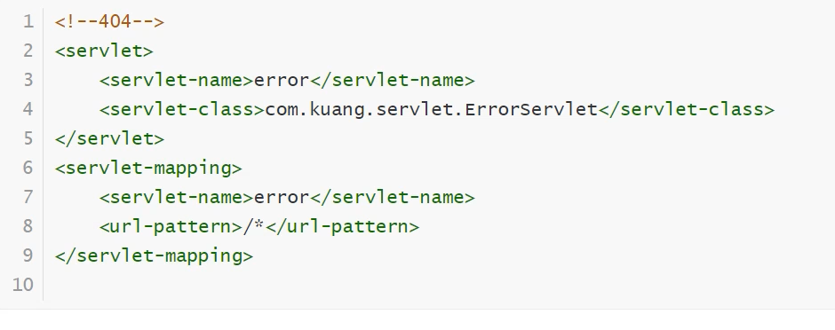
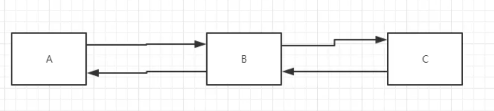
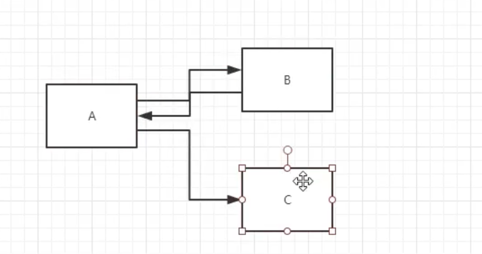
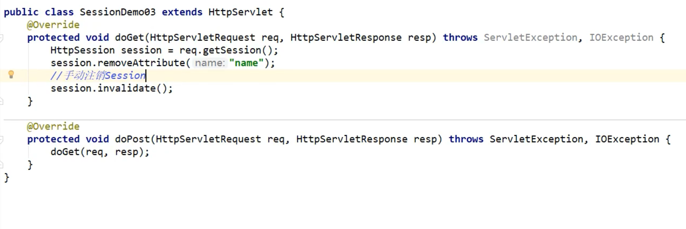

# Java Web


## 一. Java Web简介

### 1.1 胖客户端与瘦客户端

- 胖客户端

  ```bash
  指一个程序运行时需要一个单独的客户端程序支持, 例如登录QQ需要一个客户端程序.
  
  ## "远古时代"的Applet技术就是运行在客户端的程序, 在客户端完成动态代码的开发很复杂, 现在使用的可在客户端实现动态效果的JavaScript也是只完成一些简单的表单验证功能实现
  
  ```

- 瘦客户端

  ```
  不需要任何其他程序的安装, 直接使用即可,比如网上论坛, 只需要一个浏览器即可使用
  ```

### 1.2 动态Web与静态Web

#### 1.2.1 两者本质区别

```
静态Web无法进行数据库操作, 动态Web可以进行数据库操作
```

#### 1.2.2 动态Web流程图


```
Web容器会采用拼凑代码(主要时HTML)的形式动态生成数据并通过Web服务器发挥给客户端浏览器
```

#### 1.2.3 实现动态Web

- CGI (Common Gateway interface, 公共网关接口)
  ```
  多进程机制处理, 效率低
  ```

- PHP (Hypertext Preprocessor, 超文本预处理)

  ```
  服务器端嵌入式脚本语言, 只能运行在Apache服务器下, 且在使用MySQL数据库时才可以达到性能的最大发挥
  
  # 适合个人或小型项目开发
  ```

- ASP (Active Server Pages, 动态服务页)

  ```
  只能运行在IIS(Internet Information Services)服务器上, 在SQL Server数据库上才可以得到最大的发挥
  
  # 不适合Java开发
  ```

- ASP.NET

  ```
  基于.NET框架, 可选择自己喜欢的语言开发, 微软产品, 受限于平台, 往往用于中型项目的开发
  ```

- JSP (Java Server Page, Jave服务页)

  ```
  不受操作系统或平台制约
  服务器支持: Tomcat, WebLogic, JBoss, Websphere
  ```

### 1.3 企业开发架构

```
程序运行在中间件上, 并且通过中间件进行数据库的操作, 而具体一些的相关处理, 如事物/安全完全由中间件负责
```


### 1.4 Java EE架构

> Java EE架构只是工作在中间层的一种组件


#### 1.4.1 Java EE容器

> 各容器负责处理各自的程序, 互相之间没有任何影响, 而如果需要运行Web程序, 一定要有Web容器的支持

- Applet Container
- Application Client Container
- Web Container
- EJB Container

#### 1.4.2 Jave EE 组件

- EJB组件本身提供一个业务中心, 属于分布式开发的范畴

#### 1.4.3 Jave EE服务(了解即可, 需要用时再研究)

> 现阶段需要知道: JNDI, JAXP, JSTL等


### 1.5 Java EE核心设计模式

- MVC (Mode-View-Controller)设计模式

  ```
  用户一旦发出请求之后会将所有请求交给控制层处理, 由控制层调用模型层中的模型组件, 并通过这些组件进行持久层的访问, 再将所有结果都保存在JavaBean(Java类)中, 最终由JSP和JavaBean一起完成页面的显示.
  
  # EJB技术不一定会使用
  ```

  


### 1.6 Struts框架

> Struts框架主要作用在Web层上, 使用框架前, 应该熟练使用标准MVC进行项目的开发


## 二. HTML

### 2.1 URL与HTTP

#### 2.1.1 URL

```
URL(Uniform Resource Locator, 统一资源定位符)
```

#### 2.1.2 HTTP

```
HTTP协议(Hypertext Transfer Protocol, 超文本传输协议), 客户端请求与回应的标准协议, 输入地址与端口号即可获取服务器上的网页信息
```

### 2.2 编写HTML

#### 2.2.1 表格与文本显示效果

```
元素属性的属性值需要用""括起来
```

```html
<html>
    <head>
        <title>ll</title>
    </head>
    <body>
        <center>
        	<table border="1" width="80%">
                <tr>
                	<td colspan="6">
                    	<font size="15">字体显示</font>
                    </td>
                    <td rowspan="2">
                    	
                    </td>
                </tr>
                <tr>
                	<td><b>粗体</b></td>
                    <td><i>斜体</i></td>
                    <td><u>下划线</u></td>
                    <td><s>中划线</s></td>
                    <td>90<sup>o</sup></td>
                    <td>H<sub>2</sub>O</td>
                </tr>
            </table>
        </center>
    </body>
</html>
```

        <center>
        	<table border="1" width="80%">
                <tr>
                	<td colspan="6">
                    	<font size="15">字体显示</font>
                    </td>
                    <td rowspan="2">
                    	
                    </td>
                </tr>
                <tr>
                	<td><b>粗体</b></td>
                    <td><i>斜体</i></td>
                    <td><u>下划线</u></td>
                    <td><s>中划线</s></td>
                    <td>90<sup>o</sup></td>
                    <td>H<sub>2</sub>O</td>
                </tr>
            </table>
        </center>
#### 2.2.2 表单

```html
<html>
    <head>
        <title>ll</title>
    </head>
    <body>
        <form action="" method="post">
            <input type="text" name="userid" value="NO." size="2" maxlength="2"><br>
            <input type="text" name="username" value="请输入用户名"><br>
            <input type="password" name="userpass" value="请输入密码"><br>
            <input type="radio" name="sex" value="男" checked>男
            <input type="radio" name="sex" value="女">女<br>
            <select name="dept">
                <option value="技术部">技术部</option>
                <option value="销售部">销售部</option>
                <option value="财务部">财务部</option>
            </select><br>
            <input type="checkbox" name="inst" value="唱歌">唱歌
            <input type="checkbox" name="inst" value="游泳">游泳
            <input type="checkbox" name="inst" value="跳舞">跳舞
            <input type="checkbox" name="inst" value="编程" checked>编程
            <input type="checkbox" name="inst" value="上网">上网<br>
            <textarea name="note" cols="30" rows="3">请输入文本描述</textarea><br>
            <input type="submit" value="提交">
            <input type="reset" value="重置">
        </form>
    </body>
</html>
```

  <form action="" method="post">
            <input type="text" name="userid" value="NO." size="2" maxlength="2"><br>
            <input type="text" name="username" value="请输入用户名"><br>
            <input type="password" name="userpass" value="请输入密码"><br>
            <input type="radio" name="sex" value="男" checked>男
            <input type="radio" name="sex" value="女">女<br>
            <select name="dept">
                <option value="技术部">技术部</option>
                <option value="销售部">销售部</option>
                <option value="财务部">财务部</option>
            </select><br>
            <input type="checkbox" name="inst" value="唱歌">唱歌
            <input type="checkbox" name="inst" value="游泳">游泳
            <input type="checkbox" name="inst" value="跳舞">跳舞
            <input type="checkbox" name="inst" value="编程" checked>编程
            <input type="checkbox" name="inst" value="上网">上网<br>
            <textarea name="note" cols="30" rows="3">请输入文本描述</textarea><br>
            <input type="submit" value="提交">
            <input type="reset" value="重置">
        </form>

## 三. JavaScript 

> 基于对象(Object)和事件驱动(Event Driven)并具有安全性能的脚本语言, 嵌入在HTML语言中

### 3.1 

```html
<html>
   	<head>
        <title>ll</title>
        <script language="JavaScript">
            document.write("<h1>hello world</h1>");
    		alert("Hello World!!!");
    	</script>
    </head>
    <body>
        
    </body>
</html>
```

### 3.2 html导入*.js文件

1. hello.js

   ```js
   alert("Hello World");
   ```

2. hello.html

   ```html
   <html>
       <head>
           <title>ll</title>
           <script language="JavaScript" src="hello.js">
           </script>
       </head>
   </html>
   ```

### 3.3  顺序, 分支, 循环

> 语法与, Java一致, 字符串之间的比较不同, JavaScript字符串比较之间用"=="比较即可

### 3.4 函数

#### 3.4.1 如何定义

```js
function  functionName(param1, param2,...){
    [return returnValue];
}
```

1. 无需声明返回值

2. 参数类型不需要声明

### 3.5 数组

```js
function fun(){
    var arr = new array(3);
    var arr = new array("MLDN", "MLDNJAVA", "LiXingHua");
    var str = "字符串内容";
}
```

### 3.6 事件处理

#### 3.6.1 窗口事件(Window Event)

- onload : 文档载入时执行脚本 (body, frameset)

- onunload: 文档下载时执行脚本(body, frameset)

  ```html
  <html>
      <head>
          <title>ll</title>
          <script language="JavaScript">
          	function hello(){
                  alert("hello");
  			}
              function byebye(){
  				alert("byebye");
              }
          </script>
      </head>
       <body onload="hello()" onunload="byebye()">
              
          </body>
  </html>
  ```

#### 3.6.2 鼠标事件

- onclick

  ```html
  配合button
  <input type="button" value="显示" onClick="show()">
  ```

  ```html
  <html>
      <head>
          <title>ll</title>
          <script language="JavaScript">
          	function fun(){
                  alert("hello");
              }
          </script>
      </head>
      
      <body>
          <h3>
              <a href="#" onClick="fun()">press</a>
          </h3>
      </body>
  </html>
  ```

#### 3.6.3 onSubmit

> 1. 只能在<form>元素中使用
> 2. 需要使用return来接收函数的返回值, false不能提交, true可以提交
> 3. this在<form>元素上, 就是代表整个表达元素对象, 使用"this."可以访问表单内部元素, 其他元素同理
> 4. "document.formName." 可以访问表单的元素, 单选按钮, 复选框需采用数组操作, 如documetn.formName.sex[0]

1.  validate.js

   ```js
   function validate(f){
       var value = f.email.value;
       if (! /^\w+@\w+.\w+$/.test(value)){
           alert("EMAIL格式不正确!");
           f.email.focus();
           f.email.select();
           return false;
       }
       return true;
   }
   ```

2. validate.html

   ```html
   <html>
       <head>
           <title>ll</title>
           <script language="JavaScript" src="validate.js">
   
           </script>
       </head>
       <body>
           <form action="" method="post" onSubmit="return validate(this)">
               <input type="text" name="email">
               <input type="submit" value="提交">
           </form>
       </body>
   </html>
   ```

3. document.

   > 表单名为myform, sex为单选框名, inst为复选框名

   ```js
   function show(){
       var sex;
       if (document.myform.sex[0].checked){
           sex = document.myform.sex[0].value;
       } else{
           sex = document.myform.sex[2].value;
       }
       var inst = "";
       for (i = 0; i < document.myform.inst.length; i++){
   		if (document.myform.inst[i].checked){
   			inst += document.myform.inst[i].value + ", ";
           }
       }
   }
   ```

#### 3.6.4 onChange

- onChange

  ```html
  <!--配合下拉列表-->
  <select name="dept" onChange= "show(this.value)">
      
  </select>
  <input type="text" name="result" value="">
  ```

  show.js

  ```js
  function show(val){
      document.myform.result.value=val;
  }
  ```

### 3.7 使用正则表达式

```js
/正则表达式/.test(验证的内容)
```

### 3.8 window对象

#### 3.8.1 open()

> 新开一个窗口, 该窗口打开了指定的url

```js
function fun(thisurl){
    window.open(thisurl, "页面标题", "width=470, height=150, scrollbars=yes, resizable=no");
}
```

#### 3.8.2 confirm()

> 弹出一个确认框, 返回一个boolean值

```js
function fun(){
    if (window.confirm("确认删除?")){
        alert("已删除");
    }else{
        alert("未删除");
    }
}
```

#### 3.8.3 重定向 location

> 跳转到指定页面

```js
function fun(thisurl){
    window.location=thisurl;
}
```

#### 3.8.4 close()

> 关闭窗口

```js
function closeWin(){
    window.close();
}
```

#### 3.8.5 opener

```js
function closeWin(){
    window.close();
}
// window.opener就是访问父窗口
window.opener.location.reload();
// 获取窗口可以访问父窗口的元素
var doc = window.opener.document;
doc.parentform.result.value=city;
```

## 4. XML


### 4.1 XML的特性

#### 4.1.1 组成

- 前导区

  ```bash
  规定XML页面的一些属性
  version: XML版本
  encoding: 页面使用的编码
  standalone: 此XML文件是否独立运行, 如果需要进行显示可以使用CSS或XSL(与XPath结合使用)控制
  
  ## 这三个属性必须按照固定的顺序写: version, encoding, standalone
  ```

- 数据区

  ```
  1. 必须有一个根元素
  2. 一个根元素可以放多个子元素
  3. 每一个元素必须完结
  ```

#### 4.1.2 XML引入CSS

attrib.css

```css
name
{
    display:block;
    color:blue;
    font-size:20pt;
    font-weight:bold;}
id,company,email,tel,site
{
    display:block;
    color:black;
    font-size:14pt;
    font-weight:normal;
    font-style:italic;
}
```

xml_demo_03.xml

```xml
<?xml version="1.0" encoding="utf-8" standalone="no"?>
<?xml-stylesheet type="text/css" href="attrib.css"?>
<addresslist>
    <linkman>
        <name>李兴华</name>
        <id>001</id>
        <company>魔乐科技</company>
        <email>mldnqa@163.com</email>
        <tel>(010)51283346</tel>
        <site>www.MLDNJAVA.cn</site>
    </linkman>
</addresslist>
```

#### 4.1.3 元素还是属性

> 1. 如果需要显示或者为了解析方便, 那么使用元素会更好, 属性是无法显示的

#### 4.1.4  实体参照表

| 实体参照 | 对应字符 |
| -------- | -------- |
| \&amp;   | \&       |
| \&lt;    | <        |
| \&gt;    | >        |
| \&quot;  | "        |
| \&apos;  | '        |

#### 4.1.5 CDATA

- 格式语法

  ```
  <![CDATA[ 不解析的内容 ]]>
  ```

#### 4.1.6 DTD/Schema

```
现在的XML文件的内容都是任意的定义的, 如果要对一个XML文件中经常出现的元素或属性进行严格定义, 需要使用DTD和Schema技术
```


### 4.2 DOM解析

> DOM(Document Object Model, 文档对象模型)

#### 4.2.1特点

1. 随机访问

2. DOM树放在了内存中

   ```
   如果文档较大或结构比较复杂, 对内存的需求就比较高, 结构复杂树的遍历也是一项耗时的操作, 对机器的性能要求较高, 程序的效率并不十分理想.
   ```

#### 4.2.2 核心操作接口

- **Document**

  > 提供了对文档中数据进行访问和操作的入口

  1. 取得指定节点名称的NodeList

     ```java
     public NodeList getElementByTagName(String tagname);
     ```

  2. 创建一个指定名称的节点

     ```java
     public Element createElement(String tagName) throws DOMException;
     ```

  3. 创建一个文本内容节点

     ```java
     public Text createTextNode(String data)
     ```

  4. 创建一个属性

     ```java
     public Attr createAttribute(String name) throws DOMException;
     ```

- **Node**

  > 每一个Node接口代表了DOM树的一个节点

  

  1. 在当前节点下增加一个新节点

     ```java
     Node appendChild(Node newChild) throws DOMException;
     ```

  2. 取得本节点下的全部字节点

     ```java
     public NodeList getChildNodes();
     ```

  3. 取得本节点下的第一个子节点

     ```java
     public Node getFirstChild();
     ```

  4. 取得本节点下的最后一个字节点

     ```java
     public Node getLastChild();
     ```

  5. 判断本节点下是否还有其他节点

     ```java
     public boolean hasChildNodes();
     ```

  6. 判断是否还有其他属性

     ```java
     public boolean hasAtrributes();
     ```

  7. 取得节点内容

     ```java
     String getNodeValue() throws DOMException;
     ```

- **NodeList**

  > 表示一个节点的集合, 一般用于表示有顺序关系的一组节点

  1. 取得节点的个数

     ```java
     public int getLength();
     ```

  2. 根据索引取得节点对象

     ```java
     public Node item(int index);
     ```

- **NamedNodeMap**

  > 表示一组节点和其唯一名称的一一对应关系, 主要用于属性节点的表示

#### 4.2.3  DOM解析读操作

> 哪一个知识点和这特别像???

1. 建立DocumentBuilderFactory

   ```java
   DocumentBuilderFactory factory = DocumentBuilder Factory.newInstance();
   ```

2. 建立DocumentBuilder

   ```java
   DocumentBuilder builder = factory.newDocumentBuilder();
   ```

3. 建立Document

   ```java
   Document doc = builder.parse("要读取的文件路径");
   ```

4. 建立NodeList

   ```java
   NodeList nl = doc.getElementByTagName("读取节点");
   ```

5. 进行XML信息读取

   - **为什么要把NodeList中的获取的Node向下转型为Element?**

   

#### 4.2.4 DOM解析写操作

1. 取得一个TransformerFactory对象

   ```java
   TransformerFactory tf = TransformFactory.newInstance();
   ```

2. 取得一个Transformer对象并设置编码

   ```java
   Transformer t = tf.newTransformer();
   ```

   ```java
   t.setOutputProperty(OutputKeys.ENCODING, "utf-8");
   ```

3. 取得一个DOMSource对象

   ```java
   # 4.3.3 获取document实例化对象, 第三步可改为
   Document doc = builder.newDocument();来获取空白Document对象, 
   此对象用于DOMSource的构造参数
   ```

   ```java
   DOMSource source = new DOMSource(doc);
   ```

4. 指定输出流对象

   ```java
   public StreamResult(File f);
   public StreamResult(OutputStream outputStream);
   ```

5. 将XML写入指定的输出流

   ```java
   t.transform(source, result);
   ```


### 4.3 SAX解析

> Simple APIs for XML

#### 4.3.1 特点

1. 顺序模式访问, 可以快速读取XML, 操作时会触发一系列的事件

   

2. 主要事件

   - 文档开始

     ```java
     public void startDocument() throws SAXException;
     ```

   - 文档结束

     ```java
     public void endDocument() throws SAXException;
     ```

   - 元素开始

     > 可以取得元素的名称及元素的全部属性

     ```java
     public void startElement(String uri, String localName, String qName, Attributes attributes) throws SAXException;
     ```

   - 元素结束

     > 可以取得元素的名称及元素的全部属性

     ```java
     public void endElement(String uri, String localName, String qName) throws SAXException;
     ```

   - 元素内容

     ```java
     public void characters(char[] ch, int start, int length)throws SAXException;
     ```

#### 4.3.2 编写SAX解析器

> 该类需要继承DefaultHandler类


#### 4.3.3 解析XML文件

1. 建立SAX解析工厂

   ```java
   SAXParserFactory factory = SAXParserFactory.newInstance();
   ```

2. 构造解析器

   ```java
   SAXParser parser = factory.newSAXParser();
   ```

3. 指定需要解析的XML文件和SAX解析器

   ```java
   parser.parse("XML file path", new MySAX())
   ```

   

### 4.4  DOM与SAX解析的区别

> 1. DOM适合对文件进行修改和随机存取, 不适合大型文件的操作
> 2. SAX适合处理大型文件, 可以建立自己的对象模型


### 4.5 JDOM

#### 4.5.1 主要操作类

1. Document

   > 定义了XML文件的各种操作

2. DOMBuilder

   > 用来建立JDOM结构树

3. Element

   > 定义了XML元素的各种操作

4. Attribute

   > 对元素中属性进行操作

5. XMLOutputter

   > 将一个JDOM结构树格式化为一个XML文件, 并指定输出对象

#### 4.5.2 使用JDOM生成XML文件


#### 4.5.2 使用JDOM读取XML文件

> SAX解析方式读取


### 4.6 DOM4J

#### 4.6.1 主要接口

| 接口          | 描述                                                        |
| ------------- | ----------------------------------------------------------- |
| Attribute     | 定义了XML属性                                               |
| Branch        | 为了包含字节点的节点, 如XML元素和文档 ,定义了一个公共的行为 |
| CDATA         | 定义了XML CDATA区域                                         |
| CharacterData | 标识接口, 标识基于字符的节点, 如CDATA, Comment,  Text       |
| Comment       | 定义了XML的注释                                             |
| Document      | 定义了XML文档                                               |
| Element       | 定义了XML元素                                               |
| Text          | 定义了XML文本节点                                           |

#### 4.6.2 DOM4J 生成XML文件


#### 4.6.3 DOM4J解析XML文件


### 4.7 JavaScript操作DOM

#### 4.7.1 取得HTML元素并设置显示内容


#### 4.7.2 通过DOM生成下拉列表框


#### 4.7.3 JS动态操作表格

1. 增加新的表格行

   ```java
   insertRow();
   ```

2. 删除行中指定的单元格

   ```java
   deleteCell();
   ```

3. 在一行中的指定位置插入一个空的\<td>元素

   ```java
   insertCell();
   ```

   - **使用JS提供方法进行表格操作**

   

   - **表格的DOM树**


- **使用DOM提供的方法进行表格操作**


## Tomcat

### Web容器

> 1. html, htm之类的一般属于静态请求, jsp, php之类的一般是动态请求
> 2. 静态请求的所以代码都是固定的, 而动态请求的所有代码都是拼凑而成的


### Tomcat

#### 主要目录的作用


## servlet

### servlet简介

- Servlet是sun公司开发动态web的一门技术
- Sun在这些API中提供一个接口叫做Servlet, 如果你想开发一个Servlet程序, 只需要完成两个小步骤:
  - 编写一个类, 实现Servlet接口
  - 把开发好的Java类部署到web服务器中
- 把实现了Servlet接口的java程序叫做Servlet


### Maven父子工程

父项目中会有

```xml
<modules>
	<module>servlet-01</module>
</modules>
```

子项目中会有

```xml
<parent>
	<artifactId>javaweb-02-servlet</artifactId>
    <groupId>com.liaolong</groupId>
    <version>1.0-SNAPSHOT</version>
</parent>
```

父项目中的java子项目可以直接使用

- 比如夫项目中的jar包, 子项目可以直接使用不需要再导入


### Servlet几个主要的几个类或接口的继承父子关系

注意到只有再HttpServlet类中真正定义了具体的service方法


### 编写简单的HelloServlet程序

1.Servlet  java程序

```java
package com.liaolong.servlet;

import javax.servlet.ServletException;
import javax.servlet.ServletInputStream;
import javax.servlet.ServletOutputStream;
import javax.servlet.http.HttpServlet;
import javax.servlet.http.HttpServletRequest;
import javax.servlet.http.HttpServletResponse;
import java.io.IOException;
import java.io.PrintWriter;

/**
 * @author coderliaolong@outlook.com
 * @date 2021/3/5 20:40
 */
public class HelloServlet extends HttpServlet {

    // 由于get或者post只是请求实现的方式不同, 可以互相调用, 业务逻辑都一样
    @Override
    protected void doGet(HttpServletRequest req, HttpServletResponse resp) throws ServletException, IOException {

        ServletInputStream inputStream = req.getInputStream();
        // ServletOutputStream outputStream = resp.getOutputStream();
        PrintWriter writer = resp.getWriter();

        writer.print("Hello, Servlet!");

    }

    @Override
    protected void doPost(HttpServletRequest req, HttpServletResponse resp) throws ServletException, IOException {
        doGet(req, resp);
    }
}
```

2.编写servlet映射 

```
我们写的是Java程序, 但是有通过浏览器访问, 而浏览器需要连接web服务器, 所以我们需要在web服务器中注册我们写的Servlet
```


### Servlet原理

servlet 由web容器调用, 可以实现, web服务器在收到浏览器请求后, 会如下图所示


### Mapping问题

1. 一个Servlet可以指定一个映射路径

   ```xml
   <servlet-mapping>
   	<servlet-name>hello</servlet-name>
   	<url-pattern>/he1lo</url-pattern>
   </servlet-mapping>
   ```

2. 一个Servlet可以指定多个映射路径

   ```xml
   <servlet-mapping>
   	<servlet-name>he1lo</servlet-name>
   	<ur1-pattern>/he1lo</url-pattern>
   </servlet-mapping>
   <servlet-mapping>
   	<servlet-name>he1lo</servlet-name>
   	<url-pattern>/hel1o2</url-pattern>
   </servlet-mapping>
   <servlet-mapping>
   	<servlet-name>he1lo</servlet-name>
   	<url-pattern>/he11o3</url-pattern>
   </servlet-mapping>
   <servlet-mapping>
   	<servlet-name>he1lo</servlet-name>
   	<ur1-pattern>/he11o4</ur1-pattern>
   </servlet-mapping>
   <servlet-mapping>
   	<servlet-name>he1lo</servlet-name>
   	<ur1-pattern>/he1lo5</url-pattern>
   </servlet-mapping>
   ```

3. 指定默认的映射路径

   ```xml
   <servlet-mapping>
   	<servlet-name>he1lo</servlet-name>
   	<ur1-pattern>/*</url-pattern>
   </servlet-mapping>
   ```

4. 一个Servlet可以指定通用路径

   ```xml
   <servlet-mapping>
   	<servlet-name>he1lo</servlet-name>
   	<url-pattern>/hello/*</url-pattern>
   </servlet-mapping>
   ```

5. 指定一些后缀或者前缀

   ```xml
   <!--可以自定义后缀实现请求映射
   	注意点，*前面不能加项目映射的路径
   	he11o/sajdlkajda.qinjiang
        -->
   <servlet-mapping>
   	<servlet-name>hello</servlet-name>
   	<url-pattern>*.qinjiang</url-pattern>
   </servlet-mapping>
   ```

6. 优先级问题

   指定了固有的映射路径优先级最高, 如果找不到就会走默认的处理请求

   

### ServletContext

#### 1. 获取上下文


web容器在启动的时候, 他会为每一个web程序都创建一个对应的ServletContext对象, 它代表了当前的web应用

```java
public class HelloServlet extends HttpServlet {
    @Override
    protected void doGet(HttpServletRequest req, HttpServletResponse resp) throws ServletException, IOException {
        // this.getInitParameter()   获取初始化参数
        // this.getServletConfig()   获取Servlet配置
        // this.getServletContext()  获取上下文
        ServletContext context = this.getServletContext();

        String username = "liaolong"; 
        // 将数据保存在了ServletContext中, 名字为username, 值是liaolong
        context.setAttribute("username", username); 
    }

    @Override
    protected void doPost(HttpServletRequest req, HttpServletResponse resp) throws ServletException, IOException {
        doGet(req, resp);
    }
}
```

```java
public class GetContextServlet extends HttpServlet {
    @Override
    protected void doGet(HttpServletRequest req, HttpServletResponse resp) throws ServletException, IOException {
        ServletContext context = this.getServletContext();
        String username = (String) context.getAttribute("username");

        resp.setContentType("text/html");
        resp.setCharacterEncoding("utf-8");
        resp.getWriter().print("名字:" + username);
    }

    @Override
    protected void doPost(HttpServletRequest req, HttpServletResponse resp) throws ServletException, IOException {
        doGet(req, resp);
    }
}
```


#### 2. 获取初始化参数

配置一些web应用初始化参数

```xml
<context-param>
	<param-name>url</param-name>
    <param-value>jdbc:mysql://localhost:3306/mybatis</param-value>
</context-param>
```

获取该配置参数

```java
public class getInitParamByContext extends HttpServlet {
    @Override
    protected void doGet(HttpServletRequest req, HttpServletResponse resp) throws ServletException, IOException {
        ServletContext servletContext = this.getServletContext();
        String url = servletContext.getInitParameter("url");
        resp.getWriter().print(url);
    }

    @Override
    protected void doPost(HttpServletRequest req, HttpServletResponse resp) throws ServletException, IOException {
        doGet(req, resp);
    }
}
```

#### 3. 请求转发

```
A向B发出请求, B把该请求转发给C, C返回一个响应给B, b再给A, 这一过程url不会改变, 是服务器端跳转
```




```java

```


#### 读取资源文件

Properties

- 在Java目录下新建properties

- 在resources目录下新建properties

  都被打包到了同一路径下: classes, 这个路径称为classpath

```java
public class ReadProperties extends HttpServlet {
    @Override
    protected void doGet(HttpServletRequest req, HttpServletResponse resp) throws ServletException, IOException {
        Properties properties = new Properties();
        InputStream readProp = this.getServletContext().getResourceAsStream("/WEB-INF/classes/test.properties");
        properties.load(readProp);

        String username = properties.getProperty("username");
        String url = properties.getProperty("url");

        resp.getWriter().print("username:" + username);
        resp.getWriter().print("url:" + url);

    }

    @Override
    protected void doPost(HttpServletRequest req, HttpServletResponse resp) throws ServletException, IOException {
        doGet(req, resp);
    }
}
```


### HttpServletResponse

#### 响应状态码

```
200:  请求响应成功  200

3xx:  请求重定向

4xx:  找不到资源 404

5xx:  服务器代码错误  500     网关错误:  502
```

#### 向浏览器输出消息

#### 下载文件

1. 需要获取下载文件的路径
2. 下载的文件名是啥
3. 设置想办法让浏览器能够支持下载我们需要的东西
4. 获取下载文件的输入流
5. 创建缓冲区
6. 获取OutputStream对象
7. FileOutputStram流写入到buffer缓冲区
8. 使用OutputStream将缓冲区的数据输出到客户端

```java
public class DownServlet extends HttpServlet {
    @Override
    protected void doGet(HttpServletRequest req, HttpServletResponse resp) throws ServletException, IOException {
        // 1. 获取文件下载路径
        String realPath = "D:\\MyWorkspace\\javaweb01maven02\\ServletResponse\\target\\classes\\coffee.png";
        // 2. 下载的文件名是什么
        String fileName = realPath.substring(realPath.lastIndexOf("\\") + 1);
        // 3. 让浏览器能够支持下载我们需要的东西, 中文文件名需要URLEncoder.encode编码, 否则可能乱码
        resp.setHeader("content-Disposition", "attachment;filename=" + URLEncoder.encode(fileName, "utf-8"));
        // 4. 获取下载文件的输入流
        FileInputStream in = new FileInputStream(realPath);
        // 5. 创建缓冲区
        int len = 0;
        byte[] buffer = new byte[1024];
        // 6. 获取OutputStream对象
        ServletOutputStream out = resp.getOutputStream();
        // 7. 将FileOutputStream流写入到buffer缓冲区, 使用OutputStream将缓冲区中的数据输出到客户端
        while ((len = in.read(buffer)) != -1){
            out.write(buffer, 0, len);
        }

        in.close();
        out.close();

    }

    @Override
    protected void doPost(HttpServletRequest req, HttpServletResponse resp) throws ServletException, IOException {
        doGet(req, resp);
    }
}

```

#### 验证码

```java
public class VerificationCodeServlet extends HttpServlet {
    @Override
    protected void doGet(HttpServletRequest req, HttpServletResponse resp) throws ServletException, IOException {
        // 让浏览器三秒刷新一次
        resp.setHeader("refresh", "3");

        // 在内存中创建一个图片
        BufferedImage image = new BufferedImage(80, 20, BufferedImage.TYPE_INT_RGB);
        // 得到图片
        Graphics2D g =(Graphics2D) image.getGraphics();// 画笔
        // 设置图片的背景颜色
        g.setColor(Color.white);
        g.fillRect(0, 0, 80, 20);
        // 给图片写数据
        g.setColor(Color.BLUE);
        g.setFont(new Font(null, Font.BOLD, 20));
        g.drawString(makeNum(), 0, 20);

        // 告诉浏览器, 这个请求用图片的方式打开
        resp.setContentType("image/jpeg");
        // 网站存在缓存, 不让浏览器缓存
        resp.setDateHeader("expires", -1);
        resp.setHeader("Cache-Control", "no-cache");
        resp.setHeader("Pragma", "no-cache");

        // 把图片写给浏览器
        ImageIO.write(image, "jpeg", resp.getOutputStream());
    }

    private String makeNum() {
        Random random = new Random();
        String name = random.nextInt(10) + "";
        StringBuffer sb = new StringBuffer();
        for (int i = 0; i < 2 - name.length(); i++) {
            sb.append("0");
        }
        return sb.append(name).toString();
    }

    @Override
    protected void doPost(HttpServletRequest req, HttpServletResponse resp) throws ServletException, IOException {
        doGet(req, resp);
    }
}

```

#### 重定向

> B是一个web资源, 收到客户端A的请求后, B会通知A客户端去访问另外一个Web资源C, 这个过程叫做重定向




常见场景

- 用户登录

  ```java
  void sendRedirect(String var1) throws IOException;
  ```

测试

```java
public class RedirectServlet extends HttpServlet {
    @Override
    protected void doGet(HttpServletRequest req, HttpServletResponse resp) throws ServletException, IOException {
        resp.setHeader("Location", "/liaolong/vertify");
        resp.sendRedirect("/liaolong/vertify");
    }

    @Override
    protected void doPost(HttpServletRequest req, HttpServletResponse resp) throws ServletException, IOException {
        doGet(req, resp);
    }
}
```

#### 请你聊聊重定向和转发的区别

相同点

- 页面都会发生跳转

不同点

- 请求转发时, url地址不会发生改变, 属于服务器端跳转  307
- 重定向时, url地址会发生改变, 属于客户端跳转  302


### HttpServletRequest

#### 获取前端传递的参数, 并请求转发

```
getParameter()
```

```
getParameterValues()
```

index.jsp

```jsp
<%@ page contentType="text/html;charset=UTF-8" language="java" %>
<html>
<head>
    <title>baidu</title>
</head>
<body>
<div style="text-align: center">
    <form action="${pageContext.request.contextPath}/getparam" method="post">
        username:<input type="text" name="username"> <br />
        password:<input type="password" name="password"> <br />
        hobby: <input type="checkbox" name="hobbys" value="唱歌">唱歌
        <input type="checkbox" name="hobbys" value="跳舞">跳舞
        <input type="checkbox" name="hobbys" value="编程">编程<br />

        <input type="submit" value="登录">
        <input type="reset" value="重置">

    </form>
</div>

</body>
</html>
```

getparam  servlet  java

```java
public class GetParam extends HttpServlet {
    @Override
    protected void doGet(HttpServletRequest req, HttpServletResponse resp) throws ServletException, IOException {
        req.setCharacterEncoding("utf-8");
        resp.setCharacterEncoding("utf-8");

        String username = req.getParameter("username");
        String password = req.getParameter("password");
        String[] hobbys = req.getParameterValues("hobbys");

        System.out.println(Arrays.toString(hobbys));

        // req.getRequestDispatcher("/success.jsp").forward(req,resp);
        //System.out.println(req.getContextPath());
        req.getRequestDispatcher( "/success.jsp").forward(req, resp);

    }

    @Override
    protected void doPost(HttpServletRequest req, HttpServletResponse resp) throws ServletException, IOException {
        doGet(req, resp);
    }
}
```

success.jsp

```jsp
<%@ page contentType="text/html;charset=UTF-8" language="java" %>
<html>
<head>
    <title>success</title>
</head>
<body>
<h1>Success</h1>
</body>
</html>
```


### Cookie


#### 会话

**会话**: 用户打开一个浏览器, 点击了很多链接, 访问多个web资源, 关闭浏览器, 这个过程可以称之为一次会话

**有状态会话:**

- 一个网站怎么证明你来过

  1. 服务端给客户端发送cookie, 保存在客户端
  2. 服务端给客户端一个标记, 保存用户会话信息

  

  

  

#### 保存会会话的两种技术

cookie:

- 客户端技术  (响应, 请求)

session:

- 服务器技术, 利用这个技术, 可以保存用户的会话信息, 我们可以把信息或数据放在session中


```java
public class LoginTimeServlet extends HttpServlet {
    @Override
    protected void doGet(HttpServletRequest req, HttpServletResponse resp) throws ServletException, IOException {
        req.setCharacterEncoding("utf-8");
        resp.setCharacterEncoding("utf-8");
        resp.setContentType("text/html;charset=utf8");

        PrintWriter out = resp.getWriter();
        // 从客户端获取cookie
        Cookie[] cookies = req.getCookies();

        // 判断Cookie是否存在
        if (cookies != null){
            out.print("你上一次访问时间是:");

            for (int i = 0; i < cookies.length; i++) {
                if (cookies[i].getName().equals("lastLoginTime")){
                    // long lastLoginTime = Long.parseLong(URLDecoder.Decode(cookies[i].getValue(), "utf-8");
                    long lastLoginTime = Long.parseLong(cookies[i].getValue());
                    Date date = new Date(lastLoginTime);
                    out.write(date.toLocaleString());
                }
            }
        }else {
            out.print("这是您第一次访问本站");
        }

        // 服务器端给客户端响应一个cookie, 并编码
        // Cookie cookie = new Cookie("name", URLEncoder.encode("廖龙", "utf-8"));
        Cookie cookie = new Cookie("lastLoginTime", System.currentTimeMillis()+"");

        cookie.setMaxAge(60);

        resp.addCookie(cookie);

    }

    @Override
    protected void doPost(HttpServletRequest req, HttpServletResponse resp) throws ServletException, IOException {
       doGet(req, resp);
    }
}
```


#### cookie细节

- 一个Cookie只能保存一个信息
- 一个web站点可以给浏览器发送多个cookie, 最多存放20个cookie
- Cookie大小由限制: 4kb
- 300个cookie浏览器上限

如何删除coookie

- 不设置有效期, 关闭浏览器,自动失效
- 设置有效期时间为0

### 编码解码

```
URLEncoder.encode(编码内容, 编码表)
URLDecoder.decode(cookie.getValue(), "utf-8")
```


### Session


设置session属性

```java
public class SessionDemo extends HttpServlet {
    @Override
    protected void doGet(HttpServletRequest req, HttpServletResponse resp) throws ServletException, IOException {
        req.setCharacterEncoding("utf-8");
        resp.setCharacterEncoding("utf-8");
        resp.setContentType("text/html; charset=utf8");

        // 获取session
        HttpSession session = req.getSession();

        // 给Session中存东西
        session.setAttribute("name", "廖龙");

        // 获取Sessiond的ID
        String sessionId = session.getId();

        // 判断session是否已经创建
        if (session.isNew()){
            resp.getWriter().write("session创建成功, id:" + sessionId);
        }else{
            resp.getWriter().write("session已经在服务器中存在了, id:" + sessionId);

        }

    }

    @Override
    protected void doPost(HttpServletRequest req, HttpServletResponse resp) throws ServletException, IOException {
       doGet(req, resp);
    }
}
```


获取session

```java
public class SessionDemo2 extends HttpServlet {
    @Override
    protected void doGet(HttpServletRequest req, HttpServletResponse resp) throws ServletException, IOException {

        req.setCharacterEncoding("utf-8");
        resp.setCharacterEncoding("utf-8");
        resp.setContentType("utf-8");
        HttpSession session = req.getSession();

        String name = (String) session.getAttribute("name");

        System.out.println(name);

    }

    @Override
    protected void doPost(HttpServletRequest req, HttpServletResponse resp) throws ServletException, IOException {
        doGet(req, resp);
    }
```


注销session



#### session和cookie的区别

- Cookie是把用户的数据写给用户的浏览器, 浏览器保存
- Session吧用户1数据写到用户独占的Sessioin中, 服务器端保存, (保存重要的信息, 减少服务器资源的浪费)
- Session对象由服务创建


#### 设置Session默认失效时间

```xml
<session-config>
    <!-- 15分钟 -->
	<session-timeout>15</session-timeout>
</session-config>
```

