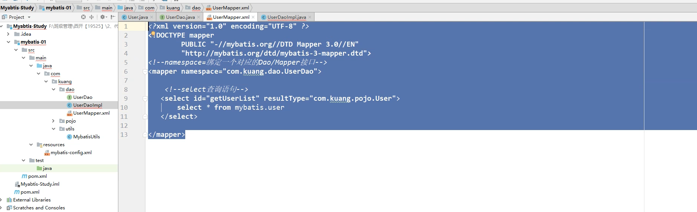
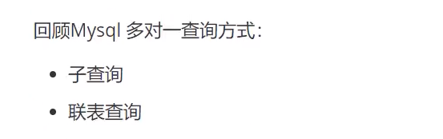

# Mybatis

### 什么是Mybatis


### 编写第一个Mybatis程序

**使用新技术的学习思路:** 搭建环境  --->  导入Mybatis  --> 编写代码  --->   测试

1.搭建环境


2.导入核心依赖


3.编写Mybatis核心配置文件


4.编写Mybatis工具类


5.User类, UserDAO接口

6.编写mapper.xml(替代UserDaoImpl类的繁琐的JDBC操作)



7.测试


 


### 万能的Map


### 模糊查询


### Mybatis配置


### Mapper映射配置


### 生命周期和作用域


### 实体类属性名与数据库字段名不一致的问题


### 日志


```properties
#将等级为DEBUG的日志信息输出到console和file这两个目的地，console和file的定义在下面的代码
log4j.rootLogger=DEBUG，console，file
#控制台输出的相关设置
log4j.appender.console=org.apache.log4j.ConsoleAppender
log4j.appender.console.Target=System.out
log4j.appender.console.Threshold=DEBUG
log4j.appender.console.layout=org.apache.log4j.PatternLayout
log4j.appender.console.layout.ConversionPattern=[%c]-%m%n
#文件输出的相关设置
log4j.appender.file=org.apache.log4j.RollingFileAppender
log4j.appender.file.File=./log/liaolong.log
log4j.appender.file.MaxFileSize=10mb
log4j.appender.file.Threshold=DEBUG
log4j.appender.file.layout=org.apache.log4j.PatternLayout
log4j.appender.file.layout.ConversionPattern=[%p][%d{yy-MM-dd}][%c]%m%n
#日志输出级别
log4j.logger.org.mybatis=DEBUG
log4j.logger.java.sql=DEBUG
log4j.logger.java.sql.statement=DEBUG
log4j.logger.java.sql.ResultSet=DEBUG
log4j.logger.java.sql.PreparedStatement=DEBUG
```

```properties
# Set root logger level to DEBUG and its only appender to A1.
log4j.rootLogger=DEBUG, A1

# A1 is set to be a ConsoleAppender.
log4j.appender.A1=org.apache.log4j.ConsoleAppender

# A1 uses PatternLayout.
log4j.appender.A1.layout=org.apache.log4j.PatternLayout
log4j.appender.A1.layout.ConversionPattern=%-4r [%t] %-5p %c %x - %m%n
```


1. 加载配置

   ```java
   BasicConfigurator.configure();
   ```

#### 简单使用


### 分页

> 分页是为了减少数据的处理量


#### RowBounds分页(了解即可)


### 使用注解开发


### Mybatis详细执行流程


### 注解实现增删改查

 


### 多对一


#### 查询方式一


#### 查询方式二





### 一对多


