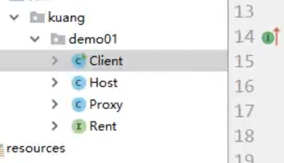

# Spring

## Spring的依赖注入和配置

DI(Dependency Injection)

IoC(Inversion of Control)


## Spring 4.0


## Spring 注解


## 使用JDBC, JPA, ORM提供Spring持久性支持


## Spring表达式语言

SpEL(Spring Expression Language)


## Spring 事物管理和AOP


## Spring MVC和开发REST风格的Web服务


## Spring Security


## Spring 缓存


## 狂神课程笔记

### spring简介

#### **核心**

```bash
Spring是一个`轻量级控制反转(IoC)`和面向切面(AOP)的容器框架
```

```bash
`Spring Boot`基本上是`Spring`框架的扩展，它消除了设置`Spring`应用程序所需的`XML配置`
```

#### **简介**

- 2002, 首次推出Spring框架的雏形 :  interface21 框架
- Spring框架以interface 21 为基础, 经过重新设计, 并不断丰富器内涵, 于2004年3月24日, 发布了1.0正式版
- Rod Johnson, Spring Framework创始人, 著名作者,  悉尼大学音乐学博士
- spring理念: 使现有的技术更加容易使用, 本身是一个大杂烩, 整合了现有的技术框架

#### **spring就相当于一个粘合剂**

- SSH:    Struct2   +   Spring   +   Hibernate
- SSM:    SpringMVC   +    Spring   +    Mybatis

[spring官方文档](https://docs.spring.io/spring-framework/docs/current/reference/html/core.html#spring-core)

[Spring官网](https://docs.spring.io/spring-framework/docs/current/reference/html/core.html#spring-core)

[Spring历史版本](https://repo.spring.io/release/org/springframework/spring/)

[Spring  github地址](https://github.com/spring-projects/)


#### **maven依赖**

```xml
<!--https://mvnrepository.com/artifact/org.springframework/spring-webmvc-->
<dependency>
	<groupId>org.springframework</groupId>
    <artifactId>spring-webmvc</artifactId>
	<version>5.2.0.RELEASE</version>
</dependency>


<!--https://mvnrepository.com/artifact/org.springframework/spring-webmvc-->
<dependency>
	<groupId>org.springframework</groupId>
	<artifactId>spring-jdbc</artifactId>
	<version>5.2.0.RELEASE</version>
</dependency>
```


#### 优点

- Spring是一个开源的免费框架(容器)
- Spring是一个轻量级, 非入侵式的框架
- IOC,  AOP
- 支持事物的处理, 对框架整合的支持


==Spring是一个轻量级的控制反转(IOC)和面向切面编程(AOP)的框架==


### Spring  组成

#### 七大模块


#### 现代化的Java开发


- Spring  Boot
  - 一个快速开发的脚手架
  - 基于SpringBoot可以快速开发单个微服务
  - 约定大于配置
- Spring Cloud
  - Spring Cloud是基于SpringBoot实现的


==学习Spring boot的前提是要完全掌握Spring和SpringMVC==


#### 弊端

发展太久以后, 违背了原来的理念, 配置十分繁琐, 人称`配置地狱`


### IOC理论推导

- UserDao接口
- UserDaoImpl
- UserService业务接口
- UserServiceImpl业务实现类

```java
package com.liaolong.spring.dao;

/**
 * @author coderliaolong@outlook.com
 * @date 2021/3/10 19:11
 */
public interface UserDao {
    void getUser();
}
```

```java
package com.liaolong.spring.dao.impl;

import com.liaolong.spring.dao.UserDao;

/**
 * @author coderliaolong@outlook.com
 * @date 2021/3/10 19:13
 */
public class UserDaoImpl implements UserDao {
    public void getUser() {
        System.out.println("UserDaoImpl!");
    }
}
```

```java
package com.liaolong.spring.service;


/**
 * @author coderliaolong@outlook.com
 * @date 2021/3/10 19:12
 */
public interface UserService {
    void getUser();
}
```

```java
package com.liaolong.spring.service.impl;

import com.liaolong.spring.dao.UserDao;
import com.liaolong.spring.service.UserService;

/**
 * @author coderliaolong@outlook.com
 * @date 2021/3/10 19:13
 */
public class UserServiceImpl implements UserService {
    private UserDao userDao;


    // 利用set进行动态实现值的注入
    public void setUserDao(UserDao userDao){
        this.userDao = userDao;
    }
    public void getUser() {
        System.out.println();
    }
}

```

在我们之前的业务中, 用户的需求会影响我们原来的代码, 我们需要根据用户的需求去修改源代码! 如果程序代码量十分大, 修改一次的代价十分昂贵!


利用set方法注入对象, 发生了革命性的变化!

- 之前, 程序主动创建对象, 控制权在程序员手上, 
- 使用set注入后 , 程序不在具有主动性, 而是变成了被动的接收对象

==这种思想, 从本质上解决了问题, 程序员不用在去管理对象的创建了, 系统的耦合性大大降低, 可以更加专注在业务的实现实现上, 这是IOC的原型==


### IOC本质


#### 本质


### hello spring

对象是由Spring来创建的

IOC是一种编程思想, 由主动的编程变成被动的接收

IOC, 对象由Spring来创建, 管理, 装配!


### IOC创建对象的方式

1. 使用无参构造创建对象, **默认**
2. 如果要使用有参构造创建对象


==在配置文件加载时, 容器中管理的对象就已经初始化了==


### Spring配置


### 依赖注入

#### 构造器注入

#### Set方式注入(重点)

#### 拓展方式注入

- 依赖注入: set注入
  - 依赖:  bean对象的创建依赖于容器
  - 注入: bean对象中的所有属性, 有容器来注入

**address类**

```java
package com.liaolong.spring.pojo;

/**
 * @author coderliaolong@outlook.com
 * @date 2021/3/10 21:06
 */
public class Address {
    private String address;
    
    public String getAddress(){
        return address;
    }

    public void setAddress(String address) {
        this.address = address;
    }
}
```


**student类**

```java
package com.liaolong.spring.pojo;

import java.util.List;
import java.util.Map;
import java.util.Properties;
import java.util.Set;

/**
 * @author coderliaolong@outlook.com
 * @date 2021/3/10 21:07
 */
public class Student {
    private String name;
    private Address address;
    private String[] books;
    private List<String> hobbys;
    private Map<String, String> cards;
    private Set<String> games;
    private Properties info;

    public String getName() {
        return name;
    }

    public void setName(String name) {
        this.name = name;
    }

    public Address getAddress() {
        return address;
    }

    public void setAddress(Address address) {
        this.address = address;
    }

    public String[] getBooks() {
        return books;
    }

    public void setBooks(String[] books) {
        this.books = books;
    }

    public List<String> getHobbys() {
        return hobbys;
    }

    public void setHobbys(List<String> hobbys) {
        this.hobbys = hobbys;
    }

    public Map<String, String> getCards() {
        return cards;
    }

    public void setCards(Map<String, String> cards) {
        this.cards = cards;
    }

    public Set<String> getGames() {
        return games;
    }

    public void setGames(Set<String> games) {
        this.games = games;
    }

    public Properties getInfo() {
        return info;
    }

    public void setInfo(Properties info) {
        this.info = info;
    }
}
```


### c命名和p命名空间

```xml
### 先导入xml约束

xmlns:p="http://www.springframework.org/schema/p"
 xmlns:c="http://www.springframework.org/schema/c"


<beans>

 <!--  p命名空间注入, 可以直接注入属性的值: property-->
    <bean id="student2" class="com.liaolong.spring.pojo.Student" p:name="l" p:books="null"/>

    <!-- c命名空间注入, 通过构造器注入, -->
    <bean id="student3" class="com.liaolong.spring.pojo.Student" c:name="ll" c:books="null"/>
</beans>

```


### Bean的作用域

| Scope                                                        | Description                                                  |
| :----------------------------------------------------------- | :----------------------------------------------------------- |
| [singleton](https://docs.spring.io/spring-framework/docs/current/reference/html/core.html#beans-factory-scopes-singleton) | (Default) Scopes a single bean definition to a single object instance for each Spring IoC container. |
| [prototype](https://docs.spring.io/spring-framework/docs/current/reference/html/core.html#beans-factory-scopes-prototype) | Scopes a single bean definition to any number of object instances. |
| [request](https://docs.spring.io/spring-framework/docs/current/reference/html/core.html#beans-factory-scopes-request) | Scopes a single bean definition to the lifecycle of a single HTTP request. That is, each HTTP request has its own instance of a bean created off the back of a single bean definition. Only valid in the context of a web-aware Spring `ApplicationContext`. |
| [session](https://docs.spring.io/spring-framework/docs/current/reference/html/core.html#beans-factory-scopes-session) | Scopes a single bean definition to the lifecycle of an HTTP `Session`. Only valid in the context of a web-aware Spring `ApplicationContext`. |
| [application](https://docs.spring.io/spring-framework/docs/current/reference/html/core.html#beans-factory-scopes-application) | Scopes a single bean definition to the lifecycle of a `ServletContext`. Only valid in the context of a web-aware Spring `ApplicationContext`. |
| [websocket](https://docs.spring.io/spring-framework/docs/current/reference/html/web.html#websocket-stomp-websocket-scope) | Scopes a single bean definition to the lifecycle of a `WebSocket`. Only valid in the context of a web-aware Spring `ApplicationContext`. |


==一般单线程使用单例, 多线程使用原型模式(prototype)==


### 自动装配

- 自动装配是Spring满足bean依赖的一种方式
- Spring会在上下文中自动寻找, 并自动给bean装配属性


在Spring中, 有三种装配形式

1. 在xml中显式配置    (前面的方式)
2. 在java中显式配置   (稍后会有讲)
3. **隐式地自动装配bean**  (重要)


#### ByName自动装配

#### ByTypez自动装配


### 注解开发

1. 导入约束:  context约束
2. 配置注解的支持:  **context:annotation-config/**


#### **@Autowired**

1. 直接在属性上使用即可, 也可以在set方法上使用该注解

2. 使用Autowired, 可以选择不编写set方法, 但有一个前提, 这个字段装配的属性在IOC(Spring)容器中存在, 比如一个其他类对对象属性, 该对象应该==要有相应的bean== , 并且, bean需要满足`byType`自动装配的条件


#### 小结：

@Resource 和@Autowired的区别：

- 都是用来自动装配的，都可以放在属性字段上
- @Autowired 通过byType的方式实现，而且必须要求这个对象存在！【常用】
- @Resource默认通过byname的方式实现，如果找不到名字，则通过byType实现！如果两个都找不到的情况下，就报错！【常用】
- **执行顺序不同：**@Autowired通过byType的方式实现。@Resource默认通过byname的方式实现。

```java
package com.liaolong.spring.pojo;

import org.springframework.beans.factory.annotation.Autowired;
import org.springframework.beans.factory.annotation.Qualifier;

import javax.annotation.Resource;

/**
 * @author coderliaolong@outlook.com
 * @date 2021/3/10 22:45
 */
public class Person {


    private String name;
    @Resource
    private Dog dog;
    @Autowired
    @Qualifier(value="cat2")
    private Cat cat;

    @Override
    public String toString() {
        return "Person{" +
                "name='" + name + '\'' +
                ", dog=" + dog +
                ", cat=" + cat +
                '}';
    }

    public String getName() {
        return name;
    }

    public void setName(String name) {
        this.name = name;
    }

    public Dog getDog() {
        return dog;
    }

    public void setDog(Dog dog) {
        this.dog = dog;
    }

    public Cat getCat() {
        return cat;
    }

    public void setCat(Cat cat) {
        this.cat = cat;
    }
}

```


### 使用注解开发


1. 注册bean

2. 属性如何注入

3. 衍生的注解

   - `@Component` 有几个衍生注解, 再Web开发中, 会按照MVC三层架构分层

     - dao 层   `@Repository`

     - service 层   `@Service`

     - contorller   `@Controller`

       ==这四个注解的功能都是一样的, 都是代表将某个类注册到Spring中, 装配Bean==

       

4. 自动装配

   ```
   - @Autowired:  自动装配, ByType方式
   		如果Autowired不能唯一自动装配上属性, 则需要通过@Qualifier(value="xxx")\
   - @Nullable    标记字段可以为null
   - @Resource  :  自动装配, ByName方式, 如果ByName方式失败, 则ByType方式, 该注解是java中的注解, 不是spring中引入的
   ```

   

5. 作用域

   singleton

   prototype

   指定要扫描的包, 这个包下的注解就会生效

   ```xml
   <context: component-scan  base-package="com.liaolong"/>
   ```

   

6. 小结

   xml与注解

   - xml更加万能, 适用于任何场合, 维护简单方便
   - 注解, 如果不是自己定义的类, 是不可以使用注解的, 比如String类, 维护相对复杂

   xml与注解相结合进行开发

   - xml用来管理bean;

   - 注解只负责完成属性的注入

   - 我们再使用的过程中, 只需要注意一个问题:  必须让注解生效, 即要开启注解支持

     ```xml
     <!--指定要扫描的包, 这个包下的注解就会生效-->
     <context: component-scan  base-package="com.liaolong"/>
     <context:annotation-config/>
     ```

     


### JavaConfig

> 1. 使用java的方式配置Spring,  可以完全不使用Spring的xml配置了, 都交给java来做,  此技术spring boot用处很大
> 2. 是Spring的一个子项目, 再Spring4之后, 它成为了一个核心功能

#### 核心类

`AnnotationConfigApplicationContext`

`AnnotationConfigWebApplicationContext`


### 代理模式

==代理模式是Spring AOP的底层原理==, 面试常问:  `SpringAOP` 和 `SpringMVC` 

代理模式的分类

- 静态代理
- 动态代理


#### 静态代理

角色分析

- 抽象角色:   一般会使用接口或者抽象类来解决
- 真实角色:  被代理的角色
- 代理角色:  代理真实角色, 代理真实角色后, 我们一般会做一些附属操作
- 客户:   访问代理对象的人


代码步骤

1. 接口

   





#### 代理模式的好处

- 可以使真实角色的操作更加纯粹!  不用去关注一些公共的业务
- 公共的业务就交给代理角色, 实现了业务的分工
- 如果公共业务发生扩展时候, 方便集中管理!

#### 缺点

- 一个真实的角色会产生一个代理角色, 代码里大, 开发效率变低


#### 动态代理

- 动态代理和静态代理角色一样
- 动态代理的代理类是动态生成的, 不是我们自己写好的
- 动态代理分为两大类:  基于接口的动态管理, 基于类的动态代理
  - 基于接口  ----   JDK动态代理
  - 基于类:   `cglib`
  - java字节码实现:  `javasist`


**以下是JDK的动态代理**

==需要回头再看==

需要了解两个类

- `Proxy`
- `InvocationHandler`

​	 


### AOP

> AOP(Aspect Oriented Programming), 面向切面编程, 通过预编译方式和运行期动态代理实现程序功能的统一维护的一种技术. 
>
> AOP是OOP的延续, 是软件开发中的一个热点, 也是Spring框架的一个重要内容, 是`函数式编程的一种衍生泛型`
>
> 利用AOP可以对业务逻辑的各个部分进行隔离, 从而使得业务逻辑各部分之间的耦合度降低, 提高程序的可重用性, 同时提高了开发的效率


### 


使用Spring实现AOP

> 需要导入一个依赖包

```xml
<dependency>
    <groupId>org.aspectj</groupId>
    <artifactId>aspectjweaver</artifactId>
    <version>1.9.4</version>
</dependency>
```


**方式一:  使用Spring的接口**

**方式二:使用自定义类来实现AOP**

**方式3: 注解实现AOP**


