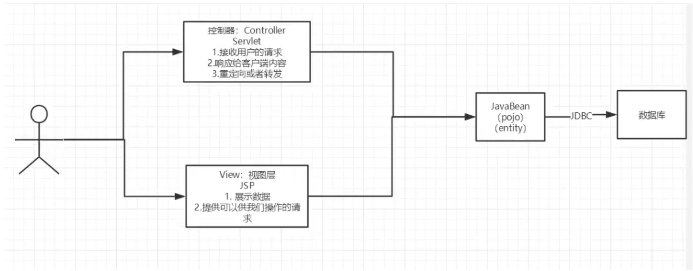

# Spring MVC

## HTTP

### URL格式

格式1:


格式2:


```
1. www 是默认的主机名
2. context部分用来代表应用名称
3. context可以有一个或多个默认资源(index.html  index.htm   default.htm)
   不带资源名称的URL指向默认资源, 多个默认资源则指向最高优先级的资源
4. 资源名后可以有一个或多个查询语句或者路径参数
   查询语句是一个key/value组, 多个查询语句之间用&分隔
   路径参数只有value部分, 多个value部分用"/"符合分隔
```

### HTTP请求

包含:

1.方法---URI----协议/版本

2.请求头信息

3.请求正文

```bash
## 方法   URI              协议/版本
POST /examples/default.jsp HTTP/1.1
## 请求头信息
Accept: text/plain; text/html 
Accept-Language: en-gb
Connection: Keep-Alive 
Host: localhost 
User-Agent: Mozilla/5.0(Macintosh;U; Intel Mac OS X10.5; en-US; rv:1.9.2.6)
Gecko/20100625 Firefox/3.6.6
Content-Length:30
Content-Type: application/x-www-form-urlencoded 
Accept-Encoding: gzip, deflate 

## 请求正文
lastName=Blanks& firstName=Mike
```

- HTTP 1.1 定义了7中类型方法:  **GET, POST**,  HEAD, OPTIONS, PUT, DELETE, TRACE

- URI定义了一个互联网资源, 通常解析为服务器根目录的相对路径
- 请求头信息中每一个请求头都用回车换行(CRLF)分隔
- 请求头与请求正文用一空行分隔

### HTTP响应


包含:

1.协议---状态码--描述

2.响应头信息

3.响应正文

```bash
## 协议/版本 状态码  描述
HTTP/1.1 200 OK 
## 响应头信息
Server: Apache-Coyote/1.1
Date: Thu,29 Sep 2013 13:13:33 GMT 
Content-Type: text/html 
Last-Modified: Web,28 Sep 2013 13:13:12 GMT 
Content-Length:112

## 响应正文
<html>
<head>
<title>HTTP Response Example</title>
</head>
<body>
Welcome to Brainy Software
</body>
</html>
```

- 访问未授权的将返回401

- 使用被禁用的请求方法将返回405

  

## Servlet与JSP

### 几点:

- 一个Servlet为响应第一次请求而创建后, 会驻留在内存中, 以便响应后续请求
- 一个Servlet应用包含了一个或多个Servlet, 一个JSP页面会被翻译并编译成一个Servlet
- 客户端与服务端基于HTTP通信, 因此Web服务端也称为HTTP服务端

### Java企业版技术

技术举例

- JMS
- EJB
- JSF
- JPA

常用容器(企业版)

- GlassFish
- JBoss
- Oracle Weblogic
- IBM WebSphere

非企业版

- Tomcat
- Jetty


## Spring

### 依赖注入

#### 场景

有两个组件, 分别为A和B,  A依赖于B

```java
public class A{
    public void importantMethod{
        B b = ....  // 获取B的个实例对象
        b.usefulMethod();
        ...
    }
    ...
}
```

使用类A的importantMethod必须要获得类B的实例引用

- 当B是一个具体的类, 那么new关键字可以直接创建组件B实例
- 当B是接口, 通过new关键字只可以创建B接口的一种实现类, 此时A类的可重用性大大降低, 因为B的其他实现类A无法使用

#### 依赖输入如何处理该场景

> 接管对象的创建工作, 并将该对象的引用注入需要改对象的组件
>
> 也即是依赖注入框架会分别创建对象A和对象B, 将对象B注入到对象A中

#### 如何使用依赖输入

1. 编写特定的set方法或者构造方法

   ```java
   /* 编写set方法 */
   public class A {
       private B b;
       public void importantMethod(){
           // 不需要考虑如何创建B
           // B b = ... // 获取B的实例对象
           b.usefulMethod();
       }
       public void setB(B b){
           this.b = b;
       }
   }
   
   
   /* 编写构造方法 */
   public class A {
       private B b;
       
       public A(B b){
           this.b = b;
       }
       public void importantMethod(){
           // 不需要考虑如何创建B
           // B b = ... // 获取B的实例对象
           b.usefulMethod();
       }
     
   }
   ```

   

#### Spring支持的依赖注入

1. setter和构造器方式 (Spring 1.0起)

2. 基于field方式
   - 该方式需要通过Autowire注解, 必须引入`org.springframework.beans.factory.annotation.Autowired`, 这对Spring产生了依赖, 无法直接迁移到另一个依赖注入容器间

#### Spring依赖注入的工作方式

> Spring提供一个控制反转容器(或者依赖注入容器)管理对象依赖关系,  使用了Spring, 程序所有重要对象的创建工作移交给Spring, 并配置如何注入依赖

1. 配置如何注入依赖

   - XML
   - 注解

2. 创建一个`ApplicationContext(接口)`对象

   实现类

   - `ClassPathXmlApplicationContext`

     ```
     在类加载路径中加载配置文件, 并且至少需要一个包含beans信息的XML文件
     ```

     创建ApplicationContext

     ```java
     ApplicationContext context = new ClassPathXmlApplicationContext( new String[]{"config1.xml", "config2.xml"});
     ```

     获取对象, id为product, 类型为Product的对象

     ```java
     Product product = context.getBean("product", Product.class);
     ```

   - `FileSystemXmlApplicationContext`

     ```
     从文件系统中加载配置文件, 并且至少需要一个包含beans信息的XML文件
     ```


#### XML的配置

> 根元素通常为beans

1.配置多个xml文件

2.配置一个主配置文件

```xml
<?xml version="1.0"encoding="UTF-8"?>
<beans xmlns="http://www.springframework.org/schema/beans"
xmlns:xsi="http://www.w3.org/2001/XMLSchema-instance"
xsi:schemaLocation="http://www.springframework.org/schema/beans http://www.springframework.org/schema/beans/spring-beans.xsd">
    
<import resource="configl.xml"/>
<import resource="module2/config2.xml"/>
<import resource="/resources/config3.xml"/>
    
</beans>
```


### Spring控制反转容器的使用


## MVC

> Model  View  Control   模型视图控制

### 早些年

用户直接访问控制层, 控制层可以直接操作数据库

```
servlet   --- CRUD-->    数据库  
弊端: 程序是否臃肿, 不利于维护
      这中模式的servlet代码: 处理请求, 响应, 视图跳转, 处理JDBC, 处理业务/逻辑代码
```





#### 现在的MVC


