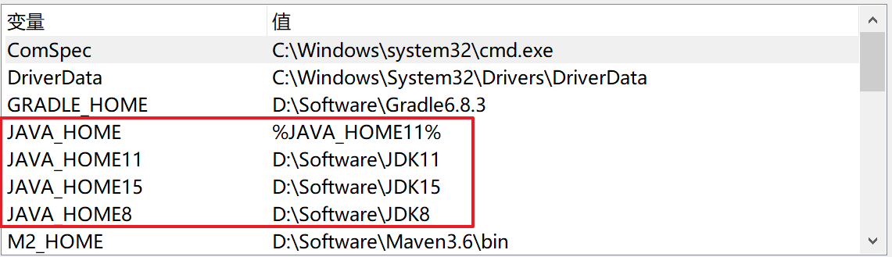
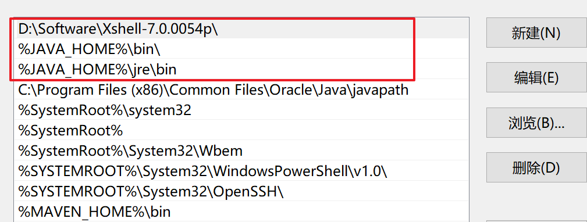
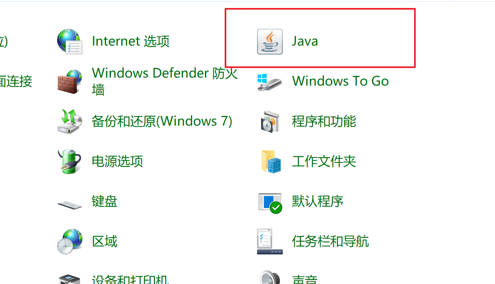
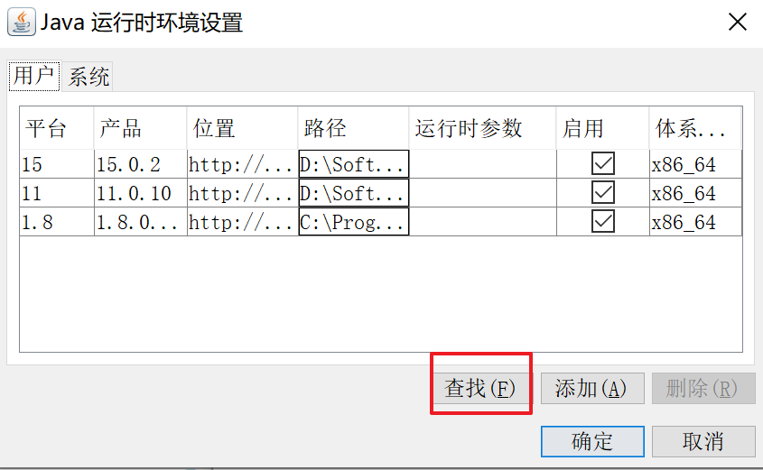
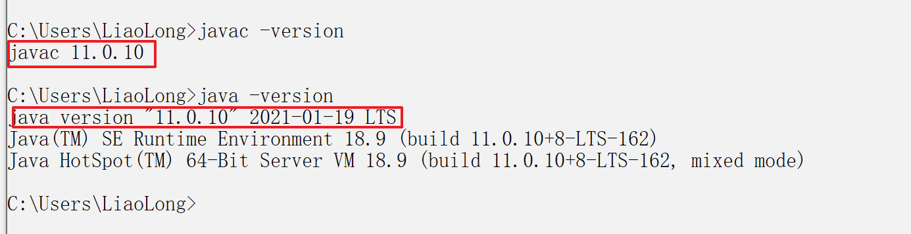

在保证开发环境相同的情况下, 每个人遇到的问题, 遇到问题的时间均有差异, 在解决问题之前, 请先参阅halo最新的文档, 有

[官方文档-开发者指南](https://docs.halo.run/developer-guide/core/prepare),  

[本地部署halo](https://halo.run/archives/install-quick-start#%E5%A6%82%E6%9E%9C%E4%BD%A0%E6%83%B3%E5%9C%A8%E6%9C%AC%E5%9C%B0%E4%BD%93%E9%AA%8C)


### 说明:

克隆项目时间: 2021-03-07

操作系统: windows 10

IDE:  IntelliJ  IDEA 2018.03

工具: Gradle6.8.3 ,   Lombok ([导入项目halo前需要的准备工作](https://www.jianshu.com/p/4a64a9666415))

JDK: JDK 11


### 遇到的问题

这个项目是我第一个学习的项目, 由于没有提前阅读官方的文档, 尝试运行该项目时遇到了一些问题


#### 多个JDK版本的安装

在学习halo之前, 一直用的是JDK8, halo项目要求JDK 11+(当然也有历史版本支持JDK8), 所以尝试安装了多个运行环境

安装后jdk后 , 需要**配置环境变量**

> 前提说明: 如果你之前安装JDK时, 自动设置了java命令的加载路径, 比如我的自动在c盘生成了`C:\Program Files (x86)\Common Files\Oracle\Java\javapath`这个路径, 你需要把这个环境变量的优先级降低, 放在你配置JAVA_HOME之后, 如下面第二张图所示, 

1. 如下图方式配置, `JAVA_HOME`用来设置当前需要使用的`JDK`版本

   

   

2. 更高级JDK版本默认没有运行环境 ` jre`的 目录, 这里可用以下命令生成

   打开cmd,   进入你的jdk安装目录, 运行以下命令, 我的是

   ```
   D:
   ```

   ```bash
   D:\Software\JDK11
   ```

   生成`jre`目录

   ```bash
   bin\jlink.exe --module-path jmods --add-modules java.desktop --output jre
   ```

3. 添加`JVM`运行环境(即`jre`目录), 在控制面板中设置, 找到`Java`








4. 测试

   > 如果`javac`测试符合预期, `java`命令测试不符合预期结果, 可以参考文末的链接

   


#### 运行halo报错1

> Error running 'ServiceStarter': Command line is too long. Shorten command line for ServiceStarter or also for Application default configuration.

解决办法

```
修改项目下 .idea\workspace.xml，找到标签 <component name="PropertiesComponent"> ， 在标签里加一行 <property name="dynamic.classpath" value="true" />
```


#### 运行halo报错2

> halo Please check location: classpath:templates/themes 

这里直接粘贴该[链接](https://bbs.halo.run/d/504-themes-anatole)下的评论所给出的方法, 报错不一样, 但原因类似, 都是在git的时候, 没有把主题模板下载下来, ==不过, 如果按照官方文档一步一步做, 应该没有那么多事==

```
我也遇到类似问题, 只能说是类似,但是具体情况不知是否完全相同, 我的项目是windows下用Idea 2019.03 导入git拉取的halo项目自动构建的, 运行后抛的异常是run.halo.app.exception.ThemePropertyMissingException: C:\Users\当前登录系统账号名\halo-test\templates\themes\anatole 没有说明文件

我的问题刚刚解决. 这里直接说我自己的解决办法:

首先, 进行操作前我先明确两个情况, 如果情况不同的, 请另找解决方案 :

1. 一定要用git拉取, 不是用zip下载的项目(自己也踩过zip下载的坑,没有解决, 只解决了git拉取方式的)
2. 之前电脑上未运行过halo项目或者halo本地构建后没有存过重要数据, 仅是为了先跑跑项目看看的朋友, 因为后续第二步删除配置文件会删除之前有构建过的halo账户密码等信息.

如果满足上面两点, 可以这样简单操作, 只是简单提供思路, 具体操作细节请根据自己配置情况做修改:

1.直接到halo的主题项目下去拉取主题项目的文件放入本地缺失主题文件的对应位置。halo默认主题的GitHub地址:[Halo 的默认主题](https://github.com/halo-dev/halo-theme-anatole/tree/6a1d8d10e5209bfec5fe14) ,将拉取后的项目根文件夹下, 除了.git版本信息文件夹外, 所有文件直接拷贝入本地halo项目这一位置(**仅为示例**), halo项目名\src\main\resources\templates\themes\anatole\

\2. 删除halo在本地计算机产生的三个或两个配置文件夹。配置文夹位置, 默认是存在本机(win10系统) C:\Users\当前登录系统账号名\ 之下, 删除的三个或两个文件夹名分别是.halo, halo-dev, halo-test (如果halo项目未成功运行, hao-dev文件夹可能不存在)
3.在IDE中重新打开halo项目, 自动Gradle导入, 然后等待构建完成再运行项目看看, 如果情况类似就可以正常启动项目, 解决抛主题文件缺失异常了.

ps:
1.我也是查到你这篇帖子才受启发去halo的GitHub项目对应项目文件夹去看看, 看的过程才发现同样如楼上所所说的, theme文件夹下anatole用@进行指向了, 应该是主题这块进行单独git开发了.但是zip下载和git直接拉取时, anatole文件夹下载的确都为空, 我确认了两次.
2.zip下载的文件大小和git拉取差异很大, 自己为了减少折腾, 直接测试git拉取解决此问题较为简单.
```


#### 参考链接

[java运行环境](https://blog.csdn.net/programminging/article/details/80770294?utm_medium=distribute.pc_relevant.none-task-blog-BlogCommendFromMachineLearnPai2-1.control&dist_request_id=&depth_1-utm_source=distribute.pc_relevant.none-task-blog-BlogCommendFromMachineLearnPai2-1.control)

[多个jdk版本安装](https://blog.csdn.net/zdl177/article/details/105246997)

[commad line is too long](https://blog.csdn.net/ZXJ_1223/article/details/80611089)

[halo社区, 关于主题模板类找不到的解决办法](https://bbs.halo.run/d/504-themes-anatole)