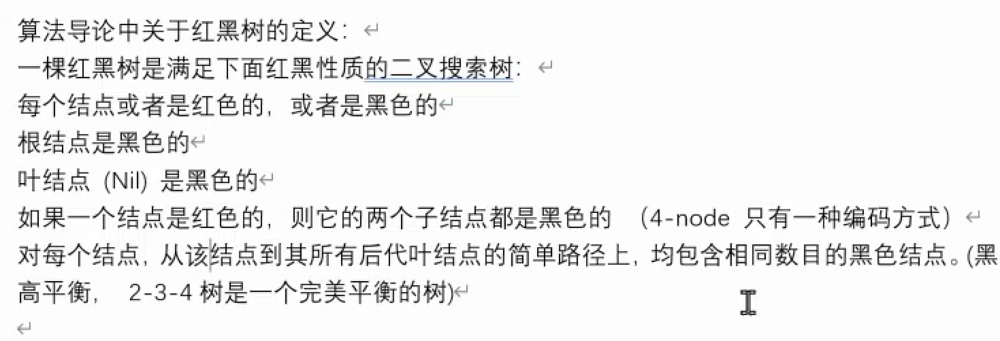

# 数据结构

1. 时间复杂度描述的是一个趋势, 随着数据量的增加复杂度的变化趋势

2. 为什么工程上是使用双向链表, 而不是单向链表

   - 双向链表查找速度快, 业务中查找的操作更多

3. 快慢指针查找链表中间节点

   ```java
   public class LinkList {
       public static void main(String[] args) {
           Node node1 = new Node("1", null);
           Node node2 = new Node("2", node1);
           Node node3 = new Node("3", node2);
           Node node4 = new Node("4", node3);
           Node node5 = new Node("5", node4);
           Node node6 = new Node("6", node5);
           Node node7 = new Node("7", node6);
   
           Node f = node7;
           Node l = node7;
           while(f.next != null && f.next.next != null){
               f = f.next.next;
               l = l.next;
           }
           System.out.println(l.value);
       }
   }
   
   class Node{
       String value;
       Node next;
   
       public Node(String value, Node next) {
           this.value = value;
           this.next = next;
       }
   
   }
   ```

   

## 红黑树

定义:

```
1. 是一颗二叉搜索树
2. 每个结点或者是红色的,或者是黑色的
3. 根结点时黑色的
4. 叶结点(Nil)是黑色的
5. 如果一个结点时红色的, 则他的两个字结点都是黑色的(4-node 只有一种编码方式)
对每个结点, 从该结点到其所有后代结点的简单路径上, 均包含相同数目的黑色结点(黑高平衡, 2-3-4树是一个完美平衡的树)
6. 
```


