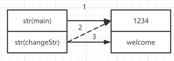

## Q1

```java
public class Test1 {
    public static void changeStr(String str){
        str = "Welcome";
    }
    public static void main(String[] args) {
        String str = "1234";
        changeStr(str);
        System.out.println(str);
    }
}

```

```
输出结果是: 1234
```


分析:

[](https://github.com/long-leo/Java-Notes/blob/main/面试题/2021-02-27/各大公司面试题个人笔记.assets/image-20210227204601812.png)


## Q2

```java
public class Test2 {
    static boolean foo(char c) {
        System.out.print(c);
        return true;
    }

    public static void main(String[] args) {
        int i = 0;
        for (foo('A'); foo('B') && (i < 2); foo('C')) {
            i++;
            foo('D');
        }
    }
}

```

```
输出结果是: ABDCBDCB
```


## Q3(E选项待解释)

```
class A {
	protected int method1(int a, int b) { return 0; }
}
Which two are valid in a class that extends class A? (Choose two)
A. public int method1(int a, int b) { return 0; }
B. private int method1(int a, int b) { return 0; }
C. private int method1(int a, long b) { return 0; }
D. public short method1(int a, int b) { return 0; }
E. static protected int method1(int a, int b) { return 0; }

```

```
选择AC
A: 方法签名与父类一致, 返回类型与父类一致, 方法可见性降低, 成功覆写
B: 方法签名与父类一致, 返回类型与父类一致, 但可见性降低, 覆写失败, 编译报错
C: 方法签名与父类不一致, 属于子类的特有方法, 可以实现继承
D: 方法签名与父类一致, 返回类型与父类不一致, 覆写失败, 编译报错
E: 方法签名与父类一致, 返回类型与父类一致, 方法可见性一致, 但变成了static方法, 覆写失败
```


## Q4

```
public class Outer{
	public void someOuterMethod() {
 		// Line 3
	}
	public class Inner{}
	public static void main( String[]argv ) {
		Outer o = new Outer();
        // Line 8
	}
}

Which instantiates an instance of Inner?
A. new Inner(); // At line 3
B. new Inner(); // At line 8
C. new o.Inner(); // At line 8
D. new Outer.Inner(); // At line 8//new Outer().new Inner()
```

```
选择A
A: 非static方法, 可以引用非static变量
B: static 方法, 不可以引用非static变量
C: 语法错误
D: 同B
```


## Q5

```
Which method is used by a servlet to place its session ID in a URL that is written to
the servlet’s response output stream?
（译：那个方法是servlet用于将其session ID入在一个URL中，该URL写入servlet的响应输出流）
A. The encodeURL method of the HttpServletRequest interface.
B. The encodeURL method of the HttpServletResponse interface.
C. The rewriteURL method of the HttpServletRequest interface.
D. The rewriteURL method of the HttpServletResponse interface.
```

```
选B
见Java ee文档
```


## Q6

```
Which two are equivalent? (Choose two)
A. <%= YoshiBean.size%>
B. <%= YoshiBean.getSize()%>
C. <%= YoshiBean.getProperty("size")%>
D. <jsp:getProperty id="YoshiBean" param="size"/>
E. <jsp:getProperty name="YoshiBean" param="size"/>
F. <jsp:getProperty id="YoshiBean" property="size"/>
G. <jsp:getProperty name="YoshiBean" property="size"/>

```

```

```


## Q7

